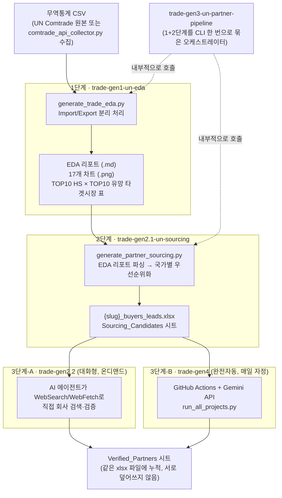

# Trade-Gen 파이프라인 — 종합 흐름 문서

> UN Comtrade 무역 통계 하나로 시작해서 "실제 검증된 해외 파트너 리스트"까지 도달하는
> 5개 스킬(`trade-gen1` ~ `trade-gen4`)의 전체 흐름을 한눈에 볼 수 있는 문서입니다.
> 각 스킬 자체의 사용법은 해당 폴더의 `SKILL.md`를, 개별 스킬의 파이프라인상 위치는
> 각 폴더의 `docs/README.md`를 참고하세요. 이 문서는 **"지금 내가 어느 단계에 있고,
> 다음에 뭘 실행해야 하는지"** 를 판단하기 위한 진입점입니다.

---

## 1. 전체 흐름도



**핵심 요약**: CSV → (1) EDA → (2) 국가 우선순위 트래커 → (3) 실제 파트너 검색(대화형 또는 자동) →
`Verified_Partners`. `trade-gen3`는 (1)+(2)를 한 번에 묶어주는 지름길일 뿐 별도 산출물은 없습니다.

---

## 2. 스킬별 요약 표

| 단계 | 스킬 | 실행 방식 | 입력 | 출력 |
|---|---|---|---|---|
| 1 | [`trade-gen1-un-eda`](../trade-gen1-un-eda/) | CLI (결정론적) | 무역통계 CSV | EDA 리포트 + 17개 차트 |
| 2 | [`trade-gen2.1-un-sourcing`](../trade-gen2.1-un-sourcing/) | CLI (결정론적) | 1단계 EDA 리포트 | `Sourcing_Candidates` 시트 |
| 3-A | [`trade-gen2.2-un-partner-deep-mining`](../trade-gen2.2-un-partner-deep-mining/) | 대화형 AI (온디맨드) | 2단계 시트 | `Verified_Partners` 시트 |
| 3-B | [`trade-gen4-un-auto-mining`](../trade-gen4-un-auto-mining/) | GitHub Actions + Gemini API (매일 자정) | 2단계 시트 | `Verified_Partners` 시트 |
| (1+2 묶음) | [`trade-gen3-un-partner-pipeline`](../trade-gen3-un-partner-pipeline/) | CLI (결정론적) | 무역통계 CSV | 1단계+2단계 산출물 전부 |

각 스킬의 상세 문서: `trade-gen{N}/docs/README.md` (파이프라인 위치 + 최근 변경 이력),
사용법: `trade-gen{N}/SKILL.md`.

---

## 3. "지금 나는 뭘 실행해야 하나?" 결정 가이드

**Q1. 아직 무역통계 CSV도 없다.**
→ `trade-gen1-un-eda/scripts/comtrade_api_collector.py`로 UN Comtrade API에서 수집하거나,
UN Comtrade 웹사이트에서 수동 다운로드. (Import는 `reporter=all`로, Export는 최소 자국
단독으로 — 가능하면 Export도 `reporter=all`로 수집할수록 3단계 경쟁국 분석 정확도가 올라감.)

**Q2. CSV는 있는데 EDA 리포트가 없다.**
→ `trade-gen1-un-eda` 실행 (또는 2단계까지 한 번에 하려면 `trade-gen3-un-partner-pipeline`).

**Q3. EDA 리포트는 있는데 국가별 우선순위 트래커(`Sourcing_Candidates`)가 없다.**
→ `trade-gen2.1-un-sourcing` 실행. *(이 시점부터 해당 프로젝트가 `trade-gen4`의 매일 자정
자동조사 대상에 자동 포함됩니다 — 별도 설정 불필요.)*

**Q4. 트래커는 있는데 실제 회사 정보(`Verified_Partners`)가 비어있다.**
→ 지금 바로, 대화 세션에서 결과를 보고 싶다 → `trade-gen2.2-un-partner-deep-mining` (자연어로
"우선순위 상위 국가 로컬파트너 찾아줘" 요청)
→ 당장 세션에 매달릴 필요 없이 백그라운드로 계속 쌓이길 원한다 → `trade-gen4`가 매일 자정
자동으로 처리 (단, Gemini API 비용 발생 + secret 설정 필요, 상세는 `trade-gen4/SKILL.md`)

**Q5. 새 품목(프로젝트)을 통째로 처음부터 시작한다.**
→ AI 에이전트에게 "새 CSV로 파이프라인 전체 진행해줘"라고 요청하면 1→2→3단계가 한 세션
안에서 자연스럽게 이어집니다. 터미널에서 스크립트만 순서대로 돌리고 싶다면
`trade-gen3-un-partner-pipeline`(1+2) 실행 후, 3단계는 반드시 자연어로 추가 요청해야 합니다
(AI의 실시간 판단이 필요해 CLI로 묶을 수 없음).

---

## 4. 파일 의존성 맵 (누가 무엇을 읽고 쓰는가)

```
{output_dir}/                          예: BIZ-Jeonbok/, BIZ-laver/
├── (raw) 무역통계 CSV                  ← 사람이 수집 또는 comtrade_api_collector.py
├── images/*.png                       ← trade-gen1 이 씀
├── reports/
│   ├── BIZ-{품목}_Gathered_EDA_Report.md   ← trade-gen1 이 씀 / trade-gen2.1 이 읽음
│   └── {품목}_Buyers_Lead_List.md          ← trade-gen2.1 이 씀 (사람이 읽는 요약)
└── data/
    ├── {slug}_buyers_leads.xlsx
    │     ├─ Sourcing_Candidates 시트   ← trade-gen2.1 이 씀 / trade-gen2.2·trade-gen4 가 읽음
    │     └─ Verified_Partners 시트     ← trade-gen2.2·trade-gen4 가 씀 (같은 시트, 안 지움)
    ├── {slug}_sourcing_history.csv     ← trade-gen2.1 실행 이력
    └── {slug}_auto_mining_log.jsonl    ← trade-gen4 감사 로그 (Gemini 원문 응답 보관)
```

`trade-gen4`의 `run_all_projects.py`는 저장소 전체를 스캔해 **`Sourcing_Candidates` 시트가
존재하는 모든 `BIZ-*/data/*_buyers_leads.xlsx`** 를 자동으로 찾아 처리합니다. 즉 2단계
(`trade-gen2.1`)를 한 번이라도 실행해두면, 워크플로우 YAML을 건드리지 않아도 다음 자정부터
자동으로 그 프로젝트가 포함됩니다.

---

## 5. 알아둘 만한 설계 원칙 (전 스킬 공통)

- **정직성 우선**: 실제 데이터로 뒷받침되지 않는 값은 절대 지어내지 않고 "확인 필요"/빈 칸으로
  남긴다 (과거 `partner_sourcing_agent.py`가 품목 무관 가짜 업체 10개를 "검증완료"로 표시하던
  문제의 재발 방지가 이 파이프라인 전체 재설계의 출발점).
- **재실행 안전성**: 데이터 기반 필드는 재실행 시 최신화, 사람이 채운 조사 결과는 절대 덮어쓰지 않음.
- **차트 단위 방어**: 데이터 부족 시 전체 파이프라인이 죽지 않고 해당 차트만 플레이스홀더로 대체.
- **출처 URL 강제**: 3단계(2.2/4)에서 `source_url` 없는 레코드는 자동 거부.
