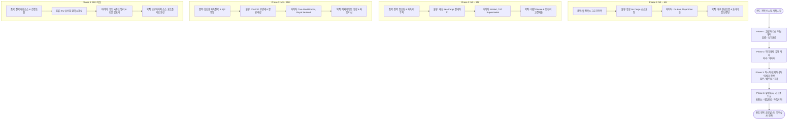

# 완도 전복 글로벌 신시장 개척 단계별 순서 및 로드맵 (Market Entry Sequence)
**- 1인 무역상사를 위한 품목 x 국가 x 물류 세부 실행 수순 -**

---

## 1. 시장 개척 수순 요약 (Market Entry Sequence Overview)

---

## 2. 각 단계별(Phase 1 ~ 4) 세부 개척 가이드

### 📌 Phase 1 (M1 ~ M4): 홍콩 & 싱가포르 (고단가/신선 시장)
- **1순위 개척 국가**: **홍콩 (Hong Kong), 싱가포르 (Singapore)**
- **주력 출하 품목**: 완도 활전복 (`HS 0307.81`, 7~10미) & 명품 건전복
- **물류 및 진입 방식**:
  - 항공 특수 산소 포장 패키징 (Air Cargo)
  - 1차 50kg 소량 MOQ 시범 발송을 통해 수입 허들 제거.
- **타겟 바이어**: On Kee Dry Seafood, Thye Shan, Kee Wah Bakery.
- **핵심 목표**: 1인 상사의 초기 현금 흐름(Cash-flow) 확보 및 kg당 $33.50 이상의 고마진 확보.

---

### 📌 Phase 2 (M5 ~ M8): 미국 & 캐나다 (북미 대량 유통 시장)
- **2순위 개척 국가**: **미국 (USA), 캐나다 (Canada)**
- **주력 출하 품목**: 완도 전복 통조림 (`HS 1605.57`, 400g/4미) & 자숙 냉동전복 파우치
- **물류 및 진입 방식**:
  - 완도 FDA/HACCP 인증 공장 OEM 생산 ➔ 해상 컨테이너 (Sea FCL/LCL) 수송.
  - FDA Prior Notice 및 캐나다 CFIA 검역 승인 대행 제공.
- **타겟 바이어**: H-Mart Commercial, T&T Supermarket, Ocean Beauty.
- **핵심 목표**: 대형 리테일 및 HORECA 체인 납품을 통한 고정 물동량(Volume) 확보.

---

### 📌 Phase 3 (M9 ~ M12): 일본, 베트남, 호주 (고부가가치 럭셔리 시장)
- **3순위 개척 국가**: **일본 (Japan), 베트남 (Viet Nam), 호주 (Australia)**
- **주력 출하 품목**: 일식 횟감용(Sashimi Grade) 자숙전복, IQF 개별급속동결 냉동전복
- **물류 및 진입 방식**:
  - 한-베 FTA 관세 0% C/O 발급 혜택 제공 및 항공/해상 혼합 운송.
- **타겟 바이어**: True World Foods Japan, Royal Seafood (Hải Sản Hoàng Gia).
- **핵심 목표**: 프리미엄 일식/중식 레스토랑 네트워크 확보 및 오세아니아/동남아 시장 확산.

---

### 📌 Phase 4 (M13 이후): 프랑스, 네덜란드, 이탈리아 (유럽 니치 가공품 시장)
- **4순위 개척 국가**: **프랑스 (France), 네덜란드 (Netherlands), 이탈리아 (Italy)**
- **주력 출하 품목**: 전복 내장 소스(게우소스), 전복 간장 조림, IQF In-shell 전복 살
- **물류 및 진입 방식**:
  - EU 수산물 수입 위생 기준 셋업 및 콜드체인 리퍼 컨테이너 수송.
- **타겟 바이어**: 유럽 시푸드 델리 유통상 및 스페셜티 푸드 임포터.
- **핵심 목표**: 초고부가가치 수산 가공 소스 시장 선점.
