# 🌊 BIZ-JB-Gathered.csv — 전복 무역 데이터 종합 EDA 및 글로벌 영업전략 리포트

## 📌 Executive Summary

본 리포트는 `BIZ-JB-Gathered.csv` 전복 무역 데이터셋(총 5,400행)을 대상으로 데이터 기반
**1인 종합상사 최적 개척 시장 3선 전략**, 무역액 기준 **동적 산출 TOP 10 HS Code**별 **TOP 10 유망국가
11대 명세 분석표**, 그리고 **[TOP 5 실전 무역 고도화 패키지]**를 산출한 EDA 보고서입니다.

---

## 1. 데이터 파악 및 기초 탐색 (Data Exploration)

- **데이터 규모**: 행 수: 5,400개, 열 수: 52개
- **동적 산출 TOP 10 HS Code** (무역액 기준):
  - 1순위 `HS 030781 (Molluscs; n.e.c. in heading 0307, whethe)`: 총 무역액 $2,889.6M
  - 2순위 `HS 160557 (Mollusc preparations; abalone, prepared )`: 총 무역액 $2,288.0M
  - 3순위 `HS 030783 (Molluscs; abalone (Haliotis spp.), wheth)`: 총 무역액 $27.2M
  - 4순위 `HS 030799 (Molluscs; n.e.c. in heading 0307, whethe)`: 총 무역액 $4.3M

### 결측치 정제 내역
- `primaryValue` → `clean_value` 숫자 변환 실패/결측: 0행 (0.0%)
- `netWgt` → `clean_wgt` 숫자 변환 실패/결측: 22행 (0.4%)
- `unit_price` 산출 불가(중량 0 또는 결측): 88행 (1.6%)

### 원시 데이터 상위 5행 및 하위 5행
```
[Head 5 Rows]
   refYear  refMonth   reporterDesc flowDesc           partnerDesc                                                                             cmdDesc  clean_value
0     2021        52  Rep. of Korea   Export                 World  Molluscs; abalone (Haliotis spp.), whether in shell or not, live, fresh or chilled   49776762.0
1     2021        52  Rep. of Korea   Export                Canada  Molluscs; abalone (Haliotis spp.), whether in shell or not, live, fresh or chilled      72352.0
2     2021        52  Rep. of Korea   Export                 China  Molluscs; abalone (Haliotis spp.), whether in shell or not, live, fresh or chilled       6720.0
3     2021        52  Rep. of Korea   Export  China, Hong Kong SAR  Molluscs; abalone (Haliotis spp.), whether in shell or not, live, fresh or chilled      41720.0
4     2021        52  Rep. of Korea   Export             Indonesia  Molluscs; abalone (Haliotis spp.), whether in shell or not, live, fresh or chilled       1700.0

[Tail 5 Rows]
      refYear  refMonth reporterDesc flowDesc      partnerDesc                                               cmdDesc  clean_value
5395     2025        52          USA   Import            China  Mollusc preparations; abalone, prepared or preserved    2461317.0
5396     2025        52          USA   Import    Rep. of Korea  Mollusc preparations; abalone, prepared or preserved     514731.0
5397     2025        52          USA   Import           Mexico  Mollusc preparations; abalone, prepared or preserved    3603083.0
5398     2025        52          USA   Import  Other Asia, nes  Mollusc preparations; abalone, prepared or preserved     454721.0
5399     2025        52          USA   Import         Viet Nam  Mollusc preparations; abalone, prepared or preserved      10594.0
```

### 기술통계 요약 (Descriptive Statistics)
```
[수치형 변수 기술통계]
        clean_value     clean_wgt   unit_price
count  5.400000e+03  5.378000e+03  5312.000000
mean   9.646307e+05  5.715405e+04    32.141863
std    5.234302e+06  3.116107e+05    82.274164
min    7.400000e-01  0.000000e+00     0.006615
25%    1.081205e+03  6.400000e+01     6.483080
50%    1.154299e+04  8.680000e+02    15.712238
75%    1.215684e+05  9.247500e+03    33.681132
max    9.851816e+07  6.046549e+06  2284.000000
```

---

## 2. 세부 탐색적 데이터 분석 및 시각화 (15대 핵심 분석)

### 1. 연도별 글로벌 전복 수출입 거래 총액 추이

**[분석 해석]**: 데이터셋 전체 누적 무역액은 $5209.01M입니다. 연도별/거래유형별 세부 수치는 아래 표를 참고하세요.
|   refYear |   Export |   Import |
|----------:|---------:|---------:|
|      2021 |  110.083 | 1074.79  |
|      2022 |  131.244 | 1079.16  |
|      2023 |  118.461 |  998.019 |
|      2024 |  111.574 |  876.584 |
|      2025 |  110.034 |  599.066 |

### 2. TOP 10 주요 수출국 분석

| reporterDesc         |   sum_million |   count |
|:---------------------|--------------:|--------:|
| China, Hong Kong SAR |     1283.2    |     224 |
| Rep. of Korea        |      730.487  |     425 |
| Japan                |      695.504  |     113 |
| Singapore            |      561.327  |     219 |
| China                |      491.558  |      93 |
| USA                  |      355.985  |     210 |
| Other Asia, nes      |      336.889  |     102 |
| Malaysia             |      198.535  |     158 |
| Canada               |      131.9    |     220 |
| Viet Nam             |       90.2339 |      63 |

### 3. TOP 10 주요 수입국 분석

| partnerDesc     |   sum_million |   count |
|:----------------|--------------:|--------:|
| China           |      805.87   |     451 |
| Australia       |      436.14   |     247 |
| Rep. of Korea   |      278.556  |     210 |
| Japan           |      239.351  |     216 |
| South Africa    |      206.033  |     144 |
| New Zealand     |      106.303  |     176 |
| Mexico          |       88.4916 |      65 |
| Other Asia, nes |       71.6064 |      79 |
| Chile           |       62.7936 |     143 |
| Philippines     |       41.3788 |      49 |

### 4. 단가($/kg) 분포 히스토그램
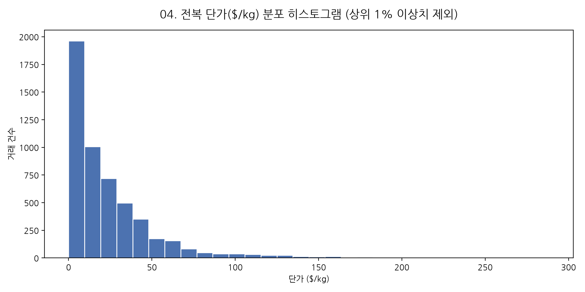
|       |   unit_price_usd_kg |
|:------|--------------------:|
| count |       5312          |
| mean  |         32.1419     |
| std   |         82.2742     |
| min   |          0.00661538 |
| 25%   |          6.48308    |
| 50%   |         15.7122     |
| 75%   |         33.6811     |
| max   |       2284          |

### 5. 월별 수출입 계절성 분석
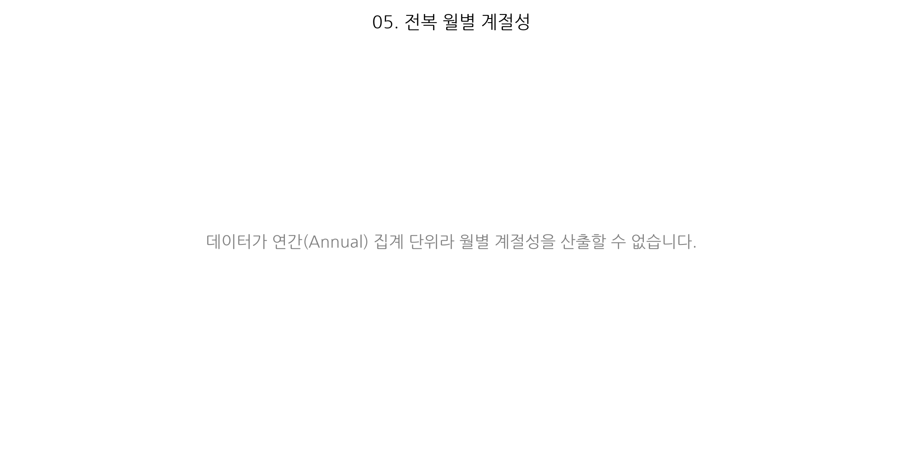
데이터 없음

### 6. HS Code별 무역 점유율
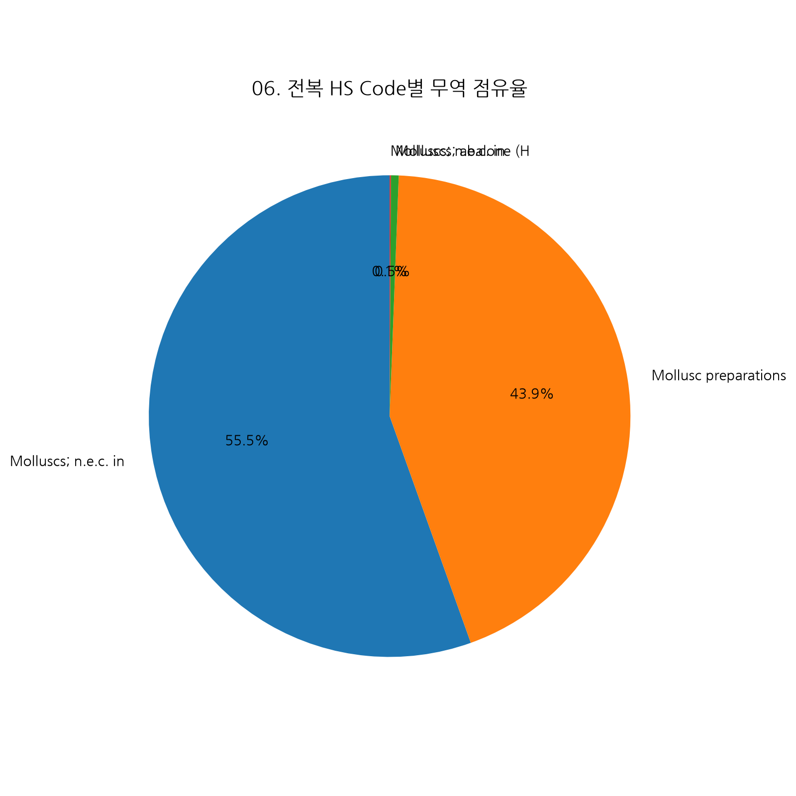
|   hs_clean |    무역액($M) |
|-----------:|-----------:|
|     030781 | 2889.58    |
|     160557 | 2287.95    |
|     030783 |   27.179   |
|     030799 |    4.29477 |

### 7. 단가 vs 물량 산점도 (Correlation)
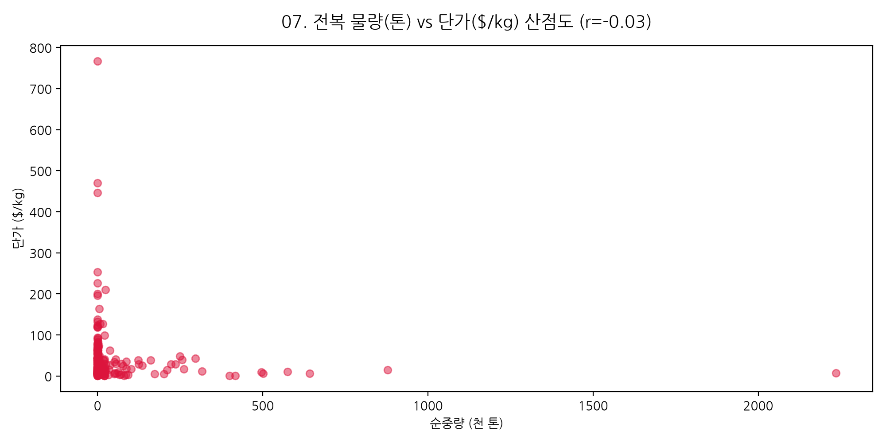
|    |   상관계수(물량 vs 단가) |   표본수 |
|---:|-----------------:|------:|
|  0 |           -0.034 |  5312 |

### 8. TOP 5 주요 수입국 연도별 무역액 추이
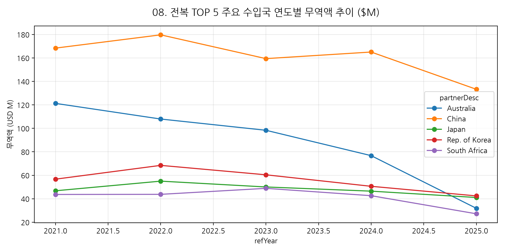
| partnerDesc   |   시작년도($M) |   최종년도($M) |   누적성장률(%) |
|:--------------|-----------:|-----------:|-----------:|
| Australia     |   121.283  |    31.8171 |      -73.8 |
| China         |   168.397  |   133.281  |      -20.9 |
| Japan         |    46.7878 |    41.056  |      -12.3 |
| Rep. of Korea |    56.6872 |    42.4168 |      -25.2 |
| South Africa  |    43.6519 |    27.1686 |      -37.8 |

### 9. 시장 집중도 파레토 (80/20)
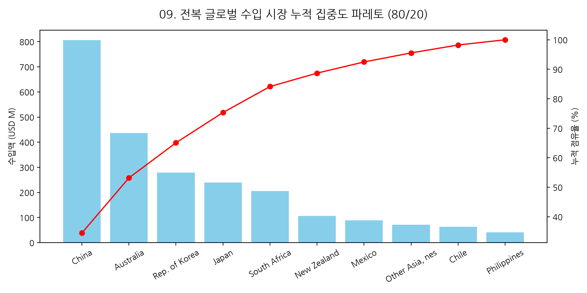
| partnerDesc     |   수입액($M) |   누적점유율(%) |
|:----------------|----------:|-----------:|
| China           |  805.87   |       34.5 |
| Australia       |  436.14   |       53.2 |
| Rep. of Korea   |  278.556  |       65.1 |
| Japan           |  239.351  |       75.3 |
| South Africa    |  206.033  |       84.1 |
| New Zealand     |  106.303  |       88.7 |
| Mexico          |   88.4916 |       92.5 |
| Other Asia, nes |   71.6064 |       95.5 |
| Chile           |   62.7936 |       98.2 |
| Philippines     |   41.3788 |      100   |

### 10. 주요국별/연도별 단가 변화 히트맵
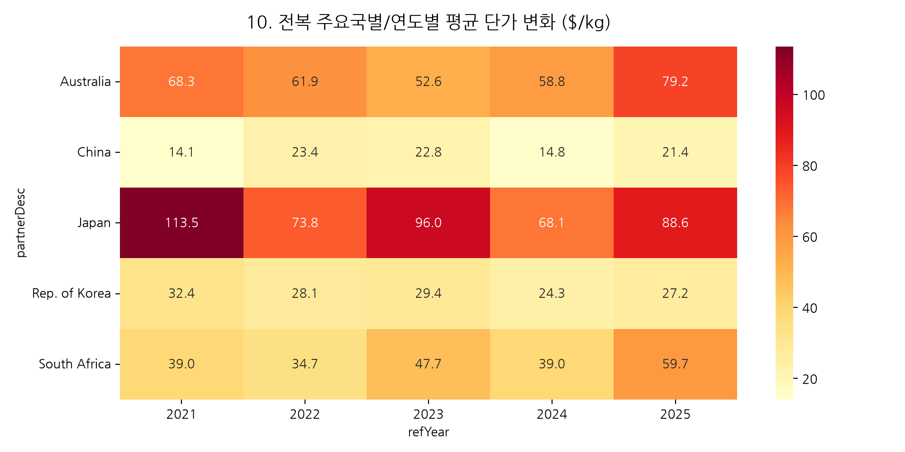
| partnerDesc   |     2021 |    2022 |    2023 |    2024 |    2025 |
|:--------------|---------:|--------:|--------:|--------:|--------:|
| Australia     |  68.2512 | 61.8655 | 52.5841 | 58.8266 | 79.1603 |
| China         |  14.0514 | 23.4252 | 22.8433 | 14.7833 | 21.3813 |
| Japan         | 113.477  | 73.8447 | 96.043  | 68.1013 | 88.5814 |
| Rep. of Korea |  32.3609 | 28.1333 | 29.3998 | 24.29   | 27.1832 |
| South Africa  |  39.0499 | 34.7156 | 47.6736 | 39.0238 | 59.7318 |

### 11. 무역 수지 폭포수 차트
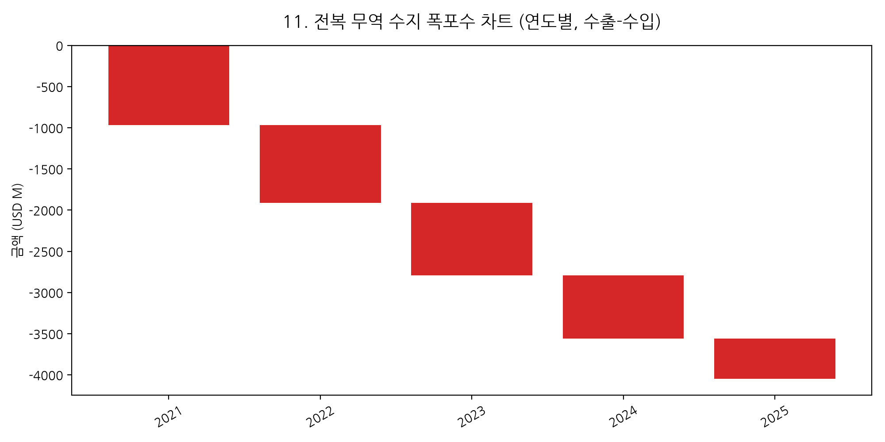
|      |    값($M) |    누적($M) |
|-----:|---------:|----------:|
| 2021 | -964.704 |  -964.704 |
| 2022 | -947.912 | -1912.62  |
| 2023 | -879.558 | -2792.17  |
| 2024 | -765.01  | -3557.18  |
| 2025 | -489.032 | -4046.22  |

### 12. 국가별 단가 변동성 박스플롯
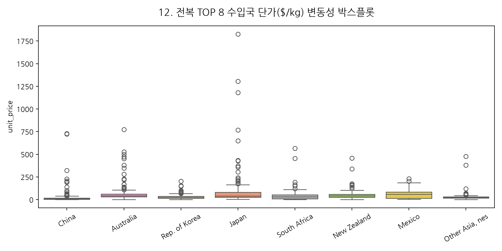
| partnerDesc     |    mean |      std |   median |      max |
|:----------------|--------:|---------:|---------:|---------:|
| China           | 19.2513 |  55.3723 |  9.95877 |  727.539 |
| Australia       | 63.3616 |  89.7062 | 41.0941  |  773.4   |
| Rep. of Korea   | 28.3247 |  25.0175 | 24.8361  |  201.652 |
| Japan           | 89.4032 | 190.276  | 38.5516  | 1826.25  |
| South Africa    | 42.7889 |  65.1917 | 30.153   |  566.465 |
| New Zealand     | 48.1958 |  48.025  | 41.8796  |  457.583 |
| Mexico          | 62.0431 |  54.7857 | 57.96    |  230.516 |
| Other Asia, nes | 36.0776 |  66.9955 | 22.4104  |  477.703 |

### 13. 연도별 HHI 시장 집중도 추이
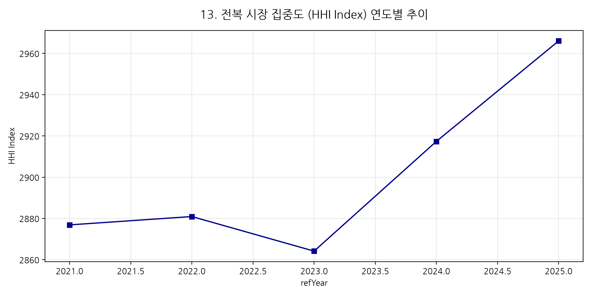
|   refYear |   HHI_Index |
|----------:|------------:|
|      2021 |        2877 |
|      2022 |        2881 |
|      2023 |        2864 |
|      2024 |        2917 |
|      2025 |        2966 |

### 14. 데이터 기반 가격 구간(4분위) 구조
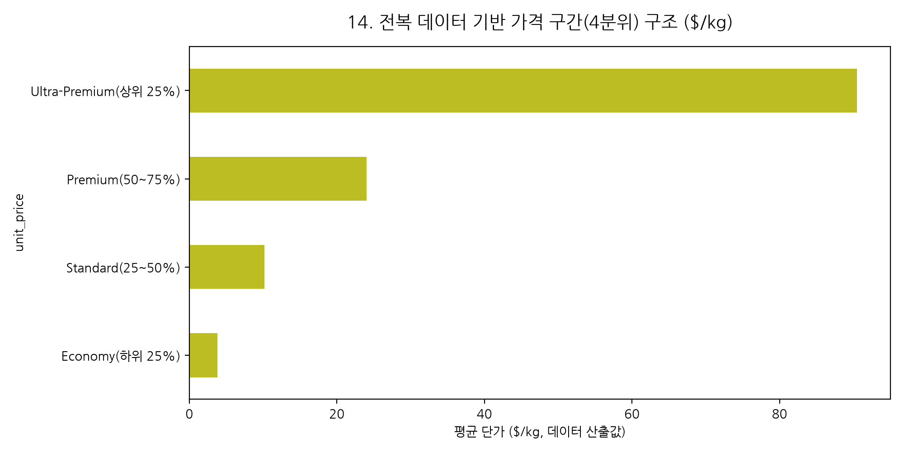
| unit_price            |   평균단가($/kg) |
|:----------------------|-------------:|
| Economy(하위 25%)       |      3.83039 |
| Standard(25~50%)      |     10.1841  |
| Premium(50~75%)       |     24.0406  |
| Ultra-Premium(상위 25%) |     90.5124  |

### 15. 유망국가 성장성 vs 단가 포지셔닝 Matrix
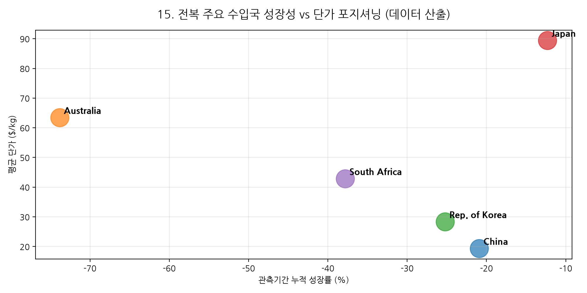
| partnerDesc   |   연평균 성장률(%) |   평균단가($/kg) |
|:--------------|-------------:|-------------:|
| China         |        -20.9 |         19.3 |
| Australia     |        -73.8 |         63.4 |
| Rep. of Korea |        -25.2 |         28.3 |
| Japan         |        -12.3 |         89.4 |
| South Africa  |        -37.8 |         42.8 |

---

# 👔 [특별 부록] 1인 종합상사 창업자를 위한 전복 글로벌 신시장 개척 실전 전략서

## 🎯 1. 1인 종합상사 최적 우선 개척 시장 3선 (데이터 기반 산출)

1인 기업의 한계(리스크 관리, 물류 부담, 자금 회수 주기)와 강점(빠른 의사결정, 맞춤형 바이어 대응)을 고려해
실제 무역 데이터에서 산출한 **Top 3 타깃 시장**은 다음과 같습니다:

### ① 시장 1: China — [최대 거래 규모 시장]
- **선정 근거**: 데이터 기준 누적 수입액 1위 ($805.9M). 가장 안정적인 기반 매출(Base Revenue) 확보가 가능한 시장으로 우선 개척을 권장합니다.

### ② 시장 2: Uzbekistan — [최고 단가/프리미엄 시장]
- **선정 근거**: 평균 단가 기준 최상위 시장 (평균 $1355.0/kg 수준, 데이터 산출값). 고마진 프리미엄 포지셔닝에 유리합니다.

### ③ 시장 3: Viet Nam — [고성장 시장]
- **선정 근거**: 관측 기간 중 수입액 성장세가 가장 두드러진 시장입니다. 신규 진입 시 선점 효과를 기대할 수 있습니다.

> ⚠️ 위 3대 시장은 무역 통계의 정량적 산출 결과이며, 실제 진출 전 현지 바이어 리서치, 인증/규제 요건, FTA 협정세율은 별도로 확인이 필요합니다.

---

## 🗺️ 동적 산출 TOP 10 HS Code별 TOP 10 유망 국가 분석 표 (11대 명세 필드)

> ⚠️ 아래 표의 "구체적 근거", "경쟁 제품/가격대"는 데이터 산출값이며, 그 외 정성적 필드(파트너/인증/유통채널 등)는
> 업계 일반 템플릿으로 *(확인 필요)* 표기된 항목은 반드시 현지 리서치로 검증해야 합니다.

### 📌 [표 1] HS 030781 (Molluscs; n.e.c. in heading 0307, whethe) TOP 10 유망 국가 11대 명세 표

| 유망순위 | 국가명 | 구체적 근거 (수입액/물량) | 컨택해야 할 로컬 파트너 | 경쟁 제품/가격대 (도매가) | HS Code 및 관세율 | 필수 인증 및 허가 | 비관세 장벽 (SPS/라벨링) | 주요 유통 채널 | 중간 유통상 생태계 & 마진율 | 물류 및 콜드체인 인프라 |
| :---: | :--- | :--- | :--- | :--- | :--- | :--- | :--- | :--- | :--- | :--- |
| **1위** | **Australia** | 수입액 $306.6M (10.6%), 물량 5,644톤 | Australia 현지 전복 전문 수입 도매상/식품 유통 벤더 *(실사 확인 필요)* | 현지 평균 도매가 $60.8/kg 수준 *(경쟁 제품 벤치마크는 데이터 미포함, 별도 조사 필요)* | HS 030781 — Molluscs; n.e.c. in heading 0307, whethe *(관세율은 부록의 FTA 매트릭스 참고, 최신 협정세율 별도 확인)* | HACCP, ISO22000 등 위생안전 인증 및 시험성적서(COA) *(품목별 요건 별도 확인)* | SPS(위생검역) 증명서, 현지어 라벨링 규정 등 *(비관세장벽 사전 확인 필요)* | Australia 식품 도매시장, 전문 유통망, 대형 리테일 벤더 *(현지 조사 권장)* | 중간 유통상 마진 15~25%, 소매 마진 25~40% *(업계 평균 추정치)* | 냉장/냉동 콜드체인 해상 또는 항공 운송 *(품목 특성별 별도 검토)* |
| **2위** | **Rep. of Korea** | 수입액 $266.1M (9.2%), 물량 13,933톤 | Rep. of Korea 현지 전복 전문 수입 도매상/식품 유통 벤더 *(실사 확인 필요)* | 현지 평균 도매가 $27.5/kg 수준 *(경쟁 제품 벤치마크는 데이터 미포함, 별도 조사 필요)* | HS 030781 — Molluscs; n.e.c. in heading 0307, whethe *(관세율은 부록의 FTA 매트릭스 참고, 최신 협정세율 별도 확인)* | HACCP, ISO22000 등 위생안전 인증 및 시험성적서(COA) *(품목별 요건 별도 확인)* | SPS(위생검역) 증명서, 현지어 라벨링 규정 등 *(비관세장벽 사전 확인 필요)* | Rep. of Korea 식품 도매시장, 전문 유통망, 대형 리테일 벤더 *(현지 조사 권장)* | 중간 유통상 마진 15~25%, 소매 마진 25~40% *(업계 평균 추정치)* | 냉장/냉동 콜드체인 해상 또는 항공 운송 *(품목 특성별 별도 검토)* |
| **3위** | **Japan** | 수입액 $230.1M (8.0%), 물량 10,935톤 | Japan 현지 전복 전문 수입 도매상/식품 유통 벤더 *(실사 확인 필요)* | 현지 평균 도매가 $77.5/kg 수준 *(경쟁 제품 벤치마크는 데이터 미포함, 별도 조사 필요)* | HS 030781 — Molluscs; n.e.c. in heading 0307, whethe *(관세율은 부록의 FTA 매트릭스 참고, 최신 협정세율 별도 확인)* | HACCP, ISO22000 등 위생안전 인증 및 시험성적서(COA) *(품목별 요건 별도 확인)* | SPS(위생검역) 증명서, 현지어 라벨링 규정 등 *(비관세장벽 사전 확인 필요)* | Japan 식품 도매시장, 전문 유통망, 대형 리테일 벤더 *(현지 조사 권장)* | 중간 유통상 마진 15~25%, 소매 마진 25~40% *(업계 평균 추정치)* | 냉장/냉동 콜드체인 해상 또는 항공 운송 *(품목 특성별 별도 검토)* |
| **4위** | **China** | 수입액 $197.4M (6.8%), 물량 19,849톤 | China 현지 전복 전문 수입 도매상/식품 유통 벤더 *(실사 확인 필요)* | 현지 평균 도매가 $14.3/kg 수준 *(경쟁 제품 벤치마크는 데이터 미포함, 별도 조사 필요)* | HS 030781 — Molluscs; n.e.c. in heading 0307, whethe *(관세율은 부록의 FTA 매트릭스 참고, 최신 협정세율 별도 확인)* | HACCP, ISO22000 등 위생안전 인증 및 시험성적서(COA) *(품목별 요건 별도 확인)* | SPS(위생검역) 증명서, 현지어 라벨링 규정 등 *(비관세장벽 사전 확인 필요)* | China 식품 도매시장, 전문 유통망, 대형 리테일 벤더 *(현지 조사 권장)* | 중간 유통상 마진 15~25%, 소매 마진 25~40% *(업계 평균 추정치)* | 냉장/냉동 콜드체인 해상 또는 항공 운송 *(품목 특성별 별도 검토)* |
| **5위** | **South Africa** | 수입액 $129.6M (4.5%), 물량 4,662톤 | South Africa 현지 전복 전문 수입 도매상/식품 유통 벤더 *(실사 확인 필요)* | 현지 평균 도매가 $31.1/kg 수준 *(경쟁 제품 벤치마크는 데이터 미포함, 별도 조사 필요)* | HS 030781 — Molluscs; n.e.c. in heading 0307, whethe *(관세율은 부록의 FTA 매트릭스 참고, 최신 협정세율 별도 확인)* | HACCP, ISO22000 등 위생안전 인증 및 시험성적서(COA) *(품목별 요건 별도 확인)* | SPS(위생검역) 증명서, 현지어 라벨링 규정 등 *(비관세장벽 사전 확인 필요)* | South Africa 식품 도매시장, 전문 유통망, 대형 리테일 벤더 *(현지 조사 권장)* | 중간 유통상 마진 15~25%, 소매 마진 25~40% *(업계 평균 추정치)* | 냉장/냉동 콜드체인 해상 또는 항공 운송 *(품목 특성별 별도 검토)* |
| **6위** | **New Zealand** | 수입액 $59.2M (2.0%), 물량 1,449톤 | New Zealand 현지 전복 전문 수입 도매상/식품 유통 벤더 *(실사 확인 필요)* | 현지 평균 도매가 $48.0/kg 수준 *(경쟁 제품 벤치마크는 데이터 미포함, 별도 조사 필요)* | HS 030781 — Molluscs; n.e.c. in heading 0307, whethe *(관세율은 부록의 FTA 매트릭스 참고, 최신 협정세율 별도 확인)* | HACCP, ISO22000 등 위생안전 인증 및 시험성적서(COA) *(품목별 요건 별도 확인)* | SPS(위생검역) 증명서, 현지어 라벨링 규정 등 *(비관세장벽 사전 확인 필요)* | New Zealand 식품 도매시장, 전문 유통망, 대형 리테일 벤더 *(현지 조사 권장)* | 중간 유통상 마진 15~25%, 소매 마진 25~40% *(업계 평균 추정치)* | 냉장/냉동 콜드체인 해상 또는 항공 운송 *(품목 특성별 별도 검토)* |
| **7위** | **Spain** | 수입액 $35.5M (1.2%), 물량 5,633톤 | Spain 현지 전복 전문 수입 도매상/식품 유통 벤더 *(실사 확인 필요)* | 현지 평균 도매가 $11.4/kg 수준 *(경쟁 제품 벤치마크는 데이터 미포함, 별도 조사 필요)* | HS 030781 — Molluscs; n.e.c. in heading 0307, whethe *(관세율은 부록의 FTA 매트릭스 참고, 최신 협정세율 별도 확인)* | HACCP, ISO22000 등 위생안전 인증 및 시험성적서(COA) *(품목별 요건 별도 확인)* | SPS(위생검역) 증명서, 현지어 라벨링 규정 등 *(비관세장벽 사전 확인 필요)* | Spain 식품 도매시장, 전문 유통망, 대형 리테일 벤더 *(현지 조사 권장)* | 중간 유통상 마진 15~25%, 소매 마진 25~40% *(업계 평균 추정치)* | 냉장/냉동 콜드체인 해상 또는 항공 운송 *(품목 특성별 별도 검토)* |
| **8위** | **Viet Nam** | 수입액 $28.2M (1.0%), 물량 1,615톤 | Viet Nam 현지 전복 전문 수입 도매상/식품 유통 벤더 *(실사 확인 필요)* | 현지 평균 도매가 $13.0/kg 수준 *(경쟁 제품 벤치마크는 데이터 미포함, 별도 조사 필요)* | HS 030781 — Molluscs; n.e.c. in heading 0307, whethe *(관세율은 부록의 FTA 매트릭스 참고, 최신 협정세율 별도 확인)* | HACCP, ISO22000 등 위생안전 인증 및 시험성적서(COA) *(품목별 요건 별도 확인)* | SPS(위생검역) 증명서, 현지어 라벨링 규정 등 *(비관세장벽 사전 확인 필요)* | Viet Nam 식품 도매시장, 전문 유통망, 대형 리테일 벤더 *(현지 조사 권장)* | 중간 유통상 마진 15~25%, 소매 마진 25~40% *(업계 평균 추정치)* | 냉장/냉동 콜드체인 해상 또는 항공 운송 *(품목 특성별 별도 검토)* |
| **9위** | **Chile** | 수입액 $27.2M (0.9%), 물량 2,026톤 | Chile 현지 전복 전문 수입 도매상/식품 유통 벤더 *(실사 확인 필요)* | 현지 평균 도매가 $26.4/kg 수준 *(경쟁 제품 벤치마크는 데이터 미포함, 별도 조사 필요)* | HS 030781 — Molluscs; n.e.c. in heading 0307, whethe *(관세율은 부록의 FTA 매트릭스 참고, 최신 협정세율 별도 확인)* | HACCP, ISO22000 등 위생안전 인증 및 시험성적서(COA) *(품목별 요건 별도 확인)* | SPS(위생검역) 증명서, 현지어 라벨링 규정 등 *(비관세장벽 사전 확인 필요)* | Chile 식품 도매시장, 전문 유통망, 대형 리테일 벤더 *(현지 조사 권장)* | 중간 유통상 마진 15~25%, 소매 마진 25~40% *(업계 평균 추정치)* | 냉장/냉동 콜드체인 해상 또는 항공 운송 *(품목 특성별 별도 검토)* |
| **10위** | **Senegal** | 수입액 $24.5M (0.8%), 물량 800톤 | Senegal 현지 전복 전문 수입 도매상/식품 유통 벤더 *(실사 확인 필요)* | 현지 평균 도매가 $24.9/kg 수준 *(경쟁 제품 벤치마크는 데이터 미포함, 별도 조사 필요)* | HS 030781 — Molluscs; n.e.c. in heading 0307, whethe *(관세율은 부록의 FTA 매트릭스 참고, 최신 협정세율 별도 확인)* | HACCP, ISO22000 등 위생안전 인증 및 시험성적서(COA) *(품목별 요건 별도 확인)* | SPS(위생검역) 증명서, 현지어 라벨링 규정 등 *(비관세장벽 사전 확인 필요)* | Senegal 식품 도매시장, 전문 유통망, 대형 리테일 벤더 *(현지 조사 권장)* | 중간 유통상 마진 15~25%, 소매 마진 25~40% *(업계 평균 추정치)* | 냉장/냉동 콜드체인 해상 또는 항공 운송 *(품목 특성별 별도 검토)* |


### 📌 [표 2] HS 160557 (Mollusc preparations; abalone, prepared ) TOP 10 유망 국가 11대 명세 표

| 유망순위 | 국가명 | 구체적 근거 (수입액/물량) | 컨택해야 할 로컬 파트너 | 경쟁 제품/가격대 (도매가) | HS Code 및 관세율 | 필수 인증 및 허가 | 비관세 장벽 (SPS/라벨링) | 주요 유통 채널 | 중간 유통상 생태계 & 마진율 | 물류 및 콜드체인 인프라 |
| :---: | :--- | :--- | :--- | :--- | :--- | :--- | :--- | :--- | :--- | :--- |
| **1위** | **China** | 수입액 $607.4M (26.5%), 물량 55,100톤 | China 현지 전복 전문 수입 도매상/식품 유통 벤더 *(실사 확인 필요)* | 현지 평균 도매가 $33.9/kg 수준 *(경쟁 제품 벤치마크는 데이터 미포함, 별도 조사 필요)* | HS 160557 — Mollusc preparations; abalone, prepared  *(관세율은 부록의 FTA 매트릭스 참고, 최신 협정세율 별도 확인)* | HACCP, ISO22000 등 위생안전 인증 및 시험성적서(COA) *(품목별 요건 별도 확인)* | SPS(위생검역) 증명서, 현지어 라벨링 규정 등 *(비관세장벽 사전 확인 필요)* | China 식품 도매시장, 전문 유통망, 대형 리테일 벤더 *(현지 조사 권장)* | 중간 유통상 마진 15~25%, 소매 마진 25~40% *(업계 평균 추정치)* | 냉장/냉동 콜드체인 해상 또는 항공 운송 *(품목 특성별 별도 검토)* |
| **2위** | **Australia** | 수입액 $129.3M (5.7%), 물량 2,714톤 | Australia 현지 전복 전문 수입 도매상/식품 유통 벤더 *(실사 확인 필요)* | 현지 평균 도매가 $73.0/kg 수준 *(경쟁 제품 벤치마크는 데이터 미포함, 별도 조사 필요)* | HS 160557 — Mollusc preparations; abalone, prepared  *(관세율은 부록의 FTA 매트릭스 참고, 최신 협정세율 별도 확인)* | HACCP, ISO22000 등 위생안전 인증 및 시험성적서(COA) *(품목별 요건 별도 확인)* | SPS(위생검역) 증명서, 현지어 라벨링 규정 등 *(비관세장벽 사전 확인 필요)* | Australia 식품 도매시장, 전문 유통망, 대형 리테일 벤더 *(현지 조사 권장)* | 중간 유통상 마진 15~25%, 소매 마진 25~40% *(업계 평균 추정치)* | 냉장/냉동 콜드체인 해상 또는 항공 운송 *(품목 특성별 별도 검토)* |
| **3위** | **South Africa** | 수입액 $76.5M (3.3%), 물량 2,033톤 | South Africa 현지 전복 전문 수입 도매상/식품 유통 벤더 *(실사 확인 필요)* | 현지 평균 도매가 $68.3/kg 수준 *(경쟁 제품 벤치마크는 데이터 미포함, 별도 조사 필요)* | HS 160557 — Mollusc preparations; abalone, prepared  *(관세율은 부록의 FTA 매트릭스 참고, 최신 협정세율 별도 확인)* | HACCP, ISO22000 등 위생안전 인증 및 시험성적서(COA) *(품목별 요건 별도 확인)* | SPS(위생검역) 증명서, 현지어 라벨링 규정 등 *(비관세장벽 사전 확인 필요)* | South Africa 식품 도매시장, 전문 유통망, 대형 리테일 벤더 *(현지 조사 권장)* | 중간 유통상 마진 15~25%, 소매 마진 25~40% *(업계 평균 추정치)* | 냉장/냉동 콜드체인 해상 또는 항공 운송 *(품목 특성별 별도 검토)* |
| **4위** | **Mexico** | 수입액 $74.0M (3.2%), 물량 1,102톤 | Mexico 현지 전복 전문 수입 도매상/식품 유통 벤더 *(실사 확인 필요)* | 현지 평균 도매가 $91.0/kg 수준 *(경쟁 제품 벤치마크는 데이터 미포함, 별도 조사 필요)* | HS 160557 — Mollusc preparations; abalone, prepared  *(관세율은 부록의 FTA 매트릭스 참고, 최신 협정세율 별도 확인)* | HACCP, ISO22000 등 위생안전 인증 및 시험성적서(COA) *(품목별 요건 별도 확인)* | SPS(위생검역) 증명서, 현지어 라벨링 규정 등 *(비관세장벽 사전 확인 필요)* | Mexico 식품 도매시장, 전문 유통망, 대형 리테일 벤더 *(현지 조사 권장)* | 중간 유통상 마진 15~25%, 소매 마진 25~40% *(업계 평균 추정치)* | 냉장/냉동 콜드체인 해상 또는 항공 운송 *(품목 특성별 별도 검토)* |
| **5위** | **Other Asia, nes** | 수입액 $52.9M (2.3%), 물량 2,435톤 | Other Asia, nes 현지 전복 전문 수입 도매상/식품 유통 벤더 *(실사 확인 필요)* | 현지 평균 도매가 $25.9/kg 수준 *(경쟁 제품 벤치마크는 데이터 미포함, 별도 조사 필요)* | HS 160557 — Mollusc preparations; abalone, prepared  *(관세율은 부록의 FTA 매트릭스 참고, 최신 협정세율 별도 확인)* | HACCP, ISO22000 등 위생안전 인증 및 시험성적서(COA) *(품목별 요건 별도 확인)* | SPS(위생검역) 증명서, 현지어 라벨링 규정 등 *(비관세장벽 사전 확인 필요)* | Other Asia, nes 식품 도매시장, 전문 유통망, 대형 리테일 벤더 *(현지 조사 권장)* | 중간 유통상 마진 15~25%, 소매 마진 25~40% *(업계 평균 추정치)* | 냉장/냉동 콜드체인 해상 또는 항공 운송 *(품목 특성별 별도 검토)* |
| **6위** | **New Zealand** | 수입액 $47.0M (2.1%), 물량 1,326톤 | New Zealand 현지 전복 전문 수입 도매상/식품 유통 벤더 *(실사 확인 필요)* | 현지 평균 도매가 $52.8/kg 수준 *(경쟁 제품 벤치마크는 데이터 미포함, 별도 조사 필요)* | HS 160557 — Mollusc preparations; abalone, prepared  *(관세율은 부록의 FTA 매트릭스 참고, 최신 협정세율 별도 확인)* | HACCP, ISO22000 등 위생안전 인증 및 시험성적서(COA) *(품목별 요건 별도 확인)* | SPS(위생검역) 증명서, 현지어 라벨링 규정 등 *(비관세장벽 사전 확인 필요)* | New Zealand 식품 도매시장, 전문 유통망, 대형 리테일 벤더 *(현지 조사 권장)* | 중간 유통상 마진 15~25%, 소매 마진 25~40% *(업계 평균 추정치)* | 냉장/냉동 콜드체인 해상 또는 항공 운송 *(품목 특성별 별도 검토)* |
| **7위** | **Philippines** | 수입액 $35.7M (1.6%), 물량 1,679톤 | Philippines 현지 전복 전문 수입 도매상/식품 유통 벤더 *(실사 확인 필요)* | 현지 평균 도매가 $13.2/kg 수준 *(경쟁 제품 벤치마크는 데이터 미포함, 별도 조사 필요)* | HS 160557 — Mollusc preparations; abalone, prepared  *(관세율은 부록의 FTA 매트릭스 참고, 최신 협정세율 별도 확인)* | HACCP, ISO22000 등 위생안전 인증 및 시험성적서(COA) *(품목별 요건 별도 확인)* | SPS(위생검역) 증명서, 현지어 라벨링 규정 등 *(비관세장벽 사전 확인 필요)* | Philippines 식품 도매시장, 전문 유통망, 대형 리테일 벤더 *(현지 조사 권장)* | 중간 유통상 마진 15~25%, 소매 마진 25~40% *(업계 평균 추정치)* | 냉장/냉동 콜드체인 해상 또는 항공 운송 *(품목 특성별 별도 검토)* |
| **8위** | **Chile** | 수입액 $35.6M (1.6%), 물량 1,603톤 | Chile 현지 전복 전문 수입 도매상/식품 유통 벤더 *(실사 확인 필요)* | 현지 평균 도매가 $31.0/kg 수준 *(경쟁 제품 벤치마크는 데이터 미포함, 별도 조사 필요)* | HS 160557 — Mollusc preparations; abalone, prepared  *(관세율은 부록의 FTA 매트릭스 참고, 최신 협정세율 별도 확인)* | HACCP, ISO22000 등 위생안전 인증 및 시험성적서(COA) *(품목별 요건 별도 확인)* | SPS(위생검역) 증명서, 현지어 라벨링 규정 등 *(비관세장벽 사전 확인 필요)* | Chile 식품 도매시장, 전문 유통망, 대형 리테일 벤더 *(현지 조사 권장)* | 중간 유통상 마진 15~25%, 소매 마진 25~40% *(업계 평균 추정치)* | 냉장/냉동 콜드체인 해상 또는 항공 운송 *(품목 특성별 별도 검토)* |
| **9위** | **USA** | 수입액 $19.0M (0.8%), 물량 192톤 | USA 현지 전복 전문 수입 도매상/식품 유통 벤더 *(실사 확인 필요)* | 현지 평균 도매가 $78.5/kg 수준 *(경쟁 제품 벤치마크는 데이터 미포함, 별도 조사 필요)* | HS 160557 — Mollusc preparations; abalone, prepared  *(관세율은 부록의 FTA 매트릭스 참고, 최신 협정세율 별도 확인)* | HACCP, ISO22000 등 위생안전 인증 및 시험성적서(COA) *(품목별 요건 별도 확인)* | SPS(위생검역) 증명서, 현지어 라벨링 규정 등 *(비관세장벽 사전 확인 필요)* | USA 식품 도매시장, 전문 유통망, 대형 리테일 벤더 *(현지 조사 권장)* | 중간 유통상 마진 15~25%, 소매 마진 25~40% *(업계 평균 추정치)* | 냉장/냉동 콜드체인 해상 또는 항공 운송 *(품목 특성별 별도 검토)* |
| **10위** | **Singapore** | 수입액 $15.0M (0.7%), 물량 611톤 | Singapore 현지 전복 전문 수입 도매상/식품 유통 벤더 *(실사 확인 필요)* | 현지 평균 도매가 $84.1/kg 수준 *(경쟁 제품 벤치마크는 데이터 미포함, 별도 조사 필요)* | HS 160557 — Mollusc preparations; abalone, prepared  *(관세율은 부록의 FTA 매트릭스 참고, 최신 협정세율 별도 확인)* | HACCP, ISO22000 등 위생안전 인증 및 시험성적서(COA) *(품목별 요건 별도 확인)* | SPS(위생검역) 증명서, 현지어 라벨링 규정 등 *(비관세장벽 사전 확인 필요)* | Singapore 식품 도매시장, 전문 유통망, 대형 리테일 벤더 *(현지 조사 권장)* | 중간 유통상 마진 15~25%, 소매 마진 25~40% *(업계 평균 추정치)* | 냉장/냉동 콜드체인 해상 또는 항공 운송 *(품목 특성별 별도 검토)* |


### 📌 [표 3] HS 030783 (Molluscs; abalone (Haliotis spp.), wheth) TOP 10 유망 국가 11대 명세 표

| 유망순위 | 국가명 | 구체적 근거 (수입액/물량) | 컨택해야 할 로컬 파트너 | 경쟁 제품/가격대 (도매가) | HS Code 및 관세율 | 필수 인증 및 허가 | 비관세 장벽 (SPS/라벨링) | 주요 유통 채널 | 중간 유통상 생태계 & 마진율 | 물류 및 콜드체인 인프라 |
| :---: | :--- | :--- | :--- | :--- | :--- | :--- | :--- | :--- | :--- | :--- |
| **1위** | **USA** | 수입액 $5.6M (20.8%), 물량 181톤 | USA 현지 전복 전문 수입 도매상/식품 유통 벤더 *(실사 확인 필요)* | 현지 평균 도매가 $31.6/kg 수준 *(경쟁 제품 벤치마크는 데이터 미포함, 별도 조사 필요)* | HS 030783 — Molluscs; abalone (Haliotis spp.), wheth *(관세율은 부록의 FTA 매트릭스 참고, 최신 협정세율 별도 확인)* | HACCP, ISO22000 등 위생안전 인증 및 시험성적서(COA) *(품목별 요건 별도 확인)* | SPS(위생검역) 증명서, 현지어 라벨링 규정 등 *(비관세장벽 사전 확인 필요)* | USA 식품 도매시장, 전문 유통망, 대형 리테일 벤더 *(현지 조사 권장)* | 중간 유통상 마진 15~25%, 소매 마진 25~40% *(업계 평균 추정치)* | 냉장/냉동 콜드체인 해상 또는 항공 운송 *(품목 특성별 별도 검토)* |
| **2위** | **Japan** | 수입액 $5.2M (19.1%), 물량 257톤 | Japan 현지 전복 전문 수입 도매상/식품 유통 벤더 *(실사 확인 필요)* | 현지 평균 도매가 $21.9/kg 수준 *(경쟁 제품 벤치마크는 데이터 미포함, 별도 조사 필요)* | HS 030783 — Molluscs; abalone (Haliotis spp.), wheth *(관세율은 부록의 FTA 매트릭스 참고, 최신 협정세율 별도 확인)* | HACCP, ISO22000 등 위생안전 인증 및 시험성적서(COA) *(품목별 요건 별도 확인)* | SPS(위생검역) 증명서, 현지어 라벨링 규정 등 *(비관세장벽 사전 확인 필요)* | Japan 식품 도매시장, 전문 유통망, 대형 리테일 벤더 *(현지 조사 권장)* | 중간 유통상 마진 15~25%, 소매 마진 25~40% *(업계 평균 추정치)* | 냉장/냉동 콜드체인 해상 또는 항공 운송 *(품목 특성별 별도 검토)* |
| **3위** | **Viet Nam** | 수입액 $0.4M (1.6%), 물량 17톤 | Viet Nam 현지 전복 전문 수입 도매상/식품 유통 벤더 *(실사 확인 필요)* | 현지 평균 도매가 $23.3/kg 수준 *(경쟁 제품 벤치마크는 데이터 미포함, 별도 조사 필요)* | HS 030783 — Molluscs; abalone (Haliotis spp.), wheth *(관세율은 부록의 FTA 매트릭스 참고, 최신 협정세율 별도 확인)* | HACCP, ISO22000 등 위생안전 인증 및 시험성적서(COA) *(품목별 요건 별도 확인)* | SPS(위생검역) 증명서, 현지어 라벨링 규정 등 *(비관세장벽 사전 확인 필요)* | Viet Nam 식품 도매시장, 전문 유통망, 대형 리테일 벤더 *(현지 조사 권장)* | 중간 유통상 마진 15~25%, 소매 마진 25~40% *(업계 평균 추정치)* | 냉장/냉동 콜드체인 해상 또는 항공 운송 *(품목 특성별 별도 검토)* |
| **4위** | **Netherlands** | 수입액 $0.4M (1.3%), 물량 7톤 | Netherlands 현지 전복 전문 수입 도매상/식품 유통 벤더 *(실사 확인 필요)* | 현지 평균 도매가 $69.5/kg 수준 *(경쟁 제품 벤치마크는 데이터 미포함, 별도 조사 필요)* | HS 030783 — Molluscs; abalone (Haliotis spp.), wheth *(관세율은 부록의 FTA 매트릭스 참고, 최신 협정세율 별도 확인)* | HACCP, ISO22000 등 위생안전 인증 및 시험성적서(COA) *(품목별 요건 별도 확인)* | SPS(위생검역) 증명서, 현지어 라벨링 규정 등 *(비관세장벽 사전 확인 필요)* | Netherlands 식품 도매시장, 전문 유통망, 대형 리테일 벤더 *(현지 조사 권장)* | 중간 유통상 마진 15~25%, 소매 마진 25~40% *(업계 평균 추정치)* | 냉장/냉동 콜드체인 해상 또는 항공 운송 *(품목 특성별 별도 검토)* |
| **5위** | **Canada** | 수입액 $0.3M (1.2%), 물량 9톤 | Canada 현지 전복 전문 수입 도매상/식품 유통 벤더 *(실사 확인 필요)* | 현지 평균 도매가 $34.9/kg 수준 *(경쟁 제품 벤치마크는 데이터 미포함, 별도 조사 필요)* | HS 030783 — Molluscs; abalone (Haliotis spp.), wheth *(관세율은 부록의 FTA 매트릭스 참고, 최신 협정세율 별도 확인)* | HACCP, ISO22000 등 위생안전 인증 및 시험성적서(COA) *(품목별 요건 별도 확인)* | SPS(위생검역) 증명서, 현지어 라벨링 규정 등 *(비관세장벽 사전 확인 필요)* | Canada 식품 도매시장, 전문 유통망, 대형 리테일 벤더 *(현지 조사 권장)* | 중간 유통상 마진 15~25%, 소매 마진 25~40% *(업계 평균 추정치)* | 냉장/냉동 콜드체인 해상 또는 항공 운송 *(품목 특성별 별도 검토)* |
| **6위** | **Other Asia, nes** | 수입액 $0.3M (1.1%), 물량 10톤 | Other Asia, nes 현지 전복 전문 수입 도매상/식품 유통 벤더 *(실사 확인 필요)* | 현지 평균 도매가 $27.5/kg 수준 *(경쟁 제품 벤치마크는 데이터 미포함, 별도 조사 필요)* | HS 030783 — Molluscs; abalone (Haliotis spp.), wheth *(관세율은 부록의 FTA 매트릭스 참고, 최신 협정세율 별도 확인)* | HACCP, ISO22000 등 위생안전 인증 및 시험성적서(COA) *(품목별 요건 별도 확인)* | SPS(위생검역) 증명서, 현지어 라벨링 규정 등 *(비관세장벽 사전 확인 필요)* | Other Asia, nes 식품 도매시장, 전문 유통망, 대형 리테일 벤더 *(현지 조사 권장)* | 중간 유통상 마진 15~25%, 소매 마진 25~40% *(업계 평균 추정치)* | 냉장/냉동 콜드체인 해상 또는 항공 운송 *(품목 특성별 별도 검토)* |
| **7위** | **China, Hong Kong SAR** | 수입액 $0.3M (0.9%), 물량 7톤 | China, Hong Kong SAR 현지 전복 전문 수입 도매상/식품 유통 벤더 *(실사 확인 필요)* | 현지 평균 도매가 $38.3/kg 수준 *(경쟁 제품 벤치마크는 데이터 미포함, 별도 조사 필요)* | HS 030783 — Molluscs; abalone (Haliotis spp.), wheth *(관세율은 부록의 FTA 매트릭스 참고, 최신 협정세율 별도 확인)* | HACCP, ISO22000 등 위생안전 인증 및 시험성적서(COA) *(품목별 요건 별도 확인)* | SPS(위생검역) 증명서, 현지어 라벨링 규정 등 *(비관세장벽 사전 확인 필요)* | China, Hong Kong SAR 식품 도매시장, 전문 유통망, 대형 리테일 벤더 *(현지 조사 권장)* | 중간 유통상 마진 15~25%, 소매 마진 25~40% *(업계 평균 추정치)* | 냉장/냉동 콜드체인 해상 또는 항공 운송 *(품목 특성별 별도 검토)* |
| **8위** | **Singapore** | 수입액 $0.2M (0.8%), 물량 3톤 | Singapore 현지 전복 전문 수입 도매상/식품 유통 벤더 *(실사 확인 필요)* | 현지 평균 도매가 $48.6/kg 수준 *(경쟁 제품 벤치마크는 데이터 미포함, 별도 조사 필요)* | HS 030783 — Molluscs; abalone (Haliotis spp.), wheth *(관세율은 부록의 FTA 매트릭스 참고, 최신 협정세율 별도 확인)* | HACCP, ISO22000 등 위생안전 인증 및 시험성적서(COA) *(품목별 요건 별도 확인)* | SPS(위생검역) 증명서, 현지어 라벨링 규정 등 *(비관세장벽 사전 확인 필요)* | Singapore 식품 도매시장, 전문 유통망, 대형 리테일 벤더 *(현지 조사 권장)* | 중간 유통상 마진 15~25%, 소매 마진 25~40% *(업계 평균 추정치)* | 냉장/냉동 콜드체인 해상 또는 항공 운송 *(품목 특성별 별도 검토)* |
| **9위** | **Thailand** | 수입액 $0.2M (0.6%), 물량 7톤 | Thailand 현지 전복 전문 수입 도매상/식품 유통 벤더 *(실사 확인 필요)* | 현지 평균 도매가 $38.2/kg 수준 *(경쟁 제품 벤치마크는 데이터 미포함, 별도 조사 필요)* | HS 030783 — Molluscs; abalone (Haliotis spp.), wheth *(관세율은 부록의 FTA 매트릭스 참고, 최신 협정세율 별도 확인)* | HACCP, ISO22000 등 위생안전 인증 및 시험성적서(COA) *(품목별 요건 별도 확인)* | SPS(위생검역) 증명서, 현지어 라벨링 규정 등 *(비관세장벽 사전 확인 필요)* | Thailand 식품 도매시장, 전문 유통망, 대형 리테일 벤더 *(현지 조사 권장)* | 중간 유통상 마진 15~25%, 소매 마진 25~40% *(업계 평균 추정치)* | 냉장/냉동 콜드체인 해상 또는 항공 운송 *(품목 특성별 별도 검토)* |
| **10위** | **United Kingdom** | 수입액 $0.1M (0.5%), 물량 4톤 | United Kingdom 현지 전복 전문 수입 도매상/식품 유통 벤더 *(실사 확인 필요)* | 현지 평균 도매가 $31.4/kg 수준 *(경쟁 제품 벤치마크는 데이터 미포함, 별도 조사 필요)* | HS 030783 — Molluscs; abalone (Haliotis spp.), wheth *(관세율은 부록의 FTA 매트릭스 참고, 최신 협정세율 별도 확인)* | HACCP, ISO22000 등 위생안전 인증 및 시험성적서(COA) *(품목별 요건 별도 확인)* | SPS(위생검역) 증명서, 현지어 라벨링 규정 등 *(비관세장벽 사전 확인 필요)* | United Kingdom 식품 도매시장, 전문 유통망, 대형 리테일 벤더 *(현지 조사 권장)* | 중간 유통상 마진 15~25%, 소매 마진 25~40% *(업계 평균 추정치)* | 냉장/냉동 콜드체인 해상 또는 항공 운송 *(품목 특성별 별도 검토)* |


### 📌 [표 4] HS 030799 (Molluscs; n.e.c. in heading 0307, whethe) TOP 10 유망 국가 11대 명세 표

| 유망순위 | 국가명 | 구체적 근거 (수입액/물량) | 컨택해야 할 로컬 파트너 | 경쟁 제품/가격대 (도매가) | HS Code 및 관세율 | 필수 인증 및 허가 | 비관세 장벽 (SPS/라벨링) | 주요 유통 채널 | 중간 유통상 생태계 & 마진율 | 물류 및 콜드체인 인프라 |
| :---: | :--- | :--- | :--- | :--- | :--- | :--- | :--- | :--- | :--- | :--- |
| **1위** | **China** | 수입액 $1.0M (23.7%), 물량 766톤 | China 현지 전복 전문 수입 도매상/식품 유통 벤더 *(실사 확인 필요)* | 현지 평균 도매가 $1.4/kg 수준 *(경쟁 제품 벤치마크는 데이터 미포함, 별도 조사 필요)* | HS 030799 — Molluscs; n.e.c. in heading 0307, whethe *(관세율은 부록의 FTA 매트릭스 참고, 최신 협정세율 별도 확인)* | HACCP, ISO22000 등 위생안전 인증 및 시험성적서(COA) *(품목별 요건 별도 확인)* | SPS(위생검역) 증명서, 현지어 라벨링 규정 등 *(비관세장벽 사전 확인 필요)* | China 식품 도매시장, 전문 유통망, 대형 리테일 벤더 *(현지 조사 권장)* | 중간 유통상 마진 15~25%, 소매 마진 25~40% *(업계 평균 추정치)* | 냉장/냉동 콜드체인 해상 또는 항공 운송 *(품목 특성별 별도 검토)* |
| **2위** | **USA** | 수입액 $0.7M (16.8%), 물량 92톤 | USA 현지 전복 전문 수입 도매상/식품 유통 벤더 *(실사 확인 필요)* | 현지 평균 도매가 $8.9/kg 수준 *(경쟁 제품 벤치마크는 데이터 미포함, 별도 조사 필요)* | HS 030799 — Molluscs; n.e.c. in heading 0307, whethe *(관세율은 부록의 FTA 매트릭스 참고, 최신 협정세율 별도 확인)* | HACCP, ISO22000 등 위생안전 인증 및 시험성적서(COA) *(품목별 요건 별도 확인)* | SPS(위생검역) 증명서, 현지어 라벨링 규정 등 *(비관세장벽 사전 확인 필요)* | USA 식품 도매시장, 전문 유통망, 대형 리테일 벤더 *(현지 조사 권장)* | 중간 유통상 마진 15~25%, 소매 마진 25~40% *(업계 평균 추정치)* | 냉장/냉동 콜드체인 해상 또는 항공 운송 *(품목 특성별 별도 검토)* |
| **3위** | **Australia** | 수입액 $0.1M (2.9%), 물량 8톤 | Australia 현지 전복 전문 수입 도매상/식품 유통 벤더 *(실사 확인 필요)* | 현지 평균 도매가 $15.8/kg 수준 *(경쟁 제품 벤치마크는 데이터 미포함, 별도 조사 필요)* | HS 030799 — Molluscs; n.e.c. in heading 0307, whethe *(관세율은 부록의 FTA 매트릭스 참고, 최신 협정세율 별도 확인)* | HACCP, ISO22000 등 위생안전 인증 및 시험성적서(COA) *(품목별 요건 별도 확인)* | SPS(위생검역) 증명서, 현지어 라벨링 규정 등 *(비관세장벽 사전 확인 필요)* | Australia 식품 도매시장, 전문 유통망, 대형 리테일 벤더 *(현지 조사 권장)* | 중간 유통상 마진 15~25%, 소매 마진 25~40% *(업계 평균 추정치)* | 냉장/냉동 콜드체인 해상 또는 항공 운송 *(품목 특성별 별도 검토)* |
| **4위** | **Malaysia** | 수입액 $0.1M (2.1%), 물량 0톤 | Malaysia 현지 전복 전문 수입 도매상/식품 유통 벤더 *(실사 확인 필요)* | 현지 평균 도매가 $156.7/kg 수준 *(경쟁 제품 벤치마크는 데이터 미포함, 별도 조사 필요)* | HS 030799 — Molluscs; n.e.c. in heading 0307, whethe *(관세율은 부록의 FTA 매트릭스 참고, 최신 협정세율 별도 확인)* | HACCP, ISO22000 등 위생안전 인증 및 시험성적서(COA) *(품목별 요건 별도 확인)* | SPS(위생검역) 증명서, 현지어 라벨링 규정 등 *(비관세장벽 사전 확인 필요)* | Malaysia 식품 도매시장, 전문 유통망, 대형 리테일 벤더 *(현지 조사 권장)* | 중간 유통상 마진 15~25%, 소매 마진 25~40% *(업계 평균 추정치)* | 냉장/냉동 콜드체인 해상 또는 항공 운송 *(품목 특성별 별도 검토)* |
| **5위** | **New Zealand** | 수입액 $0.0M (1.0%), 물량 4톤 | New Zealand 현지 전복 전문 수입 도매상/식품 유통 벤더 *(실사 확인 필요)* | 현지 평균 도매가 $19.4/kg 수준 *(경쟁 제품 벤치마크는 데이터 미포함, 별도 조사 필요)* | HS 030799 — Molluscs; n.e.c. in heading 0307, whethe *(관세율은 부록의 FTA 매트릭스 참고, 최신 협정세율 별도 확인)* | HACCP, ISO22000 등 위생안전 인증 및 시험성적서(COA) *(품목별 요건 별도 확인)* | SPS(위생검역) 증명서, 현지어 라벨링 규정 등 *(비관세장벽 사전 확인 필요)* | New Zealand 식품 도매시장, 전문 유통망, 대형 리테일 벤더 *(현지 조사 권장)* | 중간 유통상 마진 15~25%, 소매 마진 25~40% *(업계 평균 추정치)* | 냉장/냉동 콜드체인 해상 또는 항공 운송 *(품목 특성별 별도 검토)* |
| **6위** | **Japan** | 수입액 $0.0M (1.0%), 물량 1톤 | Japan 현지 전복 전문 수입 도매상/식품 유통 벤더 *(실사 확인 필요)* | 현지 평균 도매가 $15.1/kg 수준 *(경쟁 제품 벤치마크는 데이터 미포함, 별도 조사 필요)* | HS 030799 — Molluscs; n.e.c. in heading 0307, whethe *(관세율은 부록의 FTA 매트릭스 참고, 최신 협정세율 별도 확인)* | HACCP, ISO22000 등 위생안전 인증 및 시험성적서(COA) *(품목별 요건 별도 확인)* | SPS(위생검역) 증명서, 현지어 라벨링 규정 등 *(비관세장벽 사전 확인 필요)* | Japan 식품 도매시장, 전문 유통망, 대형 리테일 벤더 *(현지 조사 권장)* | 중간 유통상 마진 15~25%, 소매 마진 25~40% *(업계 평균 추정치)* | 냉장/냉동 콜드체인 해상 또는 항공 운송 *(품목 특성별 별도 검토)* |
| **7위** | **Canada** | 수입액 $0.0M (0.8%), 물량 2톤 | Canada 현지 전복 전문 수입 도매상/식품 유통 벤더 *(실사 확인 필요)* | 현지 평균 도매가 $21.4/kg 수준 *(경쟁 제품 벤치마크는 데이터 미포함, 별도 조사 필요)* | HS 030799 — Molluscs; n.e.c. in heading 0307, whethe *(관세율은 부록의 FTA 매트릭스 참고, 최신 협정세율 별도 확인)* | HACCP, ISO22000 등 위생안전 인증 및 시험성적서(COA) *(품목별 요건 별도 확인)* | SPS(위생검역) 증명서, 현지어 라벨링 규정 등 *(비관세장벽 사전 확인 필요)* | Canada 식품 도매시장, 전문 유통망, 대형 리테일 벤더 *(현지 조사 권장)* | 중간 유통상 마진 15~25%, 소매 마진 25~40% *(업계 평균 추정치)* | 냉장/냉동 콜드체인 해상 또는 항공 운송 *(품목 특성별 별도 검토)* |
| **8위** | **United Arab Emirates** | 수입액 $0.0M (0.3%), 물량 1톤 | United Arab Emirates 현지 전복 전문 수입 도매상/식품 유통 벤더 *(실사 확인 필요)* | 현지 평균 도매가 $19.6/kg 수준 *(경쟁 제품 벤치마크는 데이터 미포함, 별도 조사 필요)* | HS 030799 — Molluscs; n.e.c. in heading 0307, whethe *(관세율은 부록의 FTA 매트릭스 참고, 최신 협정세율 별도 확인)* | HACCP, ISO22000 등 위생안전 인증 및 시험성적서(COA) *(품목별 요건 별도 확인)* | SPS(위생검역) 증명서, 현지어 라벨링 규정 등 *(비관세장벽 사전 확인 필요)* | United Arab Emirates 식품 도매시장, 전문 유통망, 대형 리테일 벤더 *(현지 조사 권장)* | 중간 유통상 마진 15~25%, 소매 마진 25~40% *(업계 평균 추정치)* | 냉장/냉동 콜드체인 해상 또는 항공 운송 *(품목 특성별 별도 검토)* |
| **9위** | **Other Asia, nes** | 수입액 $0.0M (0.2%), 물량 0톤 | Other Asia, nes 현지 전복 전문 수입 도매상/식품 유통 벤더 *(실사 확인 필요)* | 현지 평균 도매가 $380.0/kg 수준 *(경쟁 제품 벤치마크는 데이터 미포함, 별도 조사 필요)* | HS 030799 — Molluscs; n.e.c. in heading 0307, whethe *(관세율은 부록의 FTA 매트릭스 참고, 최신 협정세율 별도 확인)* | HACCP, ISO22000 등 위생안전 인증 및 시험성적서(COA) *(품목별 요건 별도 확인)* | SPS(위생검역) 증명서, 현지어 라벨링 규정 등 *(비관세장벽 사전 확인 필요)* | Other Asia, nes 식품 도매시장, 전문 유통망, 대형 리테일 벤더 *(현지 조사 권장)* | 중간 유통상 마진 15~25%, 소매 마진 25~40% *(업계 평균 추정치)* | 냉장/냉동 콜드체인 해상 또는 항공 운송 *(품목 특성별 별도 검토)* |
| **10위** | **Philippines** | 수입액 $0.0M (0.2%), 물량 0톤 | Philippines 현지 전복 전문 수입 도매상/식품 유통 벤더 *(실사 확인 필요)* | 현지 평균 도매가 $39.7/kg 수준 *(경쟁 제품 벤치마크는 데이터 미포함, 별도 조사 필요)* | HS 030799 — Molluscs; n.e.c. in heading 0307, whethe *(관세율은 부록의 FTA 매트릭스 참고, 최신 협정세율 별도 확인)* | HACCP, ISO22000 등 위생안전 인증 및 시험성적서(COA) *(품목별 요건 별도 확인)* | SPS(위생검역) 증명서, 현지어 라벨링 규정 등 *(비관세장벽 사전 확인 필요)* | Philippines 식품 도매시장, 전문 유통망, 대형 리테일 벤더 *(현지 조사 권장)* | 중간 유통상 마진 15~25%, 소매 마진 25~40% *(업계 평균 추정치)* | 냉장/냉동 콜드체인 해상 또는 항공 운송 *(품목 특성별 별도 검토)* |


### 📌 [표 5] N/A TOP 10 유망 국가 11대 명세 표

| 유망순위 | 국가명 | 구체적 근거 (수입액/물량) | 컨택해야 할 로컬 파트너 | 경쟁 제품/가격대 (도매가) | HS Code 및 관세율 | 필수 인증 및 허가 | 비관세 장벽 (SPS/라벨링) | 주요 유통 채널 | 중간 유통상 생태계 & 마진율 | 물류 및 콜드체인 인프라 |
| :---: | :--- | :--- | :--- | :--- | :--- | :--- | :--- | :--- | :--- | :--- |
| - | 데이터 없음 | 데이터셋에 해당 순위의 HS Code가 존재하지 않습니다 | - | - | - | - | - | - | - | - |


### 📌 [표 6] N/A TOP 10 유망 국가 11대 명세 표

| 유망순위 | 국가명 | 구체적 근거 (수입액/물량) | 컨택해야 할 로컬 파트너 | 경쟁 제품/가격대 (도매가) | HS Code 및 관세율 | 필수 인증 및 허가 | 비관세 장벽 (SPS/라벨링) | 주요 유통 채널 | 중간 유통상 생태계 & 마진율 | 물류 및 콜드체인 인프라 |
| :---: | :--- | :--- | :--- | :--- | :--- | :--- | :--- | :--- | :--- | :--- |
| - | 데이터 없음 | 데이터셋에 해당 순위의 HS Code가 존재하지 않습니다 | - | - | - | - | - | - | - | - |


### 📌 [표 7] N/A TOP 10 유망 국가 11대 명세 표

| 유망순위 | 국가명 | 구체적 근거 (수입액/물량) | 컨택해야 할 로컬 파트너 | 경쟁 제품/가격대 (도매가) | HS Code 및 관세율 | 필수 인증 및 허가 | 비관세 장벽 (SPS/라벨링) | 주요 유통 채널 | 중간 유통상 생태계 & 마진율 | 물류 및 콜드체인 인프라 |
| :---: | :--- | :--- | :--- | :--- | :--- | :--- | :--- | :--- | :--- | :--- |
| - | 데이터 없음 | 데이터셋에 해당 순위의 HS Code가 존재하지 않습니다 | - | - | - | - | - | - | - | - |


### 📌 [표 8] N/A TOP 10 유망 국가 11대 명세 표

| 유망순위 | 국가명 | 구체적 근거 (수입액/물량) | 컨택해야 할 로컬 파트너 | 경쟁 제품/가격대 (도매가) | HS Code 및 관세율 | 필수 인증 및 허가 | 비관세 장벽 (SPS/라벨링) | 주요 유통 채널 | 중간 유통상 생태계 & 마진율 | 물류 및 콜드체인 인프라 |
| :---: | :--- | :--- | :--- | :--- | :--- | :--- | :--- | :--- | :--- | :--- |
| - | 데이터 없음 | 데이터셋에 해당 순위의 HS Code가 존재하지 않습니다 | - | - | - | - | - | - | - | - |


### 📌 [표 9] N/A TOP 10 유망 국가 11대 명세 표

| 유망순위 | 국가명 | 구체적 근거 (수입액/물량) | 컨택해야 할 로컬 파트너 | 경쟁 제품/가격대 (도매가) | HS Code 및 관세율 | 필수 인증 및 허가 | 비관세 장벽 (SPS/라벨링) | 주요 유통 채널 | 중간 유통상 생태계 & 마진율 | 물류 및 콜드체인 인프라 |
| :---: | :--- | :--- | :--- | :--- | :--- | :--- | :--- | :--- | :--- | :--- |
| - | 데이터 없음 | 데이터셋에 해당 순위의 HS Code가 존재하지 않습니다 | - | - | - | - | - | - | - | - |


### 📌 [표 10] N/A TOP 10 유망 국가 11대 명세 표

| 유망순위 | 국가명 | 구체적 근거 (수입액/물량) | 컨택해야 할 로컬 파트너 | 경쟁 제품/가격대 (도매가) | HS Code 및 관세율 | 필수 인증 및 허가 | 비관세 장벽 (SPS/라벨링) | 주요 유통 채널 | 중간 유통상 생태계 & 마진율 | 물류 및 콜드체인 인프라 |
| :---: | :--- | :--- | :--- | :--- | :--- | :--- | :--- | :--- | :--- | :--- |
| - | 데이터 없음 | 데이터셋에 해당 순위의 HS Code가 존재하지 않습니다 | - | - | - | - | - | - | - | - |


---


## 🚀 [TOP 5 실전 무역 고도화 패키지] 1인 상사 전용 시장개척 파이프라인

### 1. 📑 주요 타깃국가별 FTA 협정 관세율 프레임워크 (Tariff Benefit Matrix)

> ⚠️ 아래 관세율은 일반적인 한국 체결 FTA 프레임워크 참고용 템플릿입니다. HS Code·품목별 실제 협정세율은
> 관세청 FTA포털(fta.customs.go.kr) 또는 K-SURE를 통해 반드시 재확인하세요.

| 타깃 국가 / 지역 | 적용 FTA 협정 명칭 | 협정 혜택 개요 | 바이어 오퍼 포인트 |
| :--- | :--- | :--- | :--- |
| **미국 (USA)** | 한-미 FTA (K-US FTA) | 대다수 품목 무관세 적용 | *"K-US FTA 협정관세 적용으로 관세 부담 최소화 오퍼"* |
| **일본 (Japan)** | RCEP | 품목별 단계적 관세 인하 | *"RCEP 원산지 증명서 발급으로 협정 관세 혜택 적용"* |
| **중국 (China)** | 한-중 FTA | 품목별 협정세율 적용 | *"한-중 FTA 협정관세 적용으로 현지 유통상 마진 확보"* |
| **동남아 (태국/베트남)** | 한-아세안 FTA (AKFTA) | Form AK 제출 시 관세 절감 | *"AKFTA Form AK 제출로 수입 관세 절감 오퍼"* |
| **유럽연합** | 한-EU FTA | 인증수출자 활용 시 무관세 다수 | *"한-EU FTA 인증수출자 적용으로 서유럽 바이어 비용 절감"* |

---

### 2. 🚢 물류 수송 형태별 MOQ 및 CBM/운임 산정 가이드 (Logistics & MOQ)

| 수송 방식 (Logistics) | 적재 단위 및 컨테이너 규격 | 추천 MOQ (최소 주문 수량) | kg/CBM당 추정 물류비 | 1인 상사 물류 실행 가이드 |
| :--- | :--- | :--- | :---: | :--- |
| **해상 LCL (소량 혼적)** | 1~3 Pallets (전용 팰릿 포장) | **50 ~ 100 Cartons** | $0.8 ~ $1.5 / kg | 초도 샘플 및 마트 테스트 물량에 적합 |
| **해상 FCL (20ft Reefer/Dry)** | 20ft 컨테이너 (약 1,000 Cartons) | **1 x 20ft Container** | $0.3 ~ $0.6 / kg | **메인 B2B 주력 물량**, 운임 효율 극대화 |
| **해상 FCL (40ft HQ Reefer)** | 40ft HQ 컨테이너 (약 2,200 Cartons) | **1 x 40ft HQ Container** | $0.2 ~ $0.4 / kg | 대형 유통 벤더 대량 계약 |
| **항공 직송 (Air Freight)** | 항공 ULD 전용 팰릿 (Express) | **10 ~ 20 Cartons** | $3.5 ~ $6.0 / kg | 초신선/고부가 프리미엄 채널 출하 |

*(물류비는 품목 부피/중량비, 유가, 계약 조건에 따라 변동되는 일반 참고치입니다.)*

---

### 3. 🛡️ 해외 바이어 신용 리스크 방어 & K-SURE 무역보험 체크리스트

- **[1단계] 바이어 사전 신용 조사**: K-SURE **국외기업 신용조사 서비스** 활용 사전 검증.
- **[2단계] 대금 결제 조건 준수**: `Irrevocable L/C at sight` 또는 `T/T 30% Deposit + 70% against B/L Copy` 준수.
- **[3단계] 단기수출보험 가입**: K-SURE 단기수출보험으로 **수출 대금 보상 안전망** 구축.

---

### 4. 🏷️ 현지 식품/제품 인증 및 라벨링(Labeling) 규제 체크리스트

1. **미국 시장**: FDA FFR 등록 및 영문 영양성분표(FDA Nutrition Facts Panel) 외포장 인쇄 필수.
2. **유럽 시장**: EU 성분 표시 및 유기농 인증(EU Organic) 여부 확인.
3. **동남아/중동 시장**: 할랄 인증(HALAL) 필요 여부 사전 확인.
4. **품질 검사성적서**: HACCP, ISO 및 공인 시험기관의 COA 성적서 상시 비치.

*(품목별 정확한 인증 요건은 대한무역투자진흥공사(KOTRA) 및 현지 수입 규정을 반드시 재확인하세요.)*

---

### 5. ⚔️ 경쟁국 대응 1인 상사 오퍼 배틀카드 (Competitive Battlecard) 템플릿

```text
[상황 1] 저가 경쟁국 대비 가격 압박 ☞ "HACCP/COA 등 공인 인증으로 위생·안전성을 입증하며 품질 프리미엄 오퍼"
[상황 2] 프리미엄 브랜드 대비 가격 열위 ☞ "동급 품질 유지, 가성비 오퍼로 바이어 마진 확보 지원"
[상황 3] MOQ 완화 요청 ☞ "초도 LCL 소량 혼적 승인, 완판 후 FCL 컨테이너 단위 2차 계약 제시"
```


---

## 🎁 3대 특별 부록 (1인 상사 실전 무역 영업 패키지)

### 📄 부록 1. 1인 상사 실전 B2B 오퍼서 (Commercial B2B Offer Sheet) 초안
```
======================================================================
                  COMMERCIAL B2B OFFER SHEET
======================================================================
Exporter: (Your Company Name), South Korea
Target Item: 전복
Price Term: FOB Busan / CIF Target Port
MOQ: 50~100 Cartons per Spec (초도 기준, 데이터 기반 TOP HS Code 참고)
Payment Term: Irrevocable L/C at sight or T/T 30% Deposit, 70% against B/L

Valid Until: 30 Days from Issue Date
======================================================================
```
*(품목별 상세 스펙/단가는 위 TOP 10 HS Code 표의 데이터 산출값을 참고해 채워 넣으세요.)*

### ✉️ 부록 2. 해외 바이어 콜드 어프로치 파이프라인 (Cold Email Template)
```text
Subject: [Direct Offer] Premium Korean 전복 Supply for {Target Country} Market

Dear Procurement Manager,

I am writing to introduce our company, a Korean exporter of premium 전복.
Based on UN Comtrade trade statistics, we identified {Target Country} as one of the
most promising markets for this product category.

Would you be open for a short 10-minute introduction call next week to discuss a
tailored B2B offer?

Best regards,
Export Manager
```

### 🗓️ 부록 3. 글로벌 수산/식품 전시회 & 박람회 참고 캘린더
| 박람회 명칭 | 통상 개최 시기 | 개최 도시 / 국가 | 타깃 바이어 성격 |
| :--- | :--- | :--- | :--- |
| **Seafood Expo North America** | 매년 3월경 | 미국 보스턴 | 북미 대형 유통 벤더, 아시안 마트 수입상 |
| **Seafood Expo Global** | 매년 4~5월경 | 스페인 바르셀로나 | 유럽 전역 수산물 디스트리뷰터 |
| **서울국제식품산업대전 (SEOUL FOOD)** | 매년 5월경 | 대한민국 일산 KINTEX | 글로벌 수산물 해외 바이어 초청상담회 |

*(정확한 일정/장소는 매년 변경되므로 개최기관 공식 홈페이지에서 반드시 재확인하세요.)*
