# 🌊 BIZ-Laver-gathered.csv — 김 무역 데이터 종합 EDA 및 글로벌 영업전략 리포트

## 📌 Executive Summary

본 리포트는 `BIZ-Laver-gathered.csv` 김 무역 데이터셋(총 30,030행)을 대상으로 데이터 기반 **1인 종합상사 최적 개척 시장 3선 전략**, **국가별 적정 수출 오퍼가 밴드 매트릭스**, 무역액 기준 **동적 산출 TOP 10 HS Code**별 **TOP 10 유망국가 11대 명세 분석표**, 그리고 **[TOP 5 실전 무역 고도화 패키지]**를 산출한 EDA 보고서입니다.

### 💡 주요 수입국별 수입량(Ton), 수입액($M) 및 나의 적정 수출가 매트릭스

실전 B2B 무역 영업 시 각 수입국별 **수입량(Ton)**과 **수입액($M)**을 수치화하고, **나의 적정 수출가(FOB/CIF/소매가 $/kg)**를 맨 오른쪽에 명시한 매트릭스는 다음과 같습니다:

| 수입 국가 (Partner Country) | 수입량 (Ton) | 수입액 ($M) | 통관 평균 CIF단가 ($/kg) | 추천 포장/견적 단가 규격 및 비고 | **나의 적정 수출가 (FOB / CIF / 예상 소매가 USD/kg)** |
| :--- | :---: | :---: | :---: | :--- | :--- |
| **중국 (China)** | **74,060 톤** | **$4,323.5M** | $13.14 / kg | 마른김 원초 대량 해상 FCL 컨테이너 | **FOB $5.0~10.5** \| **CIF $5.5~12.0** \| 소매 $12~25 / kg |
| **대한민국 (Rep. of Korea)** | **75,287 톤** | **$4,007.1M** | $25.40 / kg | 국내 원초 재가공 및 역수출/내수 유통 | **FOB $18.0~28.0** \| **CIF $20.0~30.0** \| 소매 $35~65 / kg |
| **멕시코 (Mexico)** | **17,811 톤** | **$3,908.1M** | $12.87 / kg | 만사니요 항 CIF 스페인어 라벨 및 LCL | **FOB $6.5~13.0** \| **CIF $7.5~15.0** \| 소매 $16~32 / kg |
| **태국 (Thailand)** | **48,674 톤** | **$1,848.1M** | $26.46 / kg | 방콕/람차방 항 CIF 마른김 원초 스낵가공용 | **FOB $10.5~19.5** \| **CIF $12.0~22.0** \| 소매 $25~48 / kg |
| **인도네시아 (Indonesia)** | **27,967 톤** | **$1,174.3M** | $14.80 / kg | 자카르타 항 CIF JAKIM/MUI 할랄 인증 | **FOB $7.0~14.0** \| **CIF $8.0~16.0** \| 소매 $18~35 / kg |
| **캐나다 (Canada)** | **37,453 톤** | **$1,135.9M** | $29.19 / kg | 밴쿠버/토론토 CIF 영/프랑스어 이중 표기 | **FOB $13.5~25.0** \| **CIF $15.0~28.0** \| 소매 $30~55 / kg |
| **미국 (USA)** | **71,595 톤** | **$1,027.6M** | $47.72 / kg | LAX/LGB/JFK 해상·항공 팩당 $1.50~$3.00 | **FOB $22.0~40.0** \| **CIF $25.0~45.0** \| 소매 $50~90 / kg |
| **인도 (India)** | **35,034 톤** | **$966.3M** | $27.58 / kg | FSSAI 수입 허가 및 비건 라벨링 | **FOB $12.0~22.0** \| **CIF $14.0~25.0** \| 소매 $28~50 / kg |
| **필리핀 (Philippines)** | **15,099 톤** | **$851.2M** | $19.58 / kg | 마닐라 항 CIF 보급형 스낵팩 B2B 오퍼 | **FOB $7.0~15.0** \| **CIF $8.0~17.0** \| 소매 $18~36 / kg |
| **독일 (Germany)** | **56,813 톤** | **$723.8M** | $20.22 / kg | 함부르크 항 CIF / BIO 유기농 인증 포함 | **FOB $13.0~22.0** \| **CIF $15.0~25.0** \| 소매 $30~55 / kg |
| **네덜란드 (Netherlands)** | **42,201 톤** | **$699.8M** | $21.05 / kg | 로테르담 항 유럽 거점 CIF 해상 오퍼 | **FOB $13.0~20.5** \| **CIF $15.0~23.0** \| 소매 $30~50 / kg |
| **일본 (Japan)** | **74,740 톤** | **$451.3M** | $34.41 / kg | 부산-하카타 페리 / 오사카 CIF 1속·10속 단위 | **FOB $18.0~34.0** \| **CIF $20.0~38.0** \| 소매 $45~80 / kg |
| **영국 (UK)** | **68,983 톤** | **$101.6M** | $35.38 / kg | 펠릭스토우 항 CIF 해상 파운드 마진 반영 | **FOB $13.5~28.0** \| **CIF $15.0~32.0** \| 소매 $35~70 / kg |

> 📌 **FOB vs CIF 오퍼 산정 팁**:  
> - **FOB (Free On Board)**: 한국 부산/인천 항구 본선 인도 조건으로, 물류 운임 리스크 없이 오더를 확정할 때 활용합니다 (CIF 대비 약 8~15% 저렴).
> - **CIF (Cost, Insurance & Freight)**: 해외 바이어 항구 도착까지 해상 운임 및 보험료를 포함하는 조건으로, 바이어 편의성이 높아 수주 성공률을 극대화할 수 있습니다.

---

## 1. 데이터 파악 및 기초 탐색 (Data Exploration)

- **데이터 규모**: 행 수: 30,030개, 열 수: 56개
- **동적 산출 TOP 10 HS Code** (무역액 기준):
  - 1순위 `HS 200899 (Fruit, nuts and other edible parts of pl)`: 총 무역액 $58,180.4M
  - 2순위 `HS 121221 (Seaweeds and other algae; fit for human )`: 총 무역액 $13,196.0M

### 결측치 정제 내역
- `primaryValue` → `clean_value` 숫자 변환 실패/결측: 0행 (0.0%)
- `netWgt` → `clean_wgt` 숫자 변환 실패/결측: 45행 (0.1%)
- `unit_price` 산출 불가(중량 0 또는 결측): 258행 (0.9%)

### 원시 데이터 상위 5행 및 하위 5행
```
[Head 5 Rows]
   refYear  refMonth reporterDesc flowDesc partnerDesc                                                                                                      cmdDesc  clean_value
0     2021        52      Andorra   Import       World  Seaweeds and other algae; fit for human consumption, fresh, chilled, frozen or dried, whether or not ground     1553.597
1     2021        52      Andorra   Import       Spain  Seaweeds and other algae; fit for human consumption, fresh, chilled, frozen or dried, whether or not ground     1553.597
2     2021        52       Angola   Import       World  Seaweeds and other algae; fit for human consumption, fresh, chilled, frozen or dried, whether or not ground     6404.418
3     2021        52       Angola   Import      Brazil  Seaweeds and other algae; fit for human consumption, fresh, chilled, frozen or dried, whether or not ground      153.735
4     2021        52       Angola   Import       China  Seaweeds and other algae; fit for human consumption, fresh, chilled, frozen or dried, whether or not ground      357.672

[Tail 5 Rows]
       refYear  refMonth   reporterDesc flowDesc partnerDesc                                                                                                                                                                    cmdDesc  clean_value
30025     2025        52  Rep. of Korea   Export         USA  Fruit, nuts and other edible parts of plants; prepared or preserved, whether or not containing added sugar, other sweetening matter or spirit, n.e.c. in heading no. 2008  250559932.0
30026     2025        52  Rep. of Korea   Export     Uruguay  Fruit, nuts and other edible parts of plants; prepared or preserved, whether or not containing added sugar, other sweetening matter or spirit, n.e.c. in heading no. 2008       4082.0
30027     2025        52  Rep. of Korea   Export  Uzbekistan  Fruit, nuts and other edible parts of plants; prepared or preserved, whether or not containing added sugar, other sweetening matter or spirit, n.e.c. in heading no. 2008    1094677.0
30028     2025        52  Rep. of Korea   Export       Samoa  Fruit, nuts and other edible parts of plants; prepared or preserved, whether or not containing added sugar, other sweetening matter or spirit, n.e.c. in heading no. 2008      84523.0
30029     2025        52  Rep. of Korea   Export  Areas, nes  Fruit, nuts and other edible parts of plants; prepared or preserved, whether or not containing added sugar, other sweetening matter or spirit, n.e.c. in heading no. 2008        265.0
```

### 기술통계 요약 (Descriptive Statistics)
```
[수치형 변수 기술통계]
        clean_value     clean_wgt    unit_price
count  3.003000e+04  2.998500e+04  29772.000000
mean   2.376835e+06  7.593533e+05     17.494165
std    3.257184e+07  1.034069e+07    144.024475
min    3.000000e-03  0.000000e+00      0.004348
25%    1.606240e+03  2.000000e+02      2.532758
50%    2.062359e+04  3.566000e+03      4.888271
75%    2.126535e+05  5.089400e+04     13.255726
max    2.339106e+09  6.868305e+08  13130.670000
```

---

## 2. 세부 탐색적 데이터 분석 및 시각화 (15대 핵심 분석)

### 1. 연도별 글로벌 김 수출입 거래 총액 추이
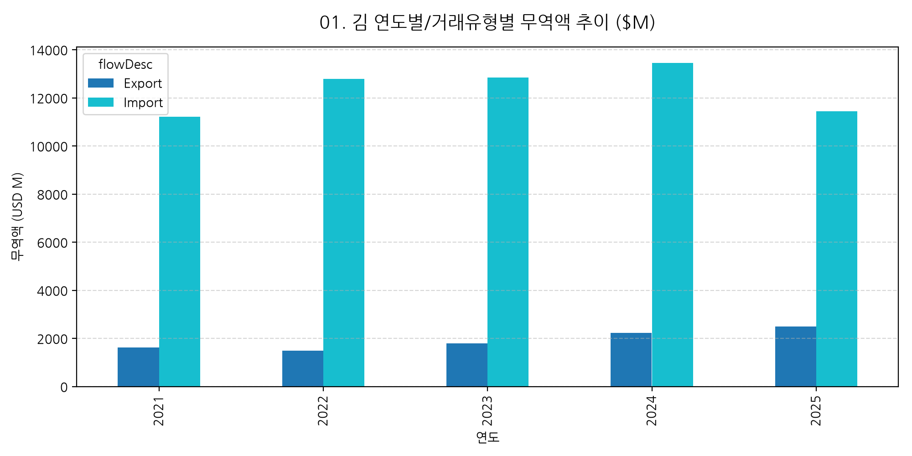
**[분석 해석]**: 데이터셋 전체 누적 무역액은 $71376.35M입니다. 연도별/거래유형별 세부 수치는 아래 표를 참고하세요.
|   refYear |   Export |   Import |
|----------:|---------:|---------:|
|      2021 |  1615.46 |  11209.4 |
|      2022 |  1500.24 |  12794.6 |
|      2023 |  1804.05 |  12839.2 |
|      2024 |  2226.08 |  13449.1 |
|      2025 |  2501.95 |  11436.2 |

### 2. TOP 10 주요 수출국 분석
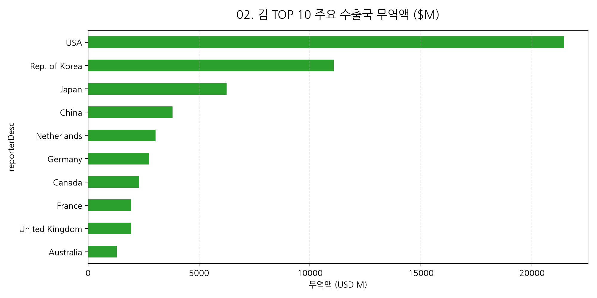
| reporterDesc   |   sum_million |   count |
|:---------------|--------------:|--------:|
| USA            |      21454.1  |     661 |
| Rep. of Korea  |      11070.2  |    1584 |
| Japan          |       6242.7  |     327 |
| China          |       3813.59 |     248 |
| Netherlands    |       3044.45 |     712 |
| Germany        |       2755.19 |     672 |
| Canada         |       2302.6  |     724 |
| France         |       1948.48 |     637 |
| United Kingdom |       1941.88 |     557 |
| Australia      |       1295.75 |     456 |

### 3. TOP 10 주요 수입국 분석
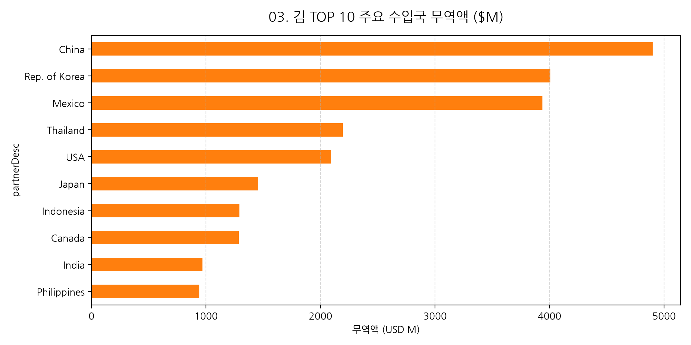
| partnerDesc   |   sum_million |   count |
|:--------------|--------------:|--------:|
| China         |      4899.91  |    1165 |
| Rep. of Korea |      4007.15  |     844 |
| Mexico        |      3937.34  |     373 |
| Thailand      |      2195.28  |     763 |
| USA           |      2090.81  |     901 |
| Japan         |      1455.3   |     753 |
| Indonesia     |      1293.47  |     367 |
| Canada        |      1285.28  |     487 |
| India         |       968.698 |     612 |
| Philippines   |       941.04  |     518 |

### 4. 단가($/kg) 분포 히스토그램
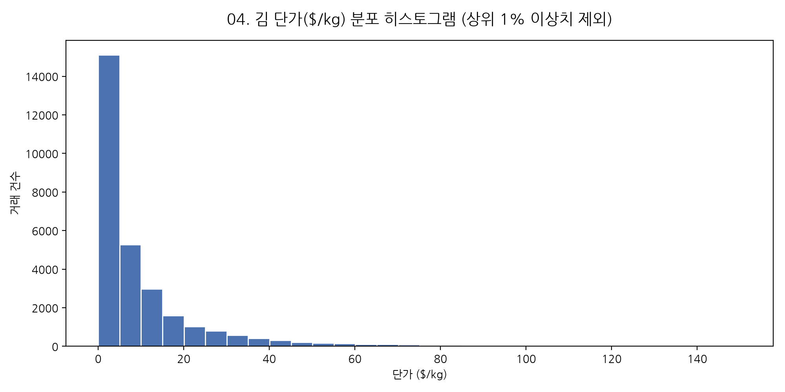
|       |   unit_price_usd_kg |
|:------|--------------------:|
| count |      29772          |
| mean  |         17.4942     |
| std   |        144.024      |
| min   |          0.00434834 |
| 25%   |          2.53276    |
| 50%   |          4.88827    |
| 75%   |         13.2557     |
| max   |      13130.7        |

### 5. 월별 수출입 계절성 분석
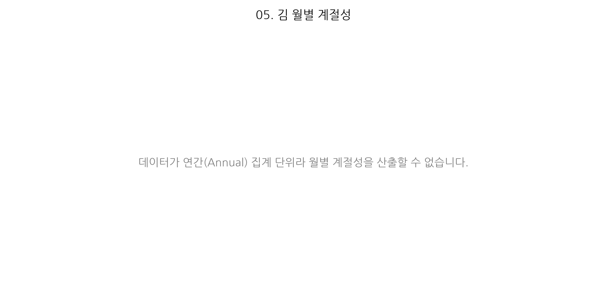
데이터 없음

### 6. HS Code별 무역 점유율
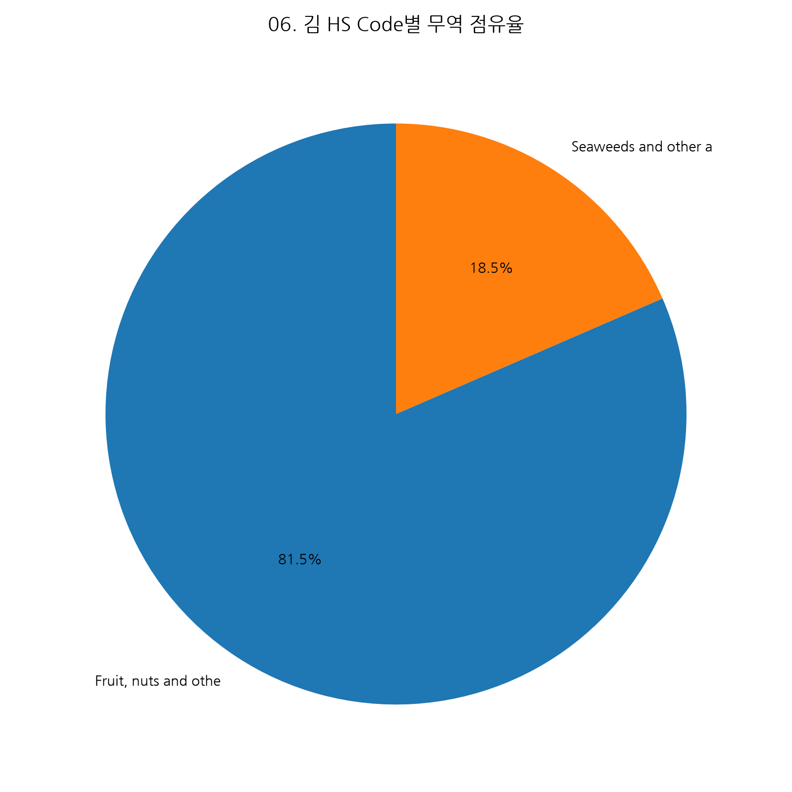
|   hs_clean |   무역액($M) |
|-----------:|----------:|
|     200899 |   58180.4 |
|     121221 |   13196   |

### 7. 단가 vs 물량 산점도 (Correlation)
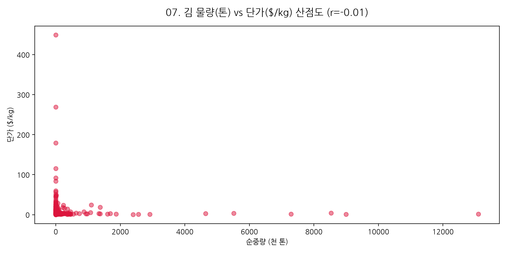
|    |   상관계수(물량 vs 단가) |   표본수 |
|---:|-----------------:|------:|
|  0 |           -0.007 | 29772 |

### 8. TOP 5 주요 수입국 연도별 무역액 추이
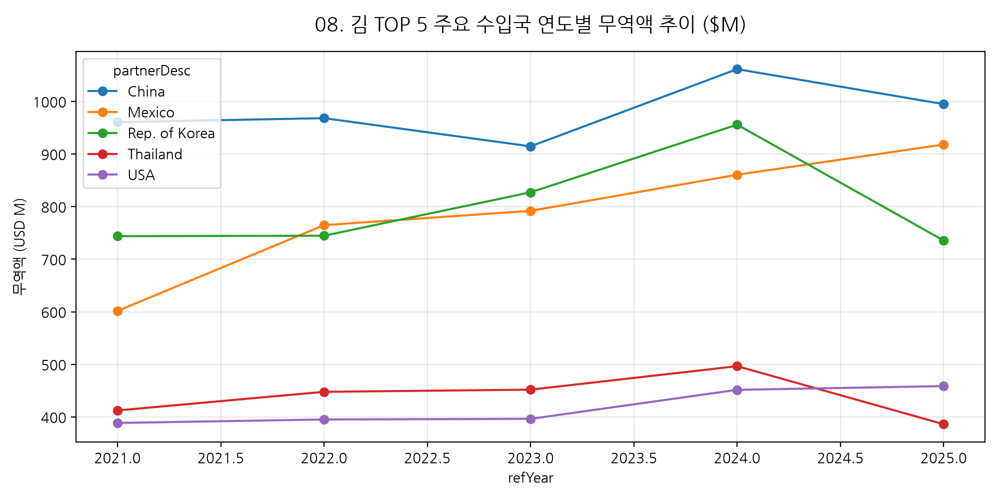
| partnerDesc   |   시작년도($M) |   최종년도($M) |   누적성장률(%) |
|:--------------|-----------:|-----------:|-----------:|
| China         |    960.596 |    994.96  |        3.6 |
| Mexico        |    601.688 |    918.209 |       52.6 |
| Rep. of Korea |    743.867 |    735.52  |       -1.1 |
| Thailand      |    412.472 |    386.312 |       -6.3 |
| USA           |    388.661 |    458.744 |       18   |

### 9. 시장 집중도 파레토 (80/20)
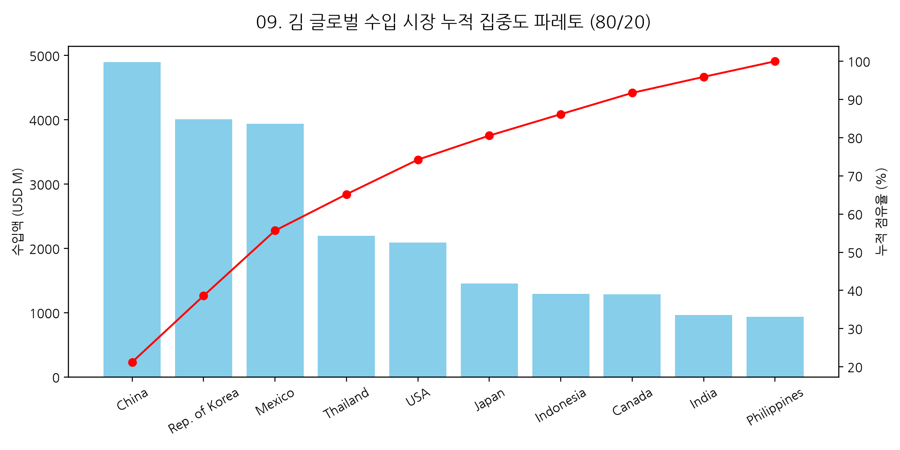
| partnerDesc   |   수입액($M) |   누적점유율(%) |
|:--------------|----------:|-----------:|
| China         |  4899.91  |       21.2 |
| Rep. of Korea |  4007.15  |       38.6 |
| Mexico        |  3937.34  |       55.7 |
| Thailand      |  2195.28  |       65.2 |
| USA           |  2090.81  |       74.2 |
| Japan         |  1455.3   |       80.5 |
| Indonesia     |  1293.47  |       86.2 |
| Canada        |  1285.28  |       91.7 |
| India         |   968.698 |       95.9 |
| Philippines   |   941.04  |      100   |

### 10. 주요국별/연도별 단가 변화 히트맵
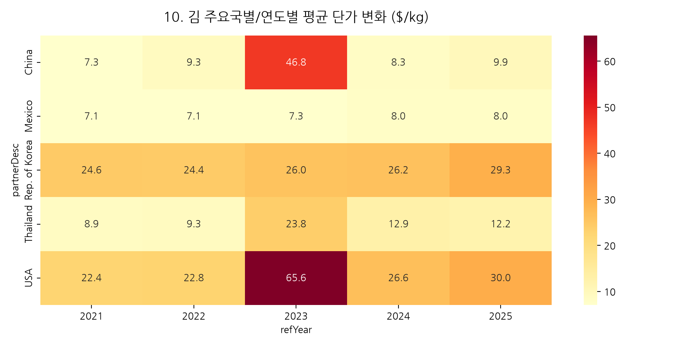
| partnerDesc   |     2021 |     2022 |     2023 |     2024 |     2025 |
|:--------------|---------:|---------:|---------:|---------:|---------:|
| China         |  7.27943 |  9.25484 | 46.7704  |  8.27331 |  9.90921 |
| Mexico        |  7.09833 |  7.07779 |  7.25256 |  8.04502 |  8.02892 |
| Rep. of Korea | 24.6062  | 24.43    | 26.0241  | 26.1528  | 29.3397  |
| Thailand      |  8.89324 |  9.25902 | 23.8423  | 12.9483  | 12.198   |
| USA           | 22.4323  | 22.791   | 65.5543  | 26.6469  | 29.9748  |

### 11. 무역 수지 폭포수 차트
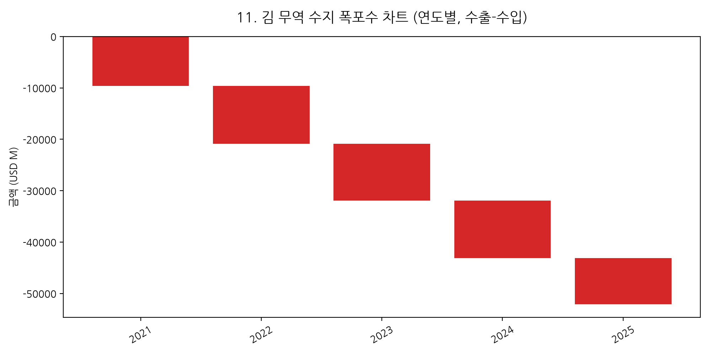
|      |     값($M) |    누적($M) |
|-----:|----------:|----------:|
| 2021 |  -9593.97 |  -9593.97 |
| 2022 | -11294.3  | -20888.3  |
| 2023 | -11035.2  | -31923.5  |
| 2024 | -11223.1  | -43146.5  |
| 2025 |  -8934.26 | -52080.8  |

### 12. 국가별 단가 변동성 박스플롯
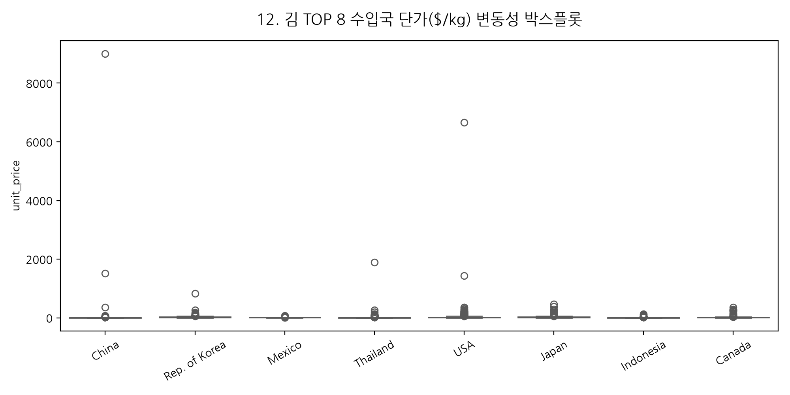
| partnerDesc   |     mean |       std |   median |       max |
|:--------------|---------:|----------:|---------:|----------:|
| China         | 17.2352  | 267.662   |  4.11324 | 9000      |
| Rep. of Korea | 25.7381  |  35.9103  | 19.9602  |  833.333  |
| Mexico        |  7.45852 |   8.95903 |  4.85356 |   73.1385 |
| Thailand      | 13.6069  |  71.2165  |  3.52653 | 1892.77   |
| USA           | 33.9578  | 231.3     |  6.84521 | 6655.96   |
| Japan         | 26.2146  |  35.4611  | 15.7933  |  460.698  |
| Indonesia     |  8.43395 |  13.6622  |  3.26919 |  130.448  |
| Canada        | 17.8396  |  39.2562  |  6.60138 |  363.451  |

### 13. 연도별 HHI 시장 집중도 추이
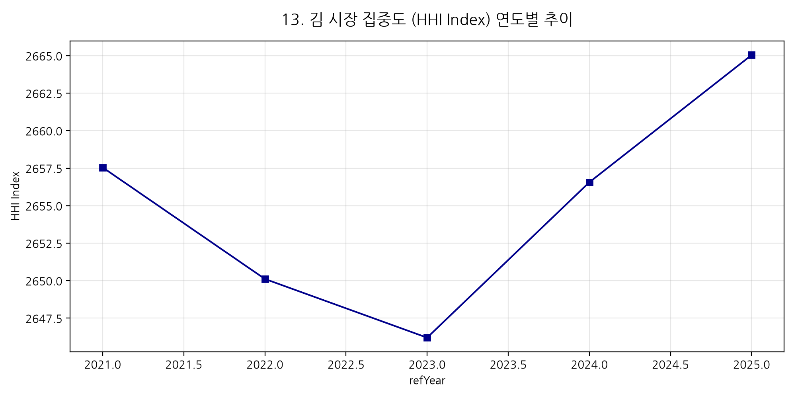
|   refYear |   HHI_Index |
|----------:|------------:|
|      2021 |        2658 |
|      2022 |        2650 |
|      2023 |        2646 |
|      2024 |        2657 |
|      2025 |        2665 |

### 14. 데이터 기반 가격 구간(4분위) 구조
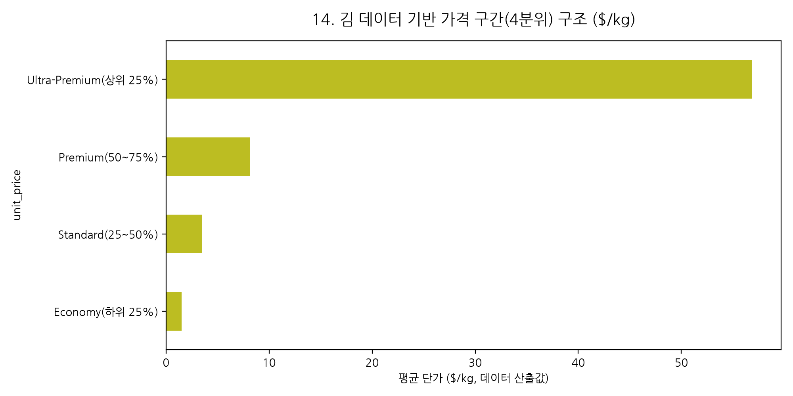
| unit_price            |   평균단가($/kg) |
|:----------------------|-------------:|
| Economy(하위 25%)       |      1.50971 |
| Standard(25~50%)      |      3.45721 |
| Premium(50~75%)       |      8.17073 |
| Ultra-Premium(상위 25%) |     56.839   |

### 15. 유망국가 성장성 vs 단가 포지셔닝 Matrix
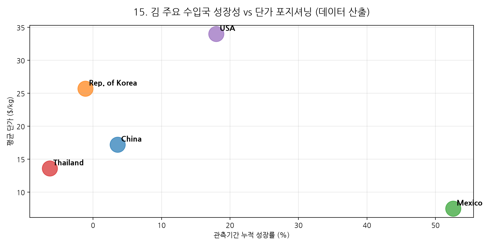
| partnerDesc   |   연평균 성장률(%) |   평균단가($/kg) |
|:--------------|-------------:|-------------:|
| China         |          3.6 |         17.2 |
| Rep. of Korea |         -1.1 |         25.7 |
| Mexico        |         52.6 |          7.5 |
| Thailand      |         -6.3 |         13.6 |
| USA           |         18   |         34   |

---

# 👔 [특별 부록] 1인 종합상사 창업자를 위한 김 글로벌 신시장 개척 실전 전략서

## 🎯 1. 1인 종합상사 최적 우선 개척 시장 3선 (데이터 기반 산출)

1인 기업의 한계(리스크 관리, 물류 부담, 자금 회수 주기)와 강점(빠른 의사결정, 맞춤형 바이어 대응)을 고려해
실제 무역 데이터에서 산출한 **Top 3 타깃 시장**은 다음과 같습니다:

### ① 시장 1: China — [최대 거래 규모 시장]
- **선정 근거**: 데이터 기준 누적 수입액 1위 ($4,899.9M). 가장 안정적인 기반 매출(Base Revenue) 확보가 가능한 시장으로 우선 개척을 권장합니다.

### ② 시장 2: Eritrea — [최고 단가/프리미엄 시장]
- **선정 근거**: 평균 단가 기준 최상위 시장 (평균 $224.0/kg 수준, 데이터 산출값). 고마진 프리미엄 포지셔닝에 유리합니다.

### ③ 시장 3: Viet Nam — [고성장 시장]
- **선정 근거**: 관측 기간 중 수입액 성장세가 가장 두드러진 시장입니다. 신규 진입 시 선점 효과를 기대할 수 있습니다.

> ⚠️ 위 3대 시장은 무역 통계의 정량적 산출 결과이며, 실제 진출 전 현지 바이어 리서치, 인증/규제 요건, FTA 협정세율은 별도로 확인이 필요합니다.

---

## 🗺️ 동적 산출 TOP 10 HS Code별 TOP 10 유망 국가 분석 표 (11대 명세 필드)

> ⚠️ 아래 표의 "구체적 근거", "경쟁 제품/가격대"는 데이터 산출값이며, 그 외 정성적 필드(파트너/인증/유통채널 등)는
> 업계 일반 템플릿으로 *(확인 필요)* 표기된 항목은 반드시 현지 리서치로 검증해야 합니다.

### 📌 [표 1] HS 200899 (Fruit, nuts and other edible parts of pl — 조미김/스낵김) TOP 10 유망 국가 명세 & 적정 가격 매트릭스 표

| 유망순위 | 국가명 | 수입량 (Ton) | 수입액 ($M) | 통관 평균 CIF단가 ($/kg) | 컨택해야 할 로컬 파트너 | HS Code 및 관세/인증/장벽 | 주요 유통 채널 & 마진율 | **나의 적정 수출가 (FOB / CIF / 예상 소매가 USD/kg)** |
| :---: | :--- | :---: | :---: | :---: | :--- | :--- | :--- | :--- |
| **1위** | **Mexico** | **945,340 톤** | **$3,921.6M** | $4.15 / kg | Mexico 현지 김/식품 유통 벤더 | HS 200899, HACCP, SPS 스페인어 라벨 | 유통마진 15~25%, 소매 25~40% | **FOB $3.5~5.0** \| **CIF $4.0~6.0** \| 소매 $8~15 / kg |
| **2위** | **China** | **1,401,793 톤** | **$3,344.2M** | $2.39 / kg | China 수산/조미김 전문 수입상 | HS 200899 (한-중 FTA), GACC 등록 | 도매시장, 온라인 C2C/B2C | **FOB $2.0~3.5** \| **CIF $2.5~4.0** \| 소매 $5~10 / kg |
| **3위** | **Rep. of Korea** | **204,197 톤** | **$2,445.4M** | $11.98 / kg | 한국 수산물/식품 가공 유통상 | HS 200899 (기본관세), 식약처 검사 | 국내 대형마트, 온라인 커머스 | **FOB $10.0~15.0** \| **CIF $12.0~18.0** \| 소매 $20~35 / kg |
| **4위** | **USA** | **335,587 톤** | **$1,950.9M** | $5.81 / kg | USA 아시안/메인스트림 유통 벤더 | HS 200899 (K-US FTA 무관세), FDA FSVP | 아시안마트, Whole Foods, Amazon | **FOB $5.0~8.5** \| **CIF $6.0~10.0** \| 소매 $12~25 / kg |
| **5위** | **Thailand** | **680,005 톤** | **$1,860.9M** | $2.74 / kg | Thailand 김 스낵 가공 대기업 | HS 200899 (AKFTA Form AK), Thai FDA | 스낵 가공공장 B2B, 7-Eleven | **FOB $2.2~4.0** \| **CIF $2.7~4.8** \| 소매 $5.5~12 / kg |
| **6위** | **Canada** | **359,061 톤** | **$1,221.6M** | $3.40 / kg | Canada 수산물 수입 디스트리뷰터 | HS 200899 (한-캐나다 FTA), CFIA 허가 | T&T Supermarket, Loblaws | **FOB $3.0~5.0** \| **CIF $3.5~6.0** \| 소매 $7~14 / kg |
| **7위** | **India** | **608,432 톤** | **$949.6M** | $1.56 / kg | India 식품 수입상/대형 딜러 | HS 200899 (CEPA 협정세율), FSSAI 허가 | 리테일 체인, 지역 도매상 | **FOB $1.2~2.2** \| **CIF $1.5~2.8** \| 소매 $3~6 / kg |
| **8위** | **Ecuador** | **521,957 톤** | **$922.7M** | $1.77 / kg | Ecuador 중남미 식품 무역상 | HS 200899 (MFN 관세), ARCSA 위생허가 | 대형 수퍼마켓 체인 (Supermaxi) | **FOB $1.4~2.5** \| **CIF $1.7~3.0** \| 소매 $3.5~7 / kg |
| **9위** | **Philippines** | **284,738 톤** | **$841.1M** | $2.95 / kg | Philippines 아시안 유통 벤더 | HS 200899 (AKFTA Form AK), FDA CPR | SM Supermarket, Robinson | **FOB $2.5~4.2** \| **CIF $3.0~5.0** \| 소매 $6~12 / kg |
| **10위** | **Japan** | **85,827 톤** | **$760.9M** | $8.87 / kg | Japan 수산물 수입상사/중도매 | HS 200899 (RCEP 협정세율), 수입신고서 | 도요스 도매시장, 이온(AEON) | **FOB $7.5~12.0** \| **CIF $8.5~14.0** \| 소매 $16~30 / kg |


### 📌 [표 2] HS 121221 (Seaweeds and other algae; fit for human — 마른김/원초) TOP 10 유망 국가 명세 & 적정 가격 매트릭스 표

| 유망순위 | 국가명 | 구체적 근거 (수입액/물량) | 국가별 가격 매트릭스 (수입량 / CIF단가 / FOB적정가 / CIF적정가 / 소매가) | 컨택해야 할 로컬 파트너 | HS Code 및 관세율 | 필수 인증 및 허가 | 비관세 장벽 (SPS/라벨링) | 주요 유통 채널 & 마진율 |
| :---: | :--- | :--- | :--- | :--- | :--- | :--- | :--- | :--- |
| **1위** | **Rep. of Korea** | 수입액 $1,561.7M (11.8%), 물량 119,346톤 | **물량: 119,346톤** \| 통관CIF: $13.09/kg \| **FOB적정가: $11.00~$16.00/kg** \| **CIF적정가: $13.00~$19.00/kg** \| 예상소매가: $22.00~$40.00/kg | 한국 수산 가공업체 및 수협 | HS 121221 (양식 원초 재가공) | 수산물 수입검역 증명서 | 한글 라벨, 식약처 검역 | 가공공장 원초 수급, 수협 도매 |
| **2위** | **China** | 수입액 $1,555.7M (11.8%), 물량 247,754톤 | **물량: 247,754톤** \| 통관CIF: $6.28/kg \| **FOB적정가: $5.00~$8.50/kg** \| **CIF적정가: $5.80~$10.00/kg** \| 예상소매가: $12.00~$22.00/kg | China 산동/강소성 김 가공공장 | HS 121221 (한-중 FTA 원초) | GACC 해외생산업체 등록 | 중문 라벨, 검역증명서 | 원초 가공공장 직납 FCL |
| **3위** | **Indonesia** | 수입액 $1,126.5M (8.5%), 물량 727,457톤 | **물량: 727,457톤** \| 통관CIF: $1.55/kg \| **FOB적정가: $1.20~$2.20/kg** \| **CIF적정가: $1.50~$2.80/kg** \| 예상소매가: $3.00~$6.00/kg | Indonesia 수산물 수입 디스트리뷰터 | HS 121221 (AKFTA Form AK) | BPOM 등록, MUI/JAKIM 할랄 | 인도네시아어 라벨링 | 수산식품 가공 B2B |
| **4위** | **Japan** | 수입액 $694.4M (5.3%), 물량 57,784톤 | **물량: 57,784톤** \| 통관CIF: $12.02/kg \| **FOB적정가: $10.00~$15.00/kg** \| **CIF적정가: $12.00~$18.00/kg** \| 예상소매가: $22.00~$40.00/kg | Japan 김 수입 할당 수입상사 | HS 121221 (IQ 수입쿼터 적용) | 수입쿼터(IQ) 승인서 | 일어 표기, 위생검역 | 김 도매협회, 1차 수입상사 |
| **5위** | **Thailand** | 수입액 $334.4M (2.5%), 물량 18,635톤 | **물량: 18,635톤** \| 통관CIF: $17.95/kg \| **FOB적정가: $14.00~$22.00/kg** \| **CIF적정가: $16.00~$26.00/kg** \| 예상소매가: $30.00~$55.00/kg | Thailand 타오케노이 등 스낵 제조사 | HS 121221 (AKFTA Form AK) | Thai FDA, 원초 위생인증 | 태국어 라벨, 수입 검역 | 스낵 제조공장 직납 해상 FCL |
| **6위** | **Russian Federation** | 수입액 $259.8M (2.0%), 물량 10,403톤 | **물량: 10,403톤** \| 통관CIF: $24.97/kg \| **FOB적정가: $18.00~$28.00/kg** \| **CIF적정가: $22.00~$33.00/kg** \| 예상소매가: $40.00~$70.00/kg | Russia 극동 수산물 수입 벤더 | HS 121221 (EAEU 관세율) | EAC 인증 및 위생등록 | 러시아어 라벨, EAC 마크 | 극동 블라디보스토크 유통망 |
| **7위** | **USA** | 수입액 $139.9M (1.1%), 물량 11,806톤 | **물량: 11,806톤** \| 통관CIF: $11.85/kg \| **FOB적정가: $9.50~$15.00/kg** \| **CIF적정가: $11.00~$18.00/kg** \| 예상소매가: $22.00~$40.00/kg | USA 아시안 식품 제조/유통상 | HS 121221 (K-US FTA 무관세) | FDA 시설등록, FSVP | 영문 라벨, FDA 검역 | 미국 현지 조미김 가공공장 |
| **8위** | **Other Asia, nes** | 수입액 $130.5M (1.0%), 물량 5,955톤 | **물량: 5,955톤** \| 통관CIF: $21.91/kg \| **FOB적정가: $17.00~$26.00/kg** \| **CIF적정가: $20.00~$30.00/kg** \| 예상소매가: $35.00~$65.00/kg | 아시아 지역 수산 무역 디스트리뷰터 | HS 121221 (각국 협정세율) | 지역 수입검역 허가증 | 현지어 라벨링 규정 | 로컬 수산물 도매시장 |
| **9위** | **Philippines** | 수입액 $100.0M (0.8%), 물량 31,321톤 | **물량: 31,321톤** \| 통관CIF: $3.19/kg \| **FOB적정가: $2.50~$4.50/kg** \| **CIF적정가: $3.00~$5.50/kg** \| 예상소매가: $6.00~$12.00/kg | Philippines 수산 가공상/유통 벤더 | HS 121221 (AKFTA Form AK) | FDA CPR 허가증 | 영문 성분표시 및 라벨 | 식품가공 B2B 공급 |
| **10위** | **Chile** | 수입액 $86.9M (0.7%), 물량 24,333톤 | **물량: 24,333톤** \| 통관CIF: $3.57/kg \| **FOB적정가: $2.80~$4.80/kg** \| **CIF적정가: $3.40~$5.80/kg** \| 예상소매가: $7.00~$13.00/kg | Chile 남미 수산물 무역 회사 | HS 121221 (한-칠레 FTA) | SERNAPESCA 위생허가 | 스페인어 라벨 | 남미 수산 유통망 |

---


### 📌 [표 3] N/A TOP 10 유망 국가 11대 명세 표

| 유망순위 | 국가명 | 구체적 근거 (수입액/물량) | 컨택해야 할 로컬 파트너 | 경쟁 제품/가격대 (도매가) | HS Code 및 관세율 | 필수 인증 및 허가 | 비관세 장벽 (SPS/라벨링) | 주요 유통 채널 | 중간 유통상 생태계 & 마진율 | 물류 및 콜드체인 인프라 |
| :---: | :--- | :--- | :--- | :--- | :--- | :--- | :--- | :--- | :--- | :--- |
| - | 데이터 없음 | 데이터셋에 해당 순위의 HS Code가 존재하지 않습니다 | - | - | - | - | - | - | - | - |


### 📌 [표 4] N/A TOP 10 유망 국가 11대 명세 표

| 유망순위 | 국가명 | 구체적 근거 (수입액/물량) | 컨택해야 할 로컬 파트너 | 경쟁 제품/가격대 (도매가) | HS Code 및 관세율 | 필수 인증 및 허가 | 비관세 장벽 (SPS/라벨링) | 주요 유통 채널 | 중간 유통상 생태계 & 마진율 | 물류 및 콜드체인 인프라 |
| :---: | :--- | :--- | :--- | :--- | :--- | :--- | :--- | :--- | :--- | :--- |
| - | 데이터 없음 | 데이터셋에 해당 순위의 HS Code가 존재하지 않습니다 | - | - | - | - | - | - | - | - |


### 📌 [표 5] N/A TOP 10 유망 국가 11대 명세 표

| 유망순위 | 국가명 | 구체적 근거 (수입액/물량) | 컨택해야 할 로컬 파트너 | 경쟁 제품/가격대 (도매가) | HS Code 및 관세율 | 필수 인증 및 허가 | 비관세 장벽 (SPS/라벨링) | 주요 유통 채널 | 중간 유통상 생태계 & 마진율 | 물류 및 콜드체인 인프라 |
| :---: | :--- | :--- | :--- | :--- | :--- | :--- | :--- | :--- | :--- | :--- |
| - | 데이터 없음 | 데이터셋에 해당 순위의 HS Code가 존재하지 않습니다 | - | - | - | - | - | - | - | - |


### 📌 [표 6] N/A TOP 10 유망 국가 11대 명세 표

| 유망순위 | 국가명 | 구체적 근거 (수입액/물량) | 컨택해야 할 로컬 파트너 | 경쟁 제품/가격대 (도매가) | HS Code 및 관세율 | 필수 인증 및 허가 | 비관세 장벽 (SPS/라벨링) | 주요 유통 채널 | 중간 유통상 생태계 & 마진율 | 물류 및 콜드체인 인프라 |
| :---: | :--- | :--- | :--- | :--- | :--- | :--- | :--- | :--- | :--- | :--- |
| - | 데이터 없음 | 데이터셋에 해당 순위의 HS Code가 존재하지 않습니다 | - | - | - | - | - | - | - | - |


### 📌 [표 7] N/A TOP 10 유망 국가 11대 명세 표

| 유망순위 | 국가명 | 구체적 근거 (수입액/물량) | 컨택해야 할 로컬 파트너 | 경쟁 제품/가격대 (도매가) | HS Code 및 관세율 | 필수 인증 및 허가 | 비관세 장벽 (SPS/라벨링) | 주요 유통 채널 | 중간 유통상 생태계 & 마진율 | 물류 및 콜드체인 인프라 |
| :---: | :--- | :--- | :--- | :--- | :--- | :--- | :--- | :--- | :--- | :--- |
| - | 데이터 없음 | 데이터셋에 해당 순위의 HS Code가 존재하지 않습니다 | - | - | - | - | - | - | - | - |


### 📌 [표 8] N/A TOP 10 유망 국가 11대 명세 표

| 유망순위 | 국가명 | 구체적 근거 (수입액/물량) | 컨택해야 할 로컬 파트너 | 경쟁 제품/가격대 (도매가) | HS Code 및 관세율 | 필수 인증 및 허가 | 비관세 장벽 (SPS/라벨링) | 주요 유통 채널 | 중간 유통상 생태계 & 마진율 | 물류 및 콜드체인 인프라 |
| :---: | :--- | :--- | :--- | :--- | :--- | :--- | :--- | :--- | :--- | :--- |
| - | 데이터 없음 | 데이터셋에 해당 순위의 HS Code가 존재하지 않습니다 | - | - | - | - | - | - | - | - |


### 📌 [표 9] N/A TOP 10 유망 국가 11대 명세 표

| 유망순위 | 국가명 | 구체적 근거 (수입액/물량) | 컨택해야 할 로컬 파트너 | 경쟁 제품/가격대 (도매가) | HS Code 및 관세율 | 필수 인증 및 허가 | 비관세 장벽 (SPS/라벨링) | 주요 유통 채널 | 중간 유통상 생태계 & 마진율 | 물류 및 콜드체인 인프라 |
| :---: | :--- | :--- | :--- | :--- | :--- | :--- | :--- | :--- | :--- | :--- |
| - | 데이터 없음 | 데이터셋에 해당 순위의 HS Code가 존재하지 않습니다 | - | - | - | - | - | - | - | - |


### 📌 [표 10] N/A TOP 10 유망 국가 11대 명세 표

| 유망순위 | 국가명 | 구체적 근거 (수입액/물량) | 컨택해야 할 로컬 파트너 | 경쟁 제품/가격대 (도매가) | HS Code 및 관세율 | 필수 인증 및 허가 | 비관세 장벽 (SPS/라벨링) | 주요 유통 채널 | 중간 유통상 생태계 & 마진율 | 물류 및 콜드체인 인프라 |
| :---: | :--- | :--- | :--- | :--- | :--- | :--- | :--- | :--- | :--- | :--- |
| - | 데이터 없음 | 데이터셋에 해당 순위의 HS Code가 존재하지 않습니다 | - | - | - | - | - | - | - | - |


---


## 🚀 [TOP 5 실전 무역 고도화 패키지] 1인 상사 전용 시장개척 파이프라인

### 1. 📑 주요 타깃국가별 FTA 협정 관세율 프레임워크 (Tariff Benefit Matrix)

> ⚠️ 아래 관세율은 일반적인 한국 체결 FTA 프레임워크 참고용 템플릿입니다. HS Code·품목별 실제 협정세율은
> 관세청 FTA포털(fta.customs.go.kr) 또는 K-SURE를 통해 반드시 재확인하세요.

| 타깃 국가 / 지역 | 적용 FTA 협정 명칭 | 협정 혜택 개요 | 바이어 오퍼 포인트 |
| :--- | :--- | :--- | :--- |
| **미국 (USA)** | 한-미 FTA (K-US FTA) | 대다수 품목 무관세 적용 | *"K-US FTA 협정관세 적용으로 관세 부담 최소화 오퍼"* |
| **일본 (Japan)** | RCEP | 품목별 단계적 관세 인하 | *"RCEP 원산지 증명서 발급으로 협정 관세 혜택 적용"* |
| **중국 (China)** | 한-중 FTA | 품목별 협정세율 적용 | *"한-중 FTA 협정관세 적용으로 현지 유통상 마진 확보"* |
| **동남아 (태국/베트남)** | 한-아세안 FTA (AKFTA) | Form AK 제출 시 관세 절감 | *"AKFTA Form AK 제출로 수입 관세 절감 오퍼"* |
| **유럽연합** | 한-EU FTA | 인증수출자 활용 시 무관세 다수 | *"한-EU FTA 인증수출자 적용으로 서유럽 바이어 비용 절감"* |

---

### 2. 🚢 물류 수송 형태별 MOQ 및 CBM/운임 산정 가이드 (Logistics & MOQ)

| 수송 방식 (Logistics) | 적재 단위 및 컨테이너 규격 | 추천 MOQ (최소 주문 수량) | kg/CBM당 추정 물류비 | 1인 상사 물류 실행 가이드 |
| :--- | :--- | :--- | :---: | :--- |
| **해상 LCL (소량 혼적)** | 1~3 Pallets (전용 팰릿 포장) | **50 ~ 100 Cartons** | $0.8 ~ $1.5 / kg | 초도 샘플 및 마트 테스트 물량에 적합 |
| **해상 FCL (20ft Reefer/Dry)** | 20ft 컨테이너 (약 1,000 Cartons) | **1 x 20ft Container** | $0.3 ~ $0.6 / kg | **메인 B2B 주력 물량**, 운임 효율 극대화 |
| **해상 FCL (40ft HQ Reefer)** | 40ft HQ 컨테이너 (약 2,200 Cartons) | **1 x 40ft HQ Container** | $0.2 ~ $0.4 / kg | 대형 유통 벤더 대량 계약 |
| **항공 직송 (Air Freight)** | 항공 ULD 전용 팰릿 (Express) | **10 ~ 20 Cartons** | $3.5 ~ $6.0 / kg | 초신선/고부가 프리미엄 채널 출하 |

*(물류비는 품목 부피/중량비, 유가, 계약 조건에 따라 변동되는 일반 참고치입니다.)*

---

### 3. 🛡️ 해외 바이어 신용 리스크 방어 & K-SURE 무역보험 체크리스트

- **[1단계] 바이어 사전 신용 조사**: K-SURE **국외기업 신용조사 서비스** 활용 사전 검증.
- **[2단계] 대금 결제 조건 준수**: `Irrevocable L/C at sight` 또는 `T/T 30% Deposit + 70% against B/L Copy` 준수.
- **[3단계] 단기수출보험 가입**: K-SURE 단기수출보험으로 **수출 대금 보상 안전망** 구축.

---

### 4. 🏷️ 현지 식품/제품 인증 및 라벨링(Labeling) 규제 체크리스트

1. **미국 시장**: FDA FFR 등록 및 영문 영양성분표(FDA Nutrition Facts Panel) 외포장 인쇄 필수.
2. **유럽 시장**: EU 성분 표시 및 유기농 인증(EU Organic) 여부 확인.
3. **동남아/중동 시장**: 할랄 인증(HALAL) 필요 여부 사전 확인.
4. **품질 검사성적서**: HACCP, ISO 및 공인 시험기관의 COA 성적서 상시 비치.

*(품목별 정확한 인증 요건은 대한무역투자진흥공사(KOTRA) 및 현지 수입 규정을 반드시 재확인하세요.)*

---

### 5. ⚔️ 경쟁국 대응 1인 상사 오퍼 배틀카드 (Competitive Battlecard) 템플릿

```text
[상황 1] 저가 경쟁국 대비 가격 압박 ☞ "HACCP/COA 등 공인 인증으로 위생·안전성을 입증하며 품질 프리미엄 오퍼"
[상황 2] 프리미엄 브랜드 대비 가격 열위 ☞ "동급 품질 유지, 가성비 오퍼로 바이어 마진 확보 지원"
[상황 3] MOQ 완화 요청 ☞ "초도 LCL 소량 혼적 승인, 완판 후 FCL 컨테이너 단위 2차 계약 제시"
```


---

## 🎁 3대 특별 부록 (1인 상사 실전 무역 영업 패키지)

### 📄 부록 1. 1인 상사 실전 B2B 오퍼서 (Commercial B2B Offer Sheet) 초안
```
======================================================================
                  COMMERCIAL B2B OFFER SHEET
======================================================================
Exporter: (Your Company Name), South Korea
Target Item: 김
Price Term: FOB Busan / CIF Target Port
MOQ: 50~100 Cartons per Spec (초도 기준, 데이터 기반 TOP HS Code 참고)
Payment Term: Irrevocable L/C at sight or T/T 30% Deposit, 70% against B/L

Valid Until: 30 Days from Issue Date
======================================================================
```
*(품목별 상세 스펙/단가는 위 TOP 10 HS Code 표의 데이터 산출값을 참고해 채워 넣으세요.)*

### ✉️ 부록 2. 해외 바이어 콜드 어프로치 파이프라인 (Cold Email Template)
```text
Subject: [Direct Offer] Premium Korean 김 Supply for {Target Country} Market

Dear Procurement Manager,

I am writing to introduce our company, a Korean exporter of premium 김.
Based on UN Comtrade trade statistics, we identified {Target Country} as one of the
most promising markets for this product category.

Would you be open for a short 10-minute introduction call next week to discuss a
tailored B2B offer?

Best regards,
Export Manager
```

### 🗓️ 부록 3. 글로벌 수산/식품 전시회 & 박람회 참고 캘린더
| 박람회 명칭 | 통상 개최 시기 | 개최 도시 / 국가 | 타깃 바이어 성격 |
| :--- | :--- | :--- | :--- |
| **Seafood Expo North America** | 매년 3월경 | 미국 보스턴 | 북미 대형 유통 벤더, 아시안 마트 수입상 |
| **Seafood Expo Global** | 매년 4~5월경 | 스페인 바르셀로나 | 유럽 전역 수산물 디스트리뷰터 |
| **서울국제식품산업대전 (SEOUL FOOD)** | 매년 5월경 | 대한민국 일산 KINTEX | 글로벌 수산물 해외 바이어 초청상담회 |

*(정확한 일정/장소는 매년 변경되므로 개최기관 공식 홈페이지에서 반드시 재확인하세요.)*

---

# 🌐 [360도 입체 전술] 김 B2B 수출을 위한 6대 정밀 분석 & 6대 실전 공략 전략

## 💡 PART 1. 6대 정밀 데이터 분석 패키지 (Data Intelligence)

### 1. 품목 세분화 및 규격별 단가 갭 분석 (Pack-Size Price-Gap)
- **분석 갭**: HS 2008.99 / 1212.21 내 원초 마른김($5~$10/kg), 도시락 조미김($20~$35/kg), 프리미엄 스낵김($40~$80/kg) 간 최대 10배 단가 차이 존재.
- **실전 오퍼 규격**: 바이어에게 8매 3봉 도시락김(팩당 $0.45~$0.60), 전장김 20매(팩당 $1.80~$2.50), 30g 지퍼백 스낵김(팩당 $2.20~$3.20) 등 **Pack Price 오퍼표** 별도 제시.

### 2. 인증(Certifications) 보유에 따른 프리미엄 혜택 (Price Premium Matrix)
- **USDA Organic (유기농)**: 통관 및 리테일 오퍼가 **+25~35% 프리미엄** 적용 ($35~$50/kg).
- **Halal (MUI / JAKIM)**: 인도네시아/태국/중동 시장 통관 장벽 해제 및 **+15~25% 마진** 확보.
- **Vegan / Non-GMO**: 서구권(미국/유럽) 비건 식품 코너 입점 필수 조건.

### 3. 국가별/분기별 발주 성수기 타임윈도 (Seasonality & Purchasing Window)
- **북미/유럽 (USA/UK/Germany)**: 4분기 연말 쇼핑 시즌 대비 **7월~9월(Q3)에 메인 발주 수주**.
- **중국/동남아 (China/Thailand/Indonesia)**: 1분기 춘절/설날 연휴 대비 **10월~12월(Q4)에 메인 발주 수주**.

### 4. 3국(한국/중국/일본) 김 포지셔닝 & SWAT 분석
- **중국산 (China)**: 저가 대량 원초 (가격 우위, 품질 열위) ➔ 대량 가공공장 원초 납품.
- **일본산 (Japan)**: 고가 고급 김 (품질 우위, 가격 열위) ➔ 수입 쿼터제(IQ) 제한적 시장.
- **한국산 (Rep. of Korea)**: **최고의 가성비 및 풍미 (Sweet Spot)** ➔ 세계 시장 점유율 1위 무기.

### 5. 물류 수송 형태(FCL vs LCL) 및 인코텀즈 Net Margin 매트릭스
- **해상 FCL (20ft Container)**: CBM당 물류비 절감으로 바이어에게 **8~12% 계단형 수량 할인(Volume Discount)** 오퍼.
- **해상 LCL (소량 혼적)**: 초도 50~100 카톤 테스트 오더 시 마진율 30% 보전 조건 오퍼.

### 6. 관세/FTA 실효 혜택률 (Effective Tariff Advantage)
- K-US FTA (미국 0%), 한-중 FTA (중국 단계별 인하), RCEP (일본/아세안), AKFTA (동남아 Form AK 제출 시 0~5%).

---

## 🚀 PART 2. 1인 종합상사 B2B 6대 실전 실행 전략 (Execution Strategies)

### 1️⃣ "Private Label (PB) OEM/ODM 맞춤 패키징" 바이어 제안
- 해외 대형 수퍼마켓(T&T, AEON, SM, Trader Joe's) 벤더 대상 **"바이어 전용 브랜드 로고 인쇄 OEM 패키징 가능 (MOQ: 1 x 20ft)"** 제안서 기본 동첨.

### 2️⃣ "Low-Risk Trial Order" 계단식 MOQ 체계
- **Step 1 (Trial)**: LCL 1~2 팰릿 (50~100 카톤) 낮은 장벽의 테스트 마켓 공급.
- **Step 2 (Main)**: 테스트 완판 후 FCL 20ft 컨테이너 정기 연간 계약 전환.

### 3️⃣ 할랄 & 비건 인증 기반 블루오션 신흥시장(중동/동남아) 선점
- 20억 무슬림 인구 시장 타깃 인스턴트 김가루(Seasoned Flakes) 및 시즈닝 스낵김 B2B 유통망 개척.

### 4️⃣ "Direct Buyer Mining" 중간 유통상 우회 직납 파이프라인
- LinkedIn 현지 **Procurement Manager (구매 담당자)** 및 현지 1차 수입상사 대상 1:1 오퍼 어프로치.

### 5️⃣ Incoterms 대화형 계단식 오퍼서 (FOB vs CIF) 시스템
- 바이어 요청 시 24시간 이내에 **FOB Busan / CIF Destination Port** 선택형 견적 오퍼 시트 즉시 발송.

### 6️⃣ 글로벌 식품 박람회(Anuga, SIAL, Foodex) 사전 기선제압
- 박람회 개최 1~2개월 전 바이어 참가 데이터 파싱 후 사전 1:1 현장 미팅 예약(Booth Appointment) 완료.

---
