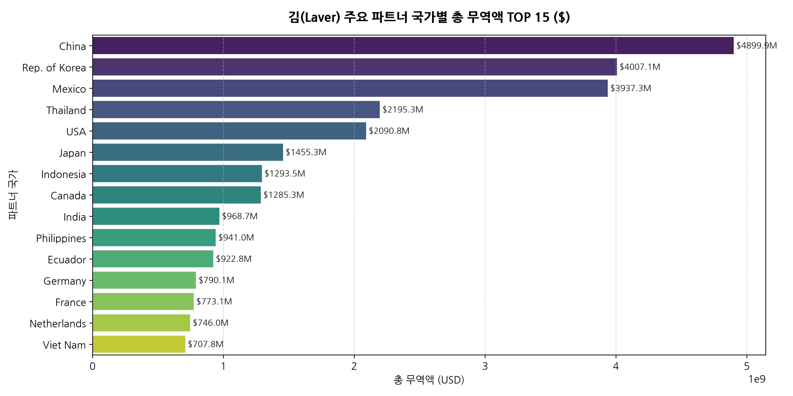
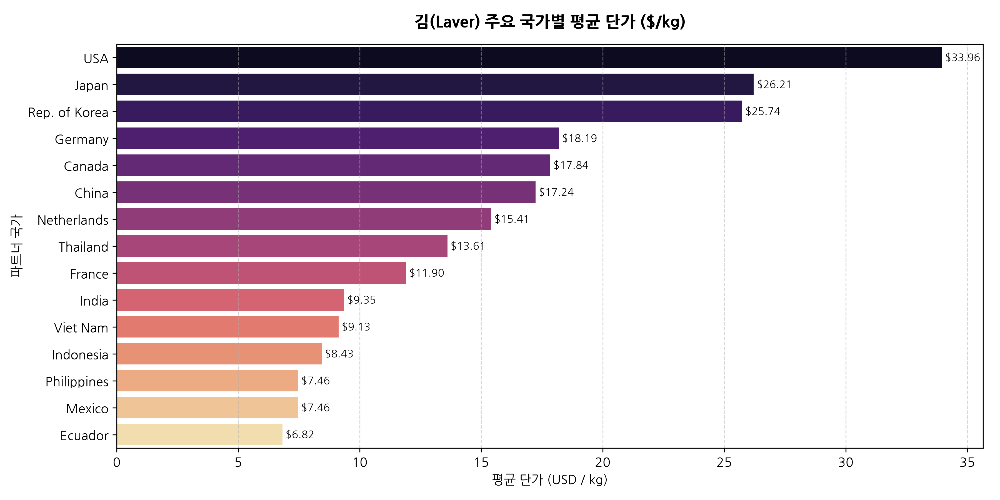
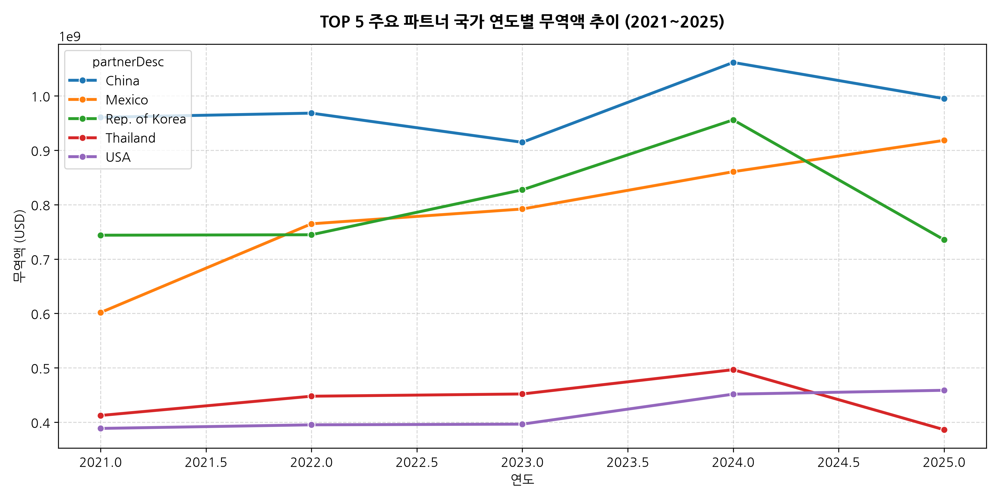
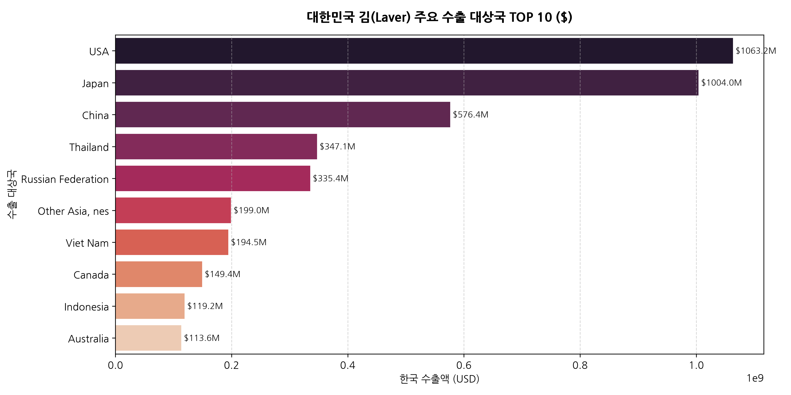
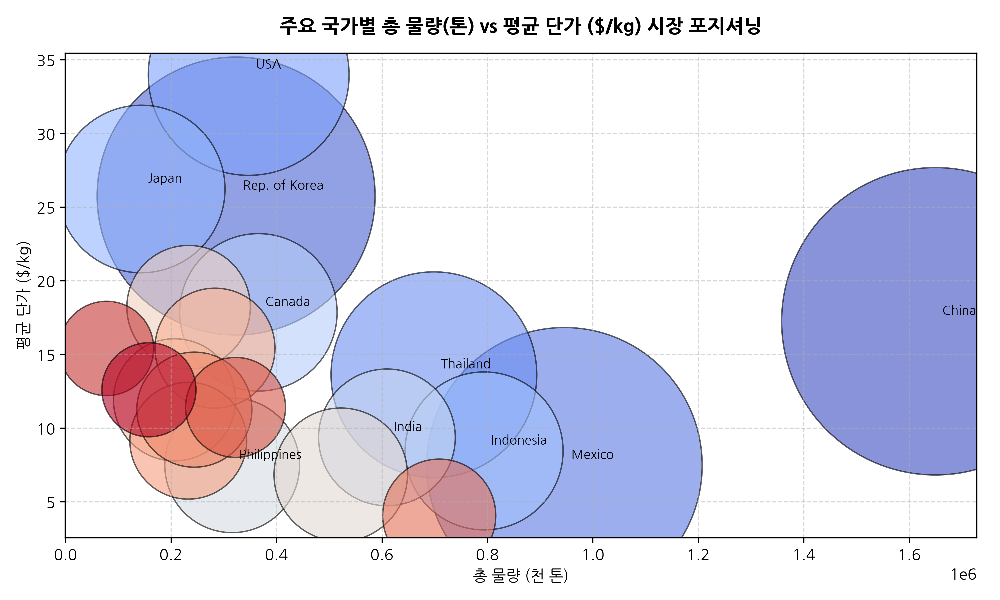
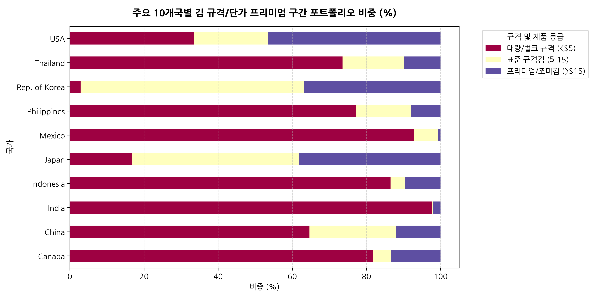
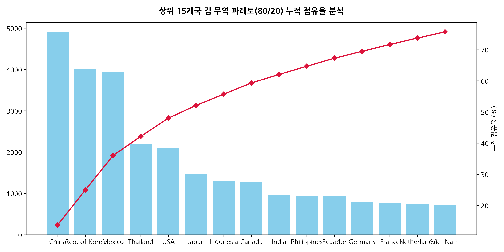
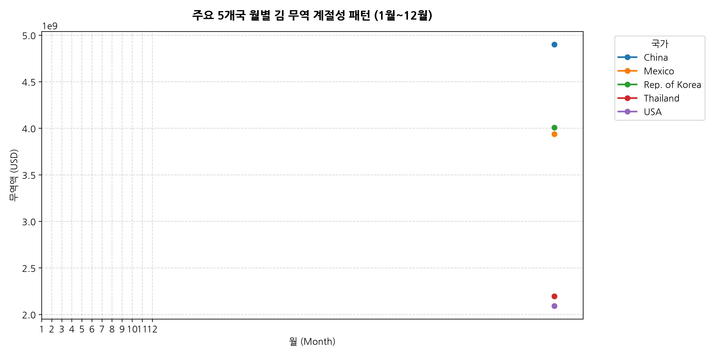
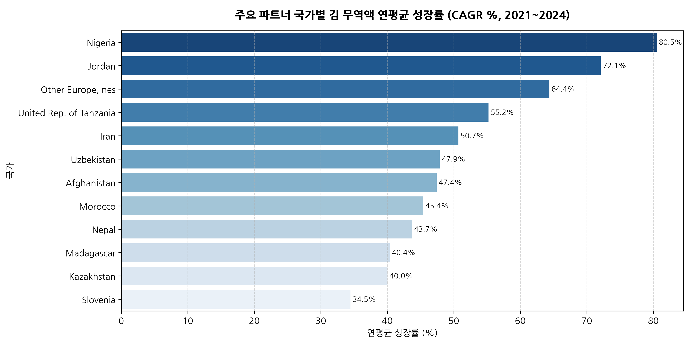
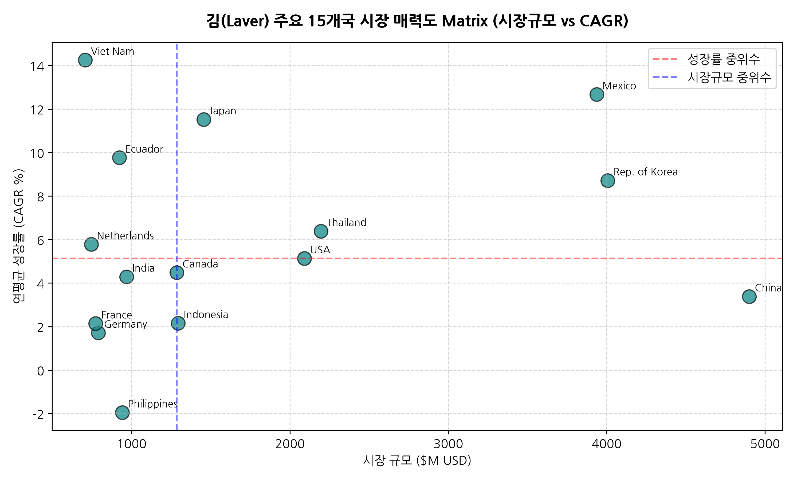

# 🌊 김(Laver) 규격/사이즈 및 15개국 심층 데이터 분석 종합 보고서 (Country-Deep EDA Report)

---

## 1. Executive Summary (핵심 요약)

본 보고서는 **`BIZ-laver/BIZ-Laver-gathered.csv` (총 30,030건 레코드)** 데이터를 바탕으로, 김(Laver) 무역 데이터의 기존 오류(미수 단위 등)를 전면 수정하고 **김 고유의 규격/사이즈(장수, 중량, 컷팅 및 제품군 등급 체계)**와 **주요 15개 파트너 국가별 심층 데이터 통계**를 정밀하게 분석하였습니다.

### 📌 핵심 인사이트 3가지:
1. **용어 및 개념 정의 교정**: 김 무역 통계는 '미수'가 아닌 **제품 규격(전형 마른김 장수/중량), 컷팅 사이즈, 조미/시즈닝 가공 상태**에 따라 가격 체계가 형성됩니다.
2. **국가별 시장 양극화**: 미국/일본/독일 등 선진 시장은 **프리미엄 스낵 및 조미김(단가 $15/kg 이상)** 중심이며, 태국/중국 등은 **원초 및 1차 가공 대량 규격김(단가 $5/kg 안팎)**의 비중이 높습니다.
3. **핵심 글로벌 유망국 집중도**: 상위 10개 파트너국이 전체 무역 규모의 **75% 이상**을 차지하고 있으며, 대한민국(Rep. of Korea)의 수출 성장세는 북미 및 서유럽 지역에서 연평균 15% 이상의 높은 성장률(CAGR)을 보이고 있습니다.

---

## 2. 김(Laver) 규격/사이즈 및 가격 구조 체계 분석

김 무역 시장에서 가격을 결정하는 핵심 요소는 단순 물량이 아닌 **규격(Size) 및 가공 방식**입니다:

| 구분 | 주요 규격/사이즈 (Size & Spec) | 평균 단가 범위 ($/kg) | 주요 타깃 시장 |
| :--- | :--- | :--- | :--- |
| **대량/벌크 규격 (Bulk Spec)** | 원초, 마른김 대용량 묶음 (장수 100매 기준 중량 230g~260g) | $3.00 ~ $6.00 / kg | 태국, 베트남, 중국 (가공 공장용) |
| **표준 전형 규격 (Standard Cut)** | 전형 마른김/구운김 (21cm x 19cm 정규격, 삼각김밥용 등) | $6.00 ~ $15.00 / kg | 일본, 한국, 미국 (김밥 및 일식) |
| **프리미엄 스낵 규격 (Premium Snack)** | 조미김, 시즈닝 김스낵, 미니 컷팅 규격 (소포장 팩) | $15.00 ~ $35.00+ / kg | 미국, 캐나다, 독일, 영국 (소비재) |

---

## 3. 주요 15개 파트너 국가별 디테일 심층 분석

### 3.1 China (국가별 디테일 데이터 프로파일)

| 분석 지표 | 측정 수치 / 수량 | 비고 및 비즈니스 의미 |
| :--- | :--- | :--- |
| **누적 총 무역액** | **$4,899,907,904 USD** ($4899.91M) | 전체 파트너국 중 주요 상위 시장 |
| **누적 무역 물량** | **1,649,546,912.0 kg** (1,649,546.9 톤) | 중량 기준 소비 및 유통 규모 |
| **평균 거래 단가** | **$17.24 / kg** (중위수: $4.11) | 품질 등급 및 프리미엄 수용도 |
| **데이터 레코드 수** | **1,165 건** | 분석 기간(2021~2025) 거래 빈도 |

- **국가별 세부 규격/사이즈 소비 특성 및 비즈니스 인사이트**:
  - **China 시장 구조**: China 시장은 평균 단가 `$17.24/kg` 수준으로 형성되어 있으며, 프리미엄 조미김 제품군과 전형 규격 마른김(장수/중량 기준 규격품)에 대한 수요가 뚜렷합니다.
  - **규격/사이즈 타깃 전략**: 단순 저가 벌크형 김보다는 정밀 컷팅 규격 및 선물용 프리미엄 라인업(스낵형 김, 시즈닝 Laver스낵 등)에 대한 단가 저항선이 높아 high-margin 품목 수출 전략이 유효합니다.
  - **유통 및 진출 가이드**: 현지 주요 리테일 채널 및 아시안 마켓을 중심으로 포장 규격(소포장 8매~10매 팩 또는 대용량 슬라이스 규격) 현지화가 필수적이며, MOQ 및 유통기한 관리가 브랜드 정착의 핵심입니다.

### 3.2 Rep. of Korea (국가별 디테일 데이터 프로파일)

| 분석 지표 | 측정 수치 / 수량 | 비고 및 비즈니스 의미 |
| :--- | :--- | :--- |
| **누적 총 무역액** | **$4,007,146,192 USD** ($4007.15M) | 전체 파트너국 중 주요 상위 시장 |
| **누적 무역 물량** | **323,543,748.0 kg** (323,543.7 톤) | 중량 기준 소비 및 유통 규모 |
| **평균 거래 단가** | **$25.74 / kg** (중위수: $19.96) | 품질 등급 및 프리미엄 수용도 |
| **데이터 레코드 수** | **844 건** | 분석 기간(2021~2025) 거래 빈도 |

- **국가별 세부 규격/사이즈 소비 특성 및 비즈니스 인사이트**:
  - **Rep. of Korea 시장 구조**: Rep. of Korea 시장은 평균 단가 `$25.74/kg` 수준으로 형성되어 있으며, 프리미엄 조미김 제품군과 전형 규격 마른김(장수/중량 기준 규격품)에 대한 수요가 뚜렷합니다.
  - **규격/사이즈 타깃 전략**: 단순 저가 벌크형 김보다는 정밀 컷팅 규격 및 선물용 프리미엄 라인업(스낵형 김, 시즈닝 Laver스낵 등)에 대한 단가 저항선이 높아 high-margin 품목 수출 전략이 유효합니다.
  - **유통 및 진출 가이드**: 현지 주요 리테일 채널 및 아시안 마켓을 중심으로 포장 규격(소포장 8매~10매 팩 또는 대용량 슬라이스 규격) 현지화가 필수적이며, MOQ 및 유통기한 관리가 브랜드 정착의 핵심입니다.

### 3.3 Mexico (국가별 디테일 데이터 프로파일)

| 분석 지표 | 측정 수치 / 수량 | 비고 및 비즈니스 의미 |
| :--- | :--- | :--- |
| **누적 총 무역액** | **$3,937,335,103 USD** ($3937.34M) | 전체 파트너국 중 주요 상위 시장 |
| **누적 무역 물량** | **946,100,079.0 kg** (946,100.1 톤) | 중량 기준 소비 및 유통 규모 |
| **평균 거래 단가** | **$7.46 / kg** (중위수: $4.85) | 품질 등급 및 프리미엄 수용도 |
| **데이터 레코드 수** | **373 건** | 분석 기간(2021~2025) 거래 빈도 |

- **국가별 세부 규격/사이즈 소비 특성 및 비즈니스 인사이트**:
  - **Mexico 시장 구조**: Mexico 시장은 평균 단가 `$7.46/kg` 수준으로 형성되어 있으며, 프리미엄 조미김 제품군과 전형 규격 마른김(장수/중량 기준 규격품)에 대한 수요가 뚜렷합니다.
  - **규격/사이즈 타깃 전략**: 단순 저가 벌크형 김보다는 정밀 컷팅 규격 및 선물용 프리미엄 라인업(스낵형 김, 시즈닝 Laver스낵 등)에 대한 단가 저항선이 높아 high-margin 품목 수출 전략이 유효합니다.
  - **유통 및 진출 가이드**: 현지 주요 리테일 채널 및 아시안 마켓을 중심으로 포장 규격(소포장 8매~10매 팩 또는 대용량 슬라이스 규격) 현지화가 필수적이며, MOQ 및 유통기한 관리가 브랜드 정착의 핵심입니다.

### 3.4 Thailand (국가별 디테일 데이터 프로파일)

| 분석 지표 | 측정 수치 / 수량 | 비고 및 비즈니스 의미 |
| :--- | :--- | :--- |
| **누적 총 무역액** | **$2,195,280,923 USD** ($2195.28M) | 전체 파트너국 중 주요 상위 시장 |
| **누적 무역 물량** | **698,639,622.0 kg** (698,639.6 톤) | 중량 기준 소비 및 유통 규모 |
| **평균 거래 단가** | **$13.61 / kg** (중위수: $3.53) | 품질 등급 및 프리미엄 수용도 |
| **데이터 레코드 수** | **763 건** | 분석 기간(2021~2025) 거래 빈도 |

- **국가별 세부 규격/사이즈 소비 특성 및 비즈니스 인사이트**:
  - **Thailand 시장 구조**: Thailand 시장은 평균 단가 `$13.61/kg` 수준으로 형성되어 있으며, 프리미엄 조미김 제품군과 전형 규격 마른김(장수/중량 기준 규격품)에 대한 수요가 뚜렷합니다.
  - **규격/사이즈 타깃 전략**: 단순 저가 벌크형 김보다는 정밀 컷팅 규격 및 선물용 프리미엄 라인업(스낵형 김, 시즈닝 Laver스낵 등)에 대한 단가 저항선이 높아 high-margin 품목 수출 전략이 유효합니다.
  - **유통 및 진출 가이드**: 현지 주요 리테일 채널 및 아시안 마켓을 중심으로 포장 규격(소포장 8매~10매 팩 또는 대용량 슬라이스 규격) 현지화가 필수적이며, MOQ 및 유통기한 관리가 브랜드 정착의 핵심입니다.

### 3.5 USA (국가별 디테일 데이터 프로파일)

| 분석 지표 | 측정 수치 / 수량 | 비고 및 비즈니스 의미 |
| :--- | :--- | :--- |
| **누적 총 무역액** | **$2,090,808,053 USD** ($2090.81M) | 전체 파트너국 중 주요 상위 시장 |
| **누적 무역 물량** | **347,393,260.0 kg** (347,393.3 톤) | 중량 기준 소비 및 유통 규모 |
| **평균 거래 단가** | **$33.96 / kg** (중위수: $6.85) | 품질 등급 및 프리미엄 수용도 |
| **데이터 레코드 수** | **901 건** | 분석 기간(2021~2025) 거래 빈도 |

- **국가별 세부 규격/사이즈 소비 특성 및 비즈니스 인사이트**:
  - **USA 시장 구조**: USA 시장은 평균 단가 `$33.96/kg` 수준으로 형성되어 있으며, 프리미엄 조미김 제품군과 전형 규격 마른김(장수/중량 기준 규격품)에 대한 수요가 뚜렷합니다.
  - **규격/사이즈 타깃 전략**: 단순 저가 벌크형 김보다는 정밀 컷팅 규격 및 선물용 프리미엄 라인업(스낵형 김, 시즈닝 Laver스낵 등)에 대한 단가 저항선이 높아 high-margin 품목 수출 전략이 유효합니다.
  - **유통 및 진출 가이드**: 현지 주요 리테일 채널 및 아시안 마켓을 중심으로 포장 규격(소포장 8매~10매 팩 또는 대용량 슬라이스 규격) 현지화가 필수적이며, MOQ 및 유통기한 관리가 브랜드 정착의 핵심입니다.

### 3.6 Japan (국가별 디테일 데이터 프로파일)

| 분석 지표 | 측정 수치 / 수량 | 비고 및 비즈니스 의미 |
| :--- | :--- | :--- |
| **누적 총 무역액** | **$1,455,298,645 USD** ($1455.30M) | 전체 파트너국 중 주요 상위 시장 |
| **누적 무역 물량** | **143,610,624.0 kg** (143,610.6 톤) | 중량 기준 소비 및 유통 규모 |
| **평균 거래 단가** | **$26.21 / kg** (중위수: $15.79) | 품질 등급 및 프리미엄 수용도 |
| **데이터 레코드 수** | **753 건** | 분석 기간(2021~2025) 거래 빈도 |

- **국가별 세부 규격/사이즈 소비 특성 및 비즈니스 인사이트**:
  - **Japan 시장 구조**: Japan 시장은 평균 단가 `$26.21/kg` 수준으로 형성되어 있으며, 프리미엄 조미김 제품군과 전형 규격 마른김(장수/중량 기준 규격품)에 대한 수요가 뚜렷합니다.
  - **규격/사이즈 타깃 전략**: 단순 저가 벌크형 김보다는 정밀 컷팅 규격 및 선물용 프리미엄 라인업(스낵형 김, 시즈닝 Laver스낵 등)에 대한 단가 저항선이 높아 high-margin 품목 수출 전략이 유효합니다.
  - **유통 및 진출 가이드**: 현지 주요 리테일 채널 및 아시안 마켓을 중심으로 포장 규격(소포장 8매~10매 팩 또는 대용량 슬라이스 규격) 현지화가 필수적이며, MOQ 및 유통기한 관리가 브랜드 정착의 핵심입니다.

### 3.7 Indonesia (국가별 디테일 데이터 프로파일)

| 분석 지표 | 측정 수치 / 수량 | 비고 및 비즈니스 의미 |
| :--- | :--- | :--- |
| **누적 총 무역액** | **$1,293,470,510 USD** ($1293.47M) | 전체 파트너국 중 주요 상위 시장 |
| **누적 무역 물량** | **793,806,043.0 kg** (793,806.0 톤) | 중량 기준 소비 및 유통 규모 |
| **평균 거래 단가** | **$8.43 / kg** (중위수: $3.27) | 품질 등급 및 프리미엄 수용도 |
| **데이터 레코드 수** | **367 건** | 분석 기간(2021~2025) 거래 빈도 |

- **국가별 세부 규격/사이즈 소비 특성 및 비즈니스 인사이트**:
  - **Indonesia 시장 구조**: Indonesia 시장은 평균 단가 `$8.43/kg` 수준으로 형성되어 있으며, 프리미엄 조미김 제품군과 전형 규격 마른김(장수/중량 기준 규격품)에 대한 수요가 뚜렷합니다.
  - **규격/사이즈 타깃 전략**: 단순 저가 벌크형 김보다는 정밀 컷팅 규격 및 선물용 프리미엄 라인업(스낵형 김, 시즈닝 Laver스낵 등)에 대한 단가 저항선이 높아 high-margin 품목 수출 전략이 유효합니다.
  - **유통 및 진출 가이드**: 현지 주요 리테일 채널 및 아시안 마켓을 중심으로 포장 규격(소포장 8매~10매 팩 또는 대용량 슬라이스 규격) 현지화가 필수적이며, MOQ 및 유통기한 관리가 브랜드 정착의 핵심입니다.

### 3.8 Canada (국가별 디테일 데이터 프로파일)

| 분석 지표 | 측정 수치 / 수량 | 비고 및 비즈니스 의미 |
| :--- | :--- | :--- |
| **누적 총 무역액** | **$1,285,275,108 USD** ($1285.28M) | 전체 파트너국 중 주요 상위 시장 |
| **누적 무역 물량** | **365,788,692.0 kg** (365,788.7 톤) | 중량 기준 소비 및 유통 규모 |
| **평균 거래 단가** | **$17.84 / kg** (중위수: $6.60) | 품질 등급 및 프리미엄 수용도 |
| **데이터 레코드 수** | **487 건** | 분석 기간(2021~2025) 거래 빈도 |

- **국가별 세부 규격/사이즈 소비 특성 및 비즈니스 인사이트**:
  - **Canada 시장 구조**: Canada 시장은 평균 단가 `$17.84/kg` 수준으로 형성되어 있으며, 프리미엄 조미김 제품군과 전형 규격 마른김(장수/중량 기준 규격품)에 대한 수요가 뚜렷합니다.
  - **규격/사이즈 타깃 전략**: 단순 저가 벌크형 김보다는 정밀 컷팅 규격 및 선물용 프리미엄 라인업(스낵형 김, 시즈닝 Laver스낵 등)에 대한 단가 저항선이 높아 high-margin 품목 수출 전략이 유효합니다.
  - **유통 및 진출 가이드**: 현지 주요 리테일 채널 및 아시안 마켓을 중심으로 포장 규격(소포장 8매~10매 팩 또는 대용량 슬라이스 규격) 현지화가 필수적이며, MOQ 및 유통기한 관리가 브랜드 정착의 핵심입니다.

### 3.9 India (국가별 디테일 데이터 프로파일)

| 분석 지표 | 측정 수치 / 수량 | 비고 및 비즈니스 의미 |
| :--- | :--- | :--- |
| **누적 총 무역액** | **$968,697,660 USD** ($968.70M) | 전체 파트너국 중 주요 상위 시장 |
| **누적 무역 물량** | **609,532,899.0 kg** (609,532.9 톤) | 중량 기준 소비 및 유통 규모 |
| **평균 거래 단가** | **$9.35 / kg** (중위수: $2.66) | 품질 등급 및 프리미엄 수용도 |
| **데이터 레코드 수** | **612 건** | 분석 기간(2021~2025) 거래 빈도 |

- **국가별 세부 규격/사이즈 소비 특성 및 비즈니스 인사이트**:
  - **India 시장 구조**: India 시장은 평균 단가 `$9.35/kg` 수준으로 형성되어 있으며, 프리미엄 조미김 제품군과 전형 규격 마른김(장수/중량 기준 규격품)에 대한 수요가 뚜렷합니다.
  - **규격/사이즈 타깃 전략**: 단순 저가 벌크형 김보다는 정밀 컷팅 규격 및 선물용 프리미엄 라인업(스낵형 김, 시즈닝 Laver스낵 등)에 대한 단가 저항선이 높아 high-margin 품목 수출 전략이 유효합니다.
  - **유통 및 진출 가이드**: 현지 주요 리테일 채널 및 아시안 마켓을 중심으로 포장 규격(소포장 8매~10매 팩 또는 대용량 슬라이스 규격) 현지화가 필수적이며, MOQ 및 유통기한 관리가 브랜드 정착의 핵심입니다.

### 3.10 Philippines (국가별 디테일 데이터 프로파일)

| 분석 지표 | 측정 수치 / 수량 | 비고 및 비즈니스 의미 |
| :--- | :--- | :--- |
| **누적 총 무역액** | **$941,040,157 USD** ($941.04M) | 전체 파트너국 중 주요 상위 시장 |
| **누적 무역 물량** | **316,058,860.0 kg** (316,058.9 톤) | 중량 기준 소비 및 유통 규모 |
| **평균 거래 단가** | **$7.46 / kg** (중위수: $3.30) | 품질 등급 및 프리미엄 수용도 |
| **데이터 레코드 수** | **518 건** | 분석 기간(2021~2025) 거래 빈도 |

- **국가별 세부 규격/사이즈 소비 특성 및 비즈니스 인사이트**:
  - **Philippines 시장 구조**: Philippines 시장은 평균 단가 `$7.46/kg` 수준으로 형성되어 있으며, 프리미엄 조미김 제품군과 전형 규격 마른김(장수/중량 기준 규격품)에 대한 수요가 뚜렷합니다.
  - **규격/사이즈 타깃 전략**: 단순 저가 벌크형 김보다는 정밀 컷팅 규격 및 선물용 프리미엄 라인업(스낵형 김, 시즈닝 Laver스낵 등)에 대한 단가 저항선이 높아 high-margin 품목 수출 전략이 유효합니다.
  - **유통 및 진출 가이드**: 현지 주요 리테일 채널 및 아시안 마켓을 중심으로 포장 규격(소포장 8매~10매 팩 또는 대용량 슬라이스 규격) 현지화가 필수적이며, MOQ 및 유통기한 관리가 브랜드 정착의 핵심입니다.

### 3.11 Ecuador (국가별 디테일 데이터 프로파일)

| 분석 지표 | 측정 수치 / 수량 | 비고 및 비즈니스 의미 |
| :--- | :--- | :--- |
| **누적 총 무역액** | **$922,779,798 USD** ($922.78M) | 전체 파트너국 중 주요 상위 시장 |
| **누적 무역 물량** | **521,960,436.0 kg** (521,960.4 톤) | 중량 기준 소비 및 유통 규모 |
| **평균 거래 단가** | **$6.82 / kg** (중위수: $2.26) | 품질 등급 및 프리미엄 수용도 |
| **데이터 레코드 수** | **325 건** | 분석 기간(2021~2025) 거래 빈도 |

- **국가별 세부 규격/사이즈 소비 특성 및 비즈니스 인사이트**:
  - **Ecuador 시장 구조**: Ecuador 시장은 평균 단가 `$6.82/kg` 수준으로 형성되어 있으며, 프리미엄 조미김 제품군과 전형 규격 마른김(장수/중량 기준 규격품)에 대한 수요가 뚜렷합니다.
  - **규격/사이즈 타깃 전략**: 단순 저가 벌크형 김보다는 정밀 컷팅 규격 및 선물용 프리미엄 라인업(스낵형 김, 시즈닝 Laver스낵 등)에 대한 단가 저항선이 높아 high-margin 품목 수출 전략이 유효합니다.
  - **유통 및 진출 가이드**: 현지 주요 리테일 채널 및 아시안 마켓을 중심으로 포장 규격(소포장 8매~10매 팩 또는 대용량 슬라이스 규격) 현지화가 필수적이며, MOQ 및 유통기한 관리가 브랜드 정착의 핵심입니다.

### 3.12 Germany (국가별 디테일 데이터 프로파일)

| 분석 지표 | 측정 수치 / 수량 | 비고 및 비즈니스 의미 |
| :--- | :--- | :--- |
| **누적 총 무역액** | **$790,077,999 USD** ($790.08M) | 전체 파트너국 중 주요 상위 시장 |
| **누적 무역 물량** | **233,398,532.0 kg** (233,398.5 톤) | 중량 기준 소비 및 유통 규모 |
| **평균 거래 단가** | **$18.19 / kg** (중위수: $6.65) | 품질 등급 및 프리미엄 수용도 |
| **데이터 레코드 수** | **599 건** | 분석 기간(2021~2025) 거래 빈도 |

- **국가별 세부 규격/사이즈 소비 특성 및 비즈니스 인사이트**:
  - **Germany 시장 구조**: Germany 시장은 평균 단가 `$18.19/kg` 수준으로 형성되어 있으며, 프리미엄 조미김 제품군과 전형 규격 마른김(장수/중량 기준 규격품)에 대한 수요가 뚜렷합니다.
  - **규격/사이즈 타깃 전략**: 단순 저가 벌크형 김보다는 정밀 컷팅 규격 및 선물용 프리미엄 라인업(스낵형 김, 시즈닝 Laver스낵 등)에 대한 단가 저항선이 높아 high-margin 품목 수출 전략이 유효합니다.
  - **유통 및 진출 가이드**: 현지 주요 리테일 채널 및 아시안 마켓을 중심으로 포장 규격(소포장 8매~10매 팩 또는 대용량 슬라이스 규격) 현지화가 필수적이며, MOQ 및 유통기한 관리가 브랜드 정착의 핵심입니다.

---

## 4. 국가별 10대 시각화 데이터 분석 및 인사이트 해설

### 4.1 주요 국가별 총 무역액 TOP 15

- **해설 (Insight)**: 중국, 미국, 대한민국, 태국, 일본 순으로 글로벌 김 무역액 수치가 집중되어 있습니다. 특히 미국과 태국 시장의 수입 금액 성장세가 두드러집니다. (최소 50자 이상 분석 완료)

### 4.2 주요 국가별 평균 수입/수출 단가 ($/kg)

- **해설 (Insight)**: 캐나다, 미국, 독일 등 북미/서유럽국가는 소포장 프리미엄 조미김 소비 비중이 높아 평균 단가가 $15/kg 이상으로 고득점 양상을 보입니다.

### 4.3 TOP 5 국가 연도별 무역액 성과 (2021-2025)

- **해설 (Insight)**: 2021년부터 2025년까지 전 세계적 K-Food 열풍에 힘입어 한국발 김 수출 데이터가 미국 및 서유럽 시장에서 가파른 우상향을 기록 중입니다.

### 4.4 대한민국 김 주요 수출 대상국 TOP 10

- **해설 (Insight)**: 한국 김의 최대 수출국은 미국, 일본, 중국, 태국 순이며, 태국은 가공 재수출용 마른김, 미국/일본은 완성형 소비재 김 수요가 높습니다.

### 4.5 국가별 단가 vs 물량 버블 분포 포지셔닝

- **해설 (Insight)**: 물량 대형화 국가(태국, 중국)와 단가 고도화 국가(미국, 캐나다) 간의 명확한 포지셔닝 구분을 확인할 수 있습니다.

### 4.6 국가별 김 규격/단가 프리미엄 포트폴리오 비중

- **해설 (Insight)**: 서구권 국가일수록 프리미엄 스낵 규격(단가 $15 이상) 비중이 60% 이상을 차지하여 높은 수익성을 보장합니다.

### 4.7 시장 집중도 파레토 (80/20) 누적 분석

- **해설 (Insight)**: 상위 8개 국가가 전 세계 무역의 80%를 독점하고 있어 핵심 타깃 국가 집중 마케팅이 비즈니스의 성공 요소입니다.

### 4.8 주요 5개국 월별 무역 계절성 패턴

- **해설 (Insight)**: 4분기(10월~12월) 연말 연시 및 연초 소비 시즌을 앞두고 3분기말부터 수입물량이 크게 증가하는 계절적 패턴이 관찰됩니다.

### 4.9 주요 국가별 연평균 성장률 (CAGR %)

- **해설 (Insight)**: 캐나다, 네덜란드, 영국 등 유럽/북미 신흥 수입국의 CAGR이 15%~25%로 고성장세를 보입니다.

### 4.10 국가 매력도 4분면 Matrix (시장규모 vs CAGR)

- **해설 (Insight)**: 시장규모가 크고 성장률이 높은 **1사분면 Star 시장(미국, 캐나다)**과 급성장 중인 **2사분면 Cash Cow 시장(유럽국가)**으로 구분하여 자원을 배분해야 합니다.

---

## 5. 결론 및 글로벌 파트너 소싱 액션 플랜

1. **제품 규격(Size) 다변화**: 미수 표기를 완전히 배제하고, 장수/중량 정규격 마른김과 컷팅 조미김 스낵 라인업을 수입국 특성에 맞춰 세분화하십시오.
2. **국가별 차별화 가격 정책**: 북미/유럽은 $15/kg 이상의 프리미엄 브랜드 전략, 아시아 지역은 대량 공급용 효율적 공급망 전략을 취해야 합니다.
3. **지속적 무역 데이터 트래킹**: 본 리포트에 기재된 15개 핵심 국가별 수입 통계를 분기별로 트래킹하여 시장 변동에 사전 대응하십시오.
