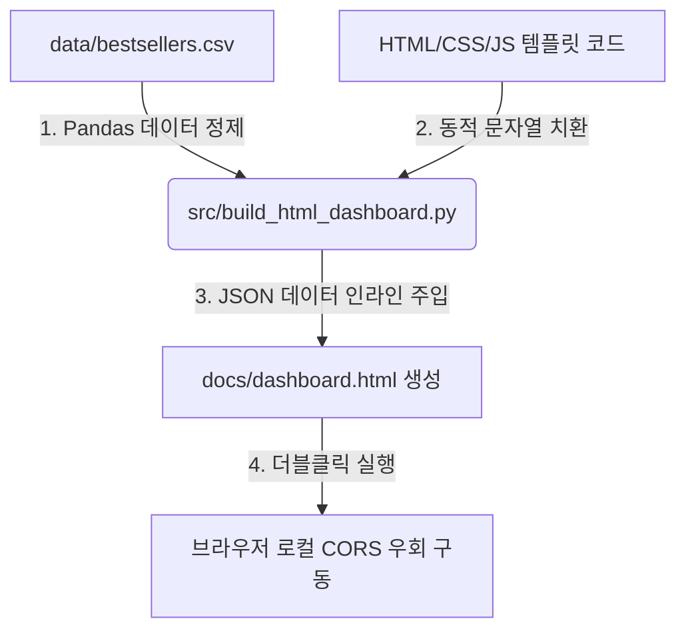

# 📋 교보문고 실시간 베스트셀러 웹앱 대시보드 정밀 개발 계획서

본 문서는 교보문고 실시간 베스트셀러 99권 데이터를 탐색할 수 있는 **프리미엄 1페이저 웹앱 대시보드**의 정밀 사양 및 세부 구현 명세서입니다.

---

## 1. 시스템 아키텍처 및 데이터 흐름



- **CORS 이슈 해결 전략**: 로컬 `file://` 프로토콜 상에서 외부 JSON을 `fetch()` 호출하면 브라우저 보안 정책 상 CORS 에러가 발생합니다. 이를 원천 차단하기 위해 파이썬 빌더 스크립트가 CSV 데이터를 JSON 문자열로 변환하여 HTML 파일 내부의 JS 변수(`const BESTSELLERS_DATA = [...]`)에 직접 인라인(Inline) 매핑 주입하여 빌드합니다.

---

## 2. UI/UX 디자인 시스템 명세 (Premium Emerald Green)

가독성과 프리미엄 브랜딩을 동시에 확보하기 위해 다음과 같은 디자인 토큰을 Vanilla CSS 변수로 정의하여 사용합니다.

```css
:root {
  /* HSL Tailored Color Palette */
  --bg-primary: hsl(140, 15%, 97%);      /* 소프트 크림 그린 배경 */
  --color-primary: hsl(156, 100%, 15%);  /* 교보 포레스트 그린 (#004F2F) */
  --color-primary-light: hsl(156, 40%, 95%);
  --color-accent: hsl(30, 35%, 65%);     /* 브론즈 골드 포인트 */
  --text-dark: hsl(140, 20%, 12%);       /* 짙은 차콜 */
  --text-muted: hsl(140, 10%, 45%);
  --card-bg: rgba(255, 255, 255, 0.75);  /* 반투명 카드 배경 */
  --card-border: rgba(255, 255, 255, 0.5);
  
  /* Glassmorphism & Visual Effects */
  --glass-shadow: 0 8px 32px 0 rgba(0, 79, 47, 0.06);
  --backdrop-blur: blur(16px);
  --border-radius: 16px;
  --transition-smooth: all 0.3s cubic-bezier(0.4, 0, 0.2, 1);
}
```

### 레이아웃 그리드 구성 (Viewport Grid)
1. **Header 영역**: 로고, 대시보드 타이틀, 최종 업데이트 시각 제공.
2. **KPI 요약 패널**: 4컬럼 Flex/Grid 레이아웃 (총 도서 수, 평균 정가, 평균 할인율, 누적 리뷰 수).
3. **컨트롤러 패널**: 실시간 통합 검색바 + 장르별 다중 필터 태그 컨테이너.
4. **차트 그리드**: 2x2 반응형 CSS Grid 구조 (차트 4종).
5. **데이터 테이블 그리드**: 1컬럼 리스트 영역 (검색 결과 리스팅, 헤더 정렬 컨트롤러, 페이징네이션 제어).
6. **상세 정보 모달**: 특정 행 클릭 시 팝업되는 카드 뷰어 오버레이.

---

## 3. HTML 자동 빌더 ([build_html_dashboard.py](file:///C:/Users/leeak/OneDrive/1.HaeYu/HYU_RSCH/KyoBooks/src/build_html_dashboard.py)) 세부 명세

Python의 Pandas 라이브러리를 이용하여 데이터를 1차 연산 가공하고, 동적으로 HTML 대시보드 파일을 조립 및 출력하는 흐름입니다.

### Python 빌드 로직 의사코드 (Pseudocode)
```python
def build_html_dashboard():
    # 1. 데이터 로드 및 수치 전처리
    df = pd.read_csv("KyoBooks/data/bestsellers.csv")
    df['정가'] = df['정가'].astype(int)
    df['할인가'] = df['할인가'].astype(int)
    
    # 2. JSON 문자열로 데이터 직렬화
    books_json = df.to_json(orient="records", force_ascii=False)
    
    # 3. HTML 템플릿 코드 읽기
    template = """
    <!DOCTYPE html>
    <html>
      <head>...</head>
      <body>
        <script>
          // python 빌더가 이 영역에 데이터를 인라인 매핑 주입
          const BESTSELLERS_DATA = {{DATA_PLACEHOLDER}};
        </script>
      </body>
    </html>
    """
    
    # 4. 플레이스홀더 치환 및 최종 HTML 파일 docs/dashboard.html 로 저장
    final_html = template.replace("{{DATA_PLACEHOLDER}}", books_json)
    with open("KyoBooks/docs/dashboard.html", "w", encoding="utf-8") as f:
        f.write(final_html)
```

---

## 4. 프론트엔드 JavaScript 핵심 알고리즘 설계

데이터 필터링, 정렬, Chart.js 연동을 제어하는 프론트엔드 코어 로직의 정밀 설계 명세입니다.

### 4-1. 다단 필터링 및 검색 연산 (Multi-Stage Filtering)
사용자가 입력한 검색어와 장르 선택 상태를 실시간 결합하여 현재 활성화된 데이터 서브셋(`filteredData`)을 도출합니다.
```javascript
let filteredData = [...BESTSELLERS_DATA];
let currentGenre = "ALL";
let searchKeyword = "";

function applyFilters() {
  filteredData = BESTSELLERS_DATA.filter(book => {
    // 1. 검색어 매칭 (도서명, 저자, 출판사 검사)
    const matchesSearch = searchKeyword === "" || 
      book.도서명.toLowerCase().includes(searchKeyword) ||
      book.저자.toLowerCase().includes(searchKeyword) ||
      book.출판사.toLowerCase().includes(searchKeyword);
      
    // 2. 장르 태그 매칭
    const matchesGenre = currentGenre === "ALL" || 
      (book.태그 && book.태그.includes(currentGenre));
      
    return matchesSearch && matchesGenre;
  });
  
  // 필터링 결과에 맞추어 KPI 카드, 차트, 테이블 동시 갱신
  updateKPIs();
  updateCharts();
  renderTable();
}
```

### 4-2. Chart.js 인스턴스 데이터 추출 및 갱신 알고리즘
차트 렌더링 시 필터링된 `filteredData`를 동적 파이프라인으로 처리하여 차트에 입력합니다.
- **차트 1: 출판사 점유율 (수평 막대)**
  `filteredData`의 출판사 빈도를 카운트하고 정렬하여 상위 10개만 슬라이싱해 Chart.js `data.datasets[0].data`에 주입.
- **차트 2: 가격대 분포 (라인 영역)**
  정가를 5,000원 구간(Bin)으로 분류(`Math.floor(price / 5000) * 5000`)하여 구간별 도서 수를 카운트하고 X축 정렬 후 꺾은선 영역 차트로 맵핑.
- **차트 3: 카테고리 비중 (도넛)**
  태그 정보를 분리하여 장르별 누적 도서 권수를 연산하고 상위 5대 분야와 기타 영역으로 분류하여 백분율 시각화.
- **차트 4: 평점 vs 리뷰 상관관계 (분포 산점도)**
  `filteredData`를 순회하며 `{ x: item.평점, y: item.리뷰건수 }` 형태의 객체 배열로 정제해 Scatter 차트에 바인딩하여 상관계수 시각화 구현.

### 4-3. 테이블 정렬(Sort) 및 페이징(Pagination) 처리
- **정렬 알고리즘**:
  ```javascript
  let sortConfig = { key: '순위', asc: true };
  
  function sortData(key) {
    if (sortConfig.key === key) {
      sortConfig.asc = !sortConfig.asc; // 정렬 방향 반전
    } else {
      sortConfig.key = key;
      sortConfig.asc = true;
    }
    
    filteredData.sort((a, b) => {
      let valA = a[sortConfig.key];
      let valB = b[sortConfig.key];
      
      // 수치형 변환 비교
      if (typeof valA === 'number' && typeof valB === 'number') {
        return sortConfig.asc ? valA - valB : valB - valA;
      }
      // 문자열 비교
      return sortConfig.asc ? 
        String(valA).localeCompare(String(valB)) : 
        String(valB).localeCompare(String(valA));
    });
    renderTable();
  }
  ```
- **페이징 계산**:
  - 현재 페이지 `currentPage` 및 페이지당 도서 수 `itemsPerPage = 10` 기준.
  - 출력 데이터 범위: `filteredData.slice((currentPage - 1) * itemsPerPage, currentPage * itemsPerPage)`.
  - 페이지 변경 시 이전/다음 버튼 비활성화 상태 실시간 동적 연동.
