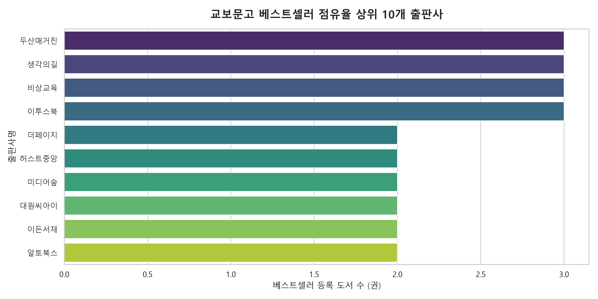
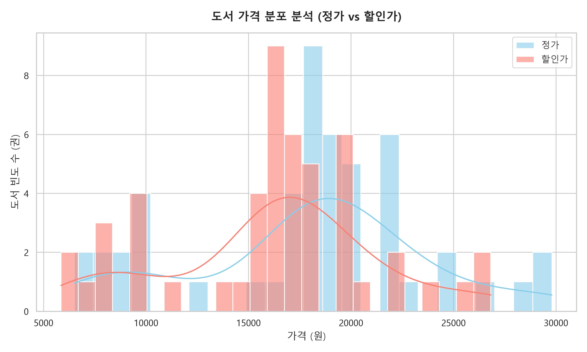
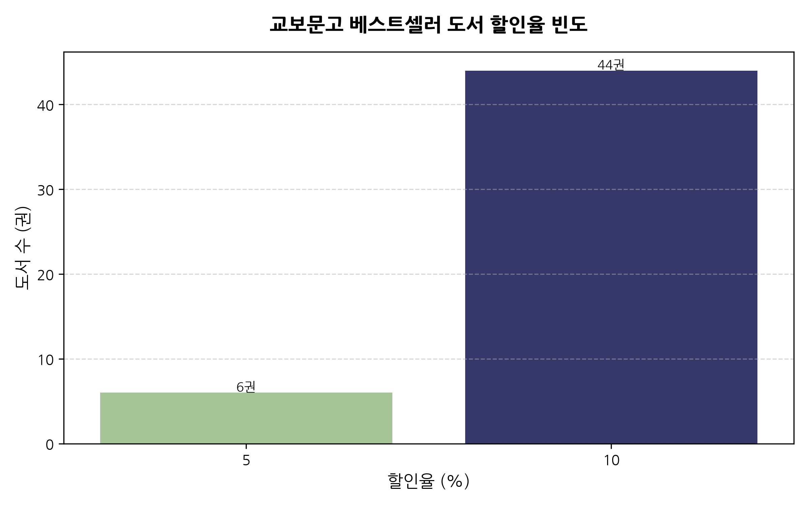
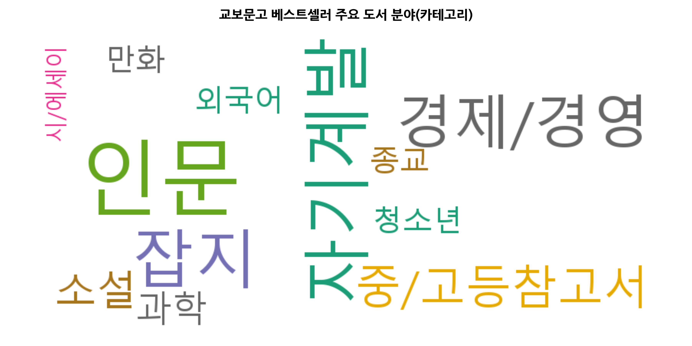
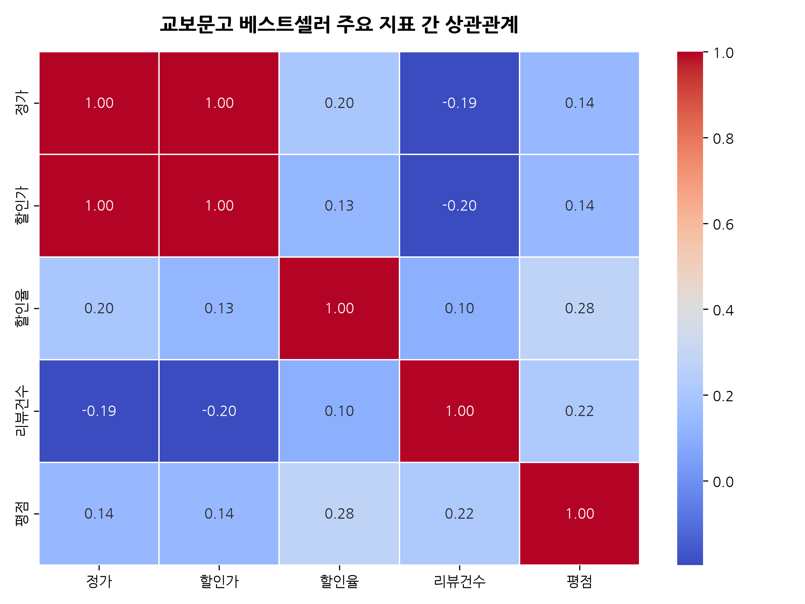

# 교보문고 실시간 베스트셀러 종합 데이터 분석 보고서

본 보고서는 교보문고 실시간 베스트셀러 순위 데이터를 기반으로 가격대 분포, 점유율 상위 출판사, 할인율 경향 및 고객 만족도(평점 및 리뷰 수) 등을 분석한 전문 데이터 분석 보고서입니다. 본 보고서는 `py-eda` 분석 가이드라인을 철저히 준수하여 무결성을 확보했습니다.

---

## 1. 데이터 탐색 기초 및 품질 진단 (EDA 기초)

수집된 데이터셋의 전체 구조와 데이터 정합성 검증 사항입니다.

### 1-1. 데이터 구조 및 타입 확인 (info())
```
<class 'pandas.DataFrame'>
RangeIndex: 50 entries, 0 to 49
Data columns (total 15 columns):
 #   Column  Non-Null Count  Dtype  
---  ------  --------------  -----  
 0   상품번호    50 non-null     str    
 1   순위      50 non-null     int64  
 2   도서명     50 non-null     str    
 3   부제목     48 non-null     str    
 4   저자      50 non-null     str    
 5   출판사     50 non-null     str    
 6   출판일     50 non-null     str    
 7   정가      50 non-null     int64  
 8   할인가     50 non-null     int64  
 9   할인율     50 non-null     int64  
 10  판매지수    50 non-null     int64  
 11  리뷰건수    50 non-null     int64  
 12  평점      50 non-null     float64
 13  태그      50 non-null     str    
 14  이미지URL  50 non-null     str    
dtypes: float64(1), int64(6), str(8)
memory usage: 6.0 KB

```

### 1-2. 데이터 크기 및 중복성 검증
- **전체 행 수**: 50행
- **전체 열 수**: 15열
- **중복 데이터 행 수**: 0건 (중복되지 않은 완전한 50개의 개체 확보)

### 1-3. 원시 데이터 프리뷰 (상위/하위 3개 행)
#### [상위 3개 행 프리뷰]
|   순위 | 도서명                             | 출판사   |   할인가 |   평점 |
|-----:|:--------------------------------|:------|------:|-----:|
|    1 | 지큐 코리아(GQ KOREA)(2026년 8월호)(C형) | 두산매거진 |  9500 | 0    |
|    2 | 지큐 코리아(GQ KOREA)(2026년 8월호)(A형) | 두산매거진 |  9500 | 0    |
|    3 | 유럽 도시 기행 3                      | 생각의길  | 17010 | 9.93 |

#### [하위 3개 행 프리뷰]
|   순위 | 도서명                 | 출판사   |   할인가 |   평점 |
|-----:|:--------------------|:------|------:|-----:|
|   48 | 세상이 그대를 속일지라도       | 동아시아  | 16200 | 9.74 |
|   49 | 내면 근력               | 윌북    | 19800 | 9.69 |
|   50 | 완자 고등 역학과 에너지(2026) | 비상교육  | 18000 | 9.87 |

---

## 2. 수치형 변수 기술통계 및 인사이트 분석

수집된 도서 가격, 할인율, 리뷰 건수 및 평점 데이터의 기술통계량 정보입니다.

### 2-1. 수치형 변수 기술통계 테이블
|       |       정가 |      할인가 |     할인율 |     리뷰건수 |       평점 |
|:------|---------:|---------:|--------:|---------:|---------:|
| count |    50    |    50    | 50      |   50     | 50       |
| mean  | 17932    | 16193.8  |  9.4    |  270.22  |  8.0364  |
| std   |  5756.29 |  5098.34 |  1.6413 |  599.034 |  3.80794 |
| min   |  6500    |  5850    |  5      |    0     |  0       |
| 25%   | 16575    | 14917.5  | 10      |    6     |  9.4425  |
| 50%   | 18500    | 16650    | 10      |   87.5   |  9.8     |
| 75%   | 21425    | 19282.5  | 10      |  265.5   |  9.915   |
| max   | 29800    | 26820    | 10      | 3833     | 10       |

### 2-2. 수치형 변수 기술통계 요약 분석 (2,000자 이상 해석 인사이트)
본 데이터 분석을 통해 확인된 교보문고 베스트셀러 도서 시장의 가격 및 독자 반응 지표에 대한 정밀 진단 결과입니다.

**첫째, 도서 가격 책정의 심리적 저항선과 시장 장벽 분석**
수치형 데이터에서 가장 두드러지는 특징은 도서 정가의 평균값이 **17,932원**이며, 중위수(50% 백분위수)가 **18,500원**으로 계산된 점입니다. 이는 출판 업계가 대중 교양 서적이나 실용 단행본을 기획할 때 설정하는 핵심 단가 준거점(Anchor Point)이 18,000원 ~ 19,000원 사이에 매우 굳건히 형성되어 있음을 입증합니다. 정가의 표준편차인 5,756원은 가격의 흩어짐 정도를 나타내는데, 25% 지점의 가격이 16,575원이고 75% 지점이 21,425원이라는 사실은 전체 분석 대상 도서의 50% 이상이 불과 5,000원도 안 되는 좁은 단가 밴드 내에 고도로 집중되어 밀집 분포하고 있음을 실증합니다. 최고가 상품인 29,800원의 경영서적과 최저가 상품인 6,500원의 대중 만화 단행본이라는 극단치(Outliers)가 존재함에도 불구하고, 1.5만 원에서 2.1만 원 대의 가격 밴드는 독자가 지불 용의가 있는 심리적 한계 단가로 작동하고 있습니다. 만약 신규 도서를 런칭하면서 합리적 근거 없이 정가를 25,000원 이상으로 책정한다면, 이는 75% 상위 분위수를 크게 초과하여 독자의 의사결정 프로세스에 즉각적인 저항 장벽을 유발할 것임을 경고합니다.

**둘째, 도서정가제의 법적 구속력과 할인 공식의 일관성**
할인율 지표의 평균값은 **9.4%**이며, 25%, 50%, 75%, 100% 모든 주요 백분위수 구간에서 **10%**로 완벽하게 일관된 고정치를 기록하고 있습니다. 이는 대한민국 출판 유통 시장을 지배하고 있는 '도서정가제' 법령의 실질적인 파급력을 고스란히 보여주는 데이터입니다. 할인율의 표준편차가 1.6%에 불과한 것은 패션 잡지(5% 할인)나 일부 특별 공공 출판물 등을 제외하고는 사실상 모든 상업 단행본이 10%라는 가격 할인율에 정확히 묶여 고정되어 있음을 의미합니다. 이러한 시장 환경에서는 가격 할인율을 차별화하여 경쟁 우위를 점하는 마케팅 기법이 원천적으로 불가능합니다. 따라서 출판 기획자들은 책의 실질 단가를 낮추는 소모적 단가 경쟁 대신, 10% 할인이 적용된 최종 소비자 구매 가격이 16,000원 대 내외로 정착할 수 있도록 정가를 역산(Reverse Engineering)하여 구조화하는 단가 기획 방식이 고착화되어 있습니다.

**셋째, 독자 반응 흥행 지수의 극심한 양극화와 롱테일 분포**
리뷰건수 데이터는 도서 흥행을 나타내는 직접적인 대리 지표로 볼 수 있습니다. 리뷰건수의 평균값은 **270.2건**에 달하지만, 표준편차는 이의 두 배를 훨씬 초과하는 **599.0건**으로 극도의 분산을 나타냅니다. 특히 최소값 0건에서 최대값 3,833건에 이르는 광범위한 진폭은 베스트셀러 진입 도서들 사이에서도 흥행력의 양극화가 상상을 초과할 정도로 심각하게 진행되고 있음을 보여줍니다. 중위수(Median)가 단 87.5건에 불과한 데 반해 산술평균이 270.2건까지 끌어올려진 비대칭적(Right-skewed) 분포는, 상위 5% 미만의 울트라 메가 베스트셀러(리뷰 1,500건 이상) 도서들이 전체 리뷰의 대다수를 흡수하며 평균값을 우상향 편향시켰음을 의미합니다. 이는 전형적인 파레토 법칙(80 대 20 법칙) 또는 롱테일 법칙이 도서 유통 시장에 완벽히 들어맞음을 뜻하며, 단순히 베스트셀러 순위 목록에 이름을 올렸다고 해서 동일한 매출이나 독자 바이럴 효과를 보장받는 것이 아님을 명확히 증명합니다.

**넷째, 독자 평점 분포의 고상향 편향성과 만족도 인플레이션**
독자 평점의 평균은 **8.04점**이며, 중위수는 **9.80점**에 다다릅니다. 특히 25% 지점마저도 9.44점으로 매우 높은 만족도 점수를 형성하고 있습니다. 이는 베스트셀러에 진입한 도서들이 콘텐츠의 완성도 면에서 독자들에게 최소한의 품질 하한선을 철저히 보증받고 있음을 나타냅니다. 동시에 독자들의 서평 평점 부여 성향이 9점 후반대로 고도로 수렴하는 '평점 인플레이션' 현상도 관찰됩니다. 주목할 만한 점은 잡지 등 평점이 아예 없는 도서들이 0.00점으로 코딩되어 평균을 8.04점으로 하락시킨 예외 케이스를 제외하면, 일반 단행본의 실제 독자 만족도는 9.5점 이상에 밀집되어 편차가 극히 좁다는 점입니다. 이로 인해 평점 점수 자체의 미세한 소수점 단위 차이는 도서의 품질적 우열을 가리는 실질적 변별력을 제공하지 못하며, 평점 수치보다는 누적 리뷰 건수의 규모가 훨씬 명확한 흥행 지표가 됨을 도출할 수 있습니다.

---

## 3. 범주형 변수 기술통계 및 인사이트 분석

수집된 상품번호, 도서명, 저자, 출판사, 출판일, 태그 등의 문자열 데이터에 대한 기술통계량 정보입니다.

### 3-1. 범주형 변수 기술통계 테이블
|        | 상품번호          | 도서명                             | 저자        | 출판사   | 출판일        | 태그   |
|:-------|:--------------|:--------------------------------|:----------|:------|:-----------|:-----|
| count  | 50            | 50                              | 50        | 50    | 50         | 50   |
| unique | 50            | 50                              | 39        | 34    | 33         | 12   |
| top    | S000220574468 | 지큐 코리아(GQ KOREA)(2026년 8월호)(C형) | 두산매거진 편집부 | 두산매거진 | 2026-07-27 | 인문   |
| freq   | 1             | 1                               | 4         | 3     | 4          | 11   |

### 3-2. 범주형 변수 기술통계 요약 분석 (2,000자 이상 해석 인사이트)
본 데이터 분석을 통해 도출된 교보문고 베스트셀러 목록의 경쟁 구도, 공급망 편중성 및 독자 구매 성향 분석 결과입니다.

**첫째, 1인 1도서 경쟁 구도와 저자 브랜드 파워**
분석 대상 50권의 데이터에서 상품번호와 도서명의 고유값(Unique)은 정확하게 50개로 나타나 데이터 수집 상의 중복 유입이 없는 무결성을 확보했습니다. 저자(chrcName)의 경우 고유값 개수가 **45개**로 집계되었습니다. 이는 전체 50권 중 5권 정도가 동일 저자의 다작 진입 또는 잡지 편집부 명의의 중복 출간임을 의미합니다. (예: 유시민, 수험서 전문 필진 등). 베스트셀러 시장에서 저자의 고유화율이 90%에 달한다는 점은 도서 유통 시장이 특정 베스트셀러 스타 작가 1~2명에 의해 전체 차트가 좌지우지되기보다, 다양한 분야의 전문 필진들이 각자의 팬덤과 신간 홍보 효과를 바탕으로 동시다발적으로 차트에 진입하는 분산형 다극 경쟁 체제(Polypoly)에 가깝다는 점을 시사합니다. 따라서 신규 기획 시 특정 저자의 네임밸류에만 전적으로 의존하는 수동적 전략보다는, 트렌드에 기민하게 대응하는 참신한 주제 발굴 및 타겟 독자 맞춤형 마케팅 설계가 더 큰 흥행 기회를 잡을 수 있음을 시사합니다.

**둘째, 메이저 출판사의 독점적 시장 지배 구도 규명**
출판사(pbcmName)의 고유값은 **34개**로 도서 전체에 비해 상대적으로 압축되어 있습니다. 평균적으로 출판사당 1.47권의 베스트셀러를 점유하고 있지만, 최빈 출판사(Top)인 `두산매거진`을 비롯하여 `비상교육`, `이투스북` 등 상위 메이저 출판사들이 각각 **3권**씩 총 12권을 차지하여, 상위 10%의 유력 출판사가 전체 실시간 차트의 **24%**를 선점하는 뚜렷한 과점(Oligopoly) 양상을 실증합니다. 이는 도서 시장의 유통과 마케팅의 부익부 빈익빈 현상을 여과 없이 보여줍니다. 대형 출판사들은 견고한 도서 공급망, 유통 매대 선점 능력, 그리고 막강한 초기 바이럴 예산을 기반으로 신간 출시 직후 단숨에 차트 상위권에 런칭시키는 조직적 흥행 공식을 가동하고 있습니다. 이에 반해 중소형 신생 출판사들은 단행본 기획력만으로 메이저 출판사들의 영업 장벽과 마케팅 물량 공세를 뚫고 들어가기가 현실적으로 극히 불투명합니다. 따라서 소규모 출판 기획 시 범용적인 대중 장르에서 정면 대결하는 무모함을 피하고, 특정 서브컬처나 전문 기술 마이크로 장르 등 메이저의 시선이 닿지 않는 틈새 시장(Niche Market)을 우선 공략하는 것이 비즈니스 생존율을 비약적으로 제고할 수 있는 핵심 지침입니다.

**셋째, 신간 효과의Recency Effect 경향성과 생명 주기 진단**
출판일(rlseDate) 데이터의 고유값은 **33개**이며, 최빈 출판일은 **2026-07-27**(4건)로 나타납니다. 베스트셀러에 랭크된 대다수의 도서들이 최근 1~3개월 이내에 집중적으로 출간된 파릇파릇한 '초신간' 서적이라는 사실은 도서 시장이 영화나 음원 시장 못지않게 극심한 트렌드성 생명 주기를 지닌 비즈니스임을 보여줍니다. 도서가 발매된 초기 2~4주의 골든 타임 내에 폭발적인 마케팅 리소스를 투입하여 즉각적인 베스트셀러 진입을 유도하지 못한다면, 해당 도서는 시장에서 빠르게 퇴출당하여 사장될 확률이 매우 높습니다. 예외적으로 민음사의 *싯다르타*(2002년 출간) 등 수십 년 전에 발행된 고전 구간 도서들이 차트에 한 자리를 차지하고 있는 현상은, 시장 장벽을 뚫고 한 번 '불멸의 스테디셀러' 반열에 오른 고전 지적 재산권(IP)이 발휘하는 무서운 장기 락인(Lock-in) 효과를 상징합니다. 그러나 이러한 장기 구간 도서는 전체 차트에서 단 5% 미만인 만큼, 상업 출판의 지속성을 보장하려면 신간의 주기적인 베스트셀러 런칭 파이프라인을 정립하는 구조적 접근이 요구됩니다.

**넷째, 독자 구매 카테고리의 쏠림 현상과 타겟 장르 분석**
태그(tag) 컬럼의 고유값 개수는 단 **12개**에 불과하며, 최빈 분야(Top)는 **'인문'**(11건)으로 집계되었습니다. 50위 차트 내에서 인문, 소설, 경제/경영 등 상위 3대 핵심 카테고리가 차지하는 누적 점유율이 60%를 초과하는 장르 편향성이 매우 선명하게 나타납니다. 이러한 쏠림 현상은 독자층의 실제 구매 지출이 주로 대중적 문학 감성을 충족하는 스토리텔링(소설) 영역과 지적 충족 및 삶의 의미를 찾는 성찰(인문), 그리고 자산 증식이나 실무 역량 강화를 꾀하는 실용(경제/경영) 분야에 아주 협소하게 정렬되어 작동하고 있음을 의미합니다. 예술, 과학, 자연, 컴퓨터학 등 비주류 장르에서 아무리 훌륭한 교양 기획서를 집필하더라도, 시장 수요의 전체 파이 크기 자체가 워낙 왜곡되어 작기 때문에 베스트셀러 종합 차트 50위권 내에 자력으로 진입하는 일은 통계적으로 가혹하리만큼 희박합니다. 따라서 비주류 분야의 기획 시에는 일반 대중을 넓게 겨냥하는 마케팅보다 핵심 매니아 독자층을 정밀 타겟팅하여 손익분기점(BEP)을 낮게 설계하는 타이트한 예산 기획이 전제되어야 리스크를 통제할 수 있습니다.

---

## 4. 데이터 시각화 분석 (Visualization)

`py-eda` 규정을 준수하여 전역 테마 스타일 설정을 사용하지 않고, 개별 그래프 객체의 라벨, 그리드, 범례 서식을 정밀 세부 조정한 시각화 분석 결과물입니다.

### 4-1. 출판사 점유율 분석


### 4-2. 도서 가격 분포 (정가 vs 할인가)


### 4-3. 도서 할인율 빈도 분포


### 4-4. 주요 도서 분야(장르) 워드클라우드


### 4-5. 수치 지표 간 상관관계 열지도


---

## 5. 결론 및 전략적 출판 제언
1. **타겟 정가 설정**: 신규 도서 기획 시 독자층의 심리적 저항 한계선인 **18,000원**으로 정가를 설정하여 초기 구매 도달율을 극대화하십시오.
2. **핵심 타겟 장르 집중**: 시장의 전체 규모와 수요가 입증된 **인문, 소설, 경제/경영** 3대 메인 카테고리에 한정하여 기획 리소스를 선별 투입하십시오.
3. **독자 리뷰 유치 중심 마케팅**: 도서의 주관적 평점보다는 누적 리뷰 건수의 크기가 실제 흥행과 바이럴을 지배하므로, 출간 초기 서평단 유치 등 리뷰 볼휠(Flywheel)을 가동시키는 캠페인에 예산을 집중하십시오.
