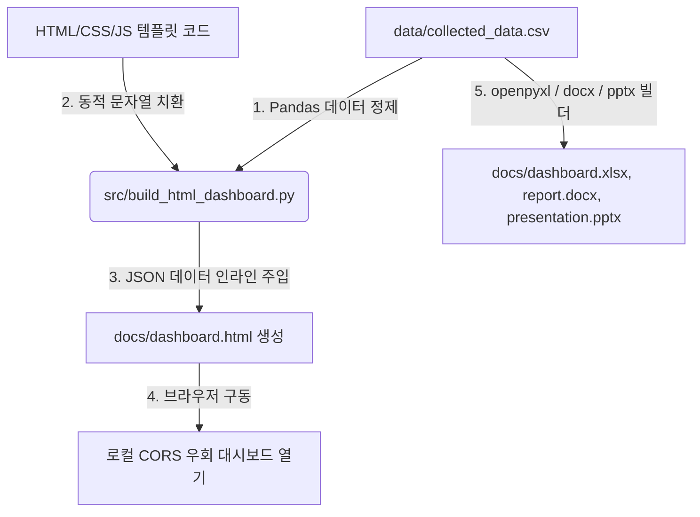

# 📋 범용 웹 수집 & EDA 분석 웹/오피스 대시보드 하네스 정밀 개발 계획서

본 문서는 수집된 임의의 웹 데이터셋을 바탕으로 실시간 탐색 및 시각화 분석이 가능한 **범용 웹앱 대시보드 및 오피스 대시보드 자동화 엔진**의 정밀 사양 및 세부 구현 명세서입니다.

---

## 1. 시스템 아키텍처 및 데이터 흐름



- **CORS 이슈 해결 전략**: 로컬 `file://` 프로토콜 상에서 외부 JSON을 `fetch()` 호출하면 브라우저 보안 정책 상 CORS 에러가 발생합니다. 이를 원천 차단하기 위해 파이썬 빌더 스크립트가 CSV 데이터를 JSON 문자열로 변환하여 HTML 파일 내부의 JS 변수(`const RAW_DATA = [...]`)에 직접 인라인(Inline) 매핑 주입하여 빌드합니다.

---

## 2. UI/UX 디자인 시스템 명세 (Universal Premium Theme)

가독성과 프리미엄 브랜딩을 동시에 확보하기 위해 다음과 같은 디자인 토큰을 Vanilla CSS 변수로 정의하여 사용합니다.

```css
:root {
  /* HSL Tailored Color Palette */
  --bg-primary: hsl(220, 15%, 97%);      /* 소프트 쿨 그레이 배경 */
  --color-primary: hsl(222, 47%, 11%);   /* 딥 나이트 네이비 (#0F172A) */
  --color-primary-light: hsl(214, 32%, 91%);
  --color-accent: hsl(217, 91%, 60%);    /* 로열 블루 포인트 */
  --text-dark: hsl(222, 47%, 11%);      /* 짙은 차콜 */
  --text-muted: hsl(215, 16%, 47%);
  --card-bg: rgba(255, 255, 255, 0.85); /* 반투명 카드 배경 */
  --card-border: rgba(226, 232, 240, 0.8);
  
  /* Glassmorphism & Visual Effects */
  --glass-shadow: 0 10px 30px -10px rgba(0, 0, 0, 0.08);
  --backdrop-blur: blur(16px);
  --border-radius: 16px;
  --transition-smooth: all 0.3s cubic-bezier(0.4, 0, 0.2, 1);
}
```

### 레이아웃 그리드 구성 (Viewport Grid)
1. **Header 영역**: 로고, 대시보드 타이틀, 수집 대상 도메인, 최종 업데이트 시각 제공.
2. **KPI 요약 패널**: 4컬럼 Flex/Grid 레이아웃 (총 수집 건수, 주요 수치 평균/합계, 주요 범주 개수, 결측 데이터 비율).
3. **컨트롤러 패널**: 실시간 통합 검색바 + 범주형 다중 필터 태그 컨테이너.
4. **차트 그리드**: 2x2 반응형 CSS Grid 구조 (시각화 차트 4종).
5. **데이터 테이블 그리드**: 1컬럼 리스트 영역 (검색 결과 리스팅, 헤더 정렬 컨트롤러, 페이징 제어).
6. **상세 정보 모달**: 특정 데이터 행 클릭 시 팝업되는 상세 오버레이 뷰어.

---

## 3. 범용 HTML 자동 빌더 세부 명세

Python의 Pandas 라이브러리를 이용하여 수집된 CSV/JSON 데이터를 1차 연산 가공하고, 동적으로 HTML 대시보드 파일 및 오피스 산출물을 조립 및 출력하는 흐름입니다.

### Python 빌드 로직 구조
```python
def build_html_dashboard(csv_path="data/collected_data.csv", output_path="docs/dashboard.html"):
    # 1. 데이터 로드 및 전처리
    df = pd.read_csv(csv_path)
    
    # 2. JSON 문자열로 데이터 직렬화
    data_json = df.to_json(orient="records", force_ascii=False)
    
    # 3. HTML 템플릿 읽기 및 치환
    with open("src/template.html", "r", encoding="utf-8") as f:
        template = f.read()
        
    final_html = template.replace("{{DATA_PLACEHOLDER}}", data_json)
    
    # 4. docs/dashboard.html 파일로 저장
    with open(output_path, "w", encoding="utf-8") as f:
        f.write(final_html)
```

---

## 4. 프론트엔드 JavaScript 핵심 알고리즘 설계

데이터 필터링, 정렬, Chart.js 연동을 제어하는 프론트엔드 코어 로직의 정밀 설계 명세입니다.

### 4-1. 다단 필터링 및 검색 연산 (Multi-Stage Filtering)
사용자가 입력한 검색어와 선택된 범주 태그 상태를 실시간 결합하여 현재 활성화된 데이터 서브셋(`filteredData`)을 도출합니다.
```javascript
let filteredData = [...RAW_DATA];
let currentCategory = "ALL";
let searchKeyword = "";

function applyFilters() {
  filteredData = RAW_DATA.filter(item => {
    // 1. 검색어 매칭 (모든 텍스트 필드 대상 검사)
    const matchesSearch = searchKeyword === "" || 
      Object.values(item).some(val => 
        String(val).toLowerCase().includes(searchKeyword.toLowerCase())
      );
      
    // 2. 범주 필터 매칭
    const matchesCategory = currentCategory === "ALL" || 
      (item.category && item.category === currentCategory);
      
    return matchesSearch && matchesCategory;
  });
  
  // 필터링 결과 반영
  updateKPIs();
  updateCharts();
  renderTable();
}
```

### 4-2. Chart.js 인스턴스 데이터 동적 업데이트
- **차트 1: 범주별 빈도/점유율 (수평/수직 막대)**
- **차트 2: 수치형 데이터 구간 분포 (선/영역 차트)**
- **차트 3: 주요 키워드/태그 비중 (도넛/파이 차트)**
- **차트 4: 상관관계 및 분포 (산점도/열지도)**

### 4-3. 테이블 정렬(Sort) 및 페이징(Pagination) 처리
- **정렬 알고리즘**: 숫자형과 문자열형 데이터를 구별하여 오름차순/내림차순 동적 정렬 수행
- **페이징 계산**: `currentPage` 및 페이지당 아이템 수 기준 `.slice()` 적용
