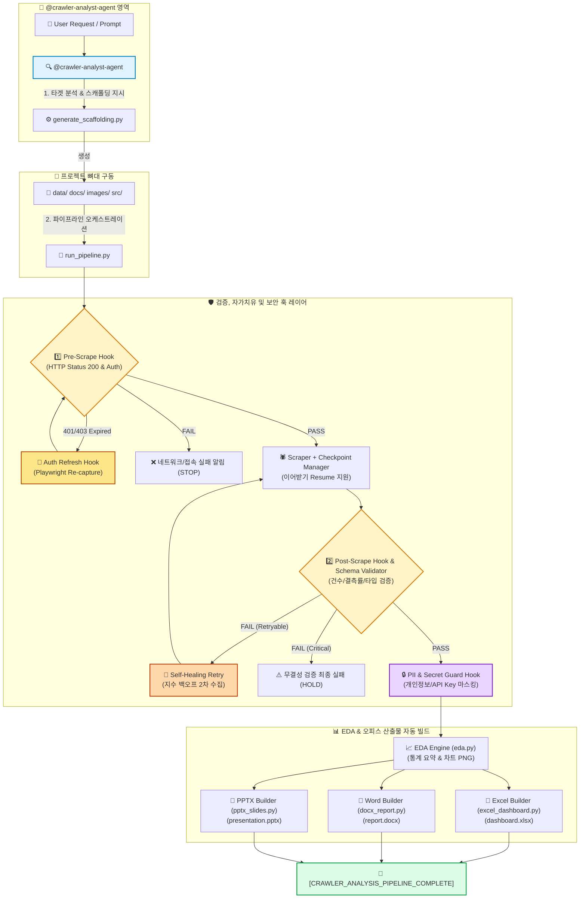
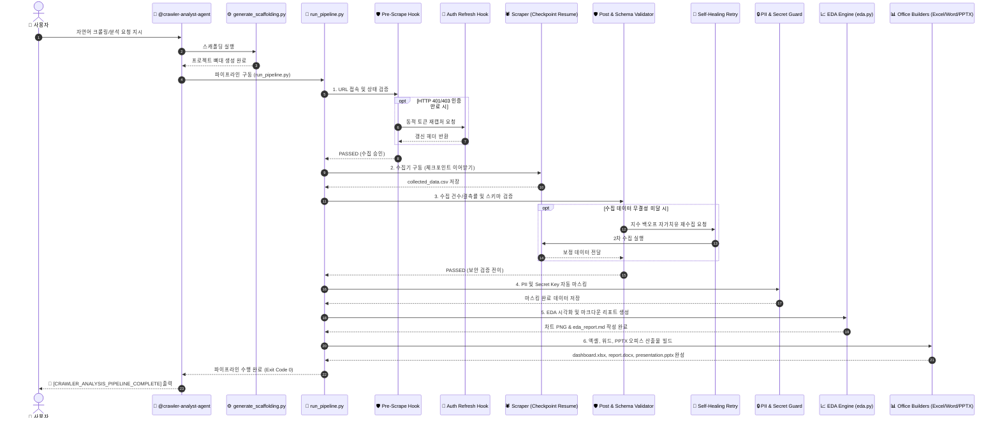

# [Implementation Plan] 범용 웹 크롤링 및 데이터 분석 파이프라인 하네스

이 문서는 어떠한 타겟 웹사이트에 대해서도 웹 크롤링, 탐색적 데이터 분석(EDA), 엑셀 대시보드(`.xlsx`), Word 비즈니스 보고서(`.docx`), PPTX 발표 슬라이드(`.pptx`) 작성을 한 번에 수행하는 범용 파이프라인 하네스(Harness)의 구조, **Pre/Post Hook 시스템**, **자가치유 재시도/세션 갱신**, **데이터 스키마 검증기**, **체크포인트 이어받기**, **개인정보/비밀키 보안 마스킹 훅**, 및 **크롤러 분석 에이전트(@crawler-analyst-agent) 구축 예시**를 담은 전방위 정밀 구현 명세입니다.

---

## 1. 개요 및 목적
- **목적**: 특정 도메인에 종속되지 않고, 임의의 웹사이트 URL과 수집 컬럼 정의만으로 1분 이내에 자동 분석 파이프라인 프로젝트를 구축하고 검증하는 하네스 환경 제공.
- **핵심 목표**:
  1. 표준화된 프로젝트 스캐폴딩 생성 (`generate_scaffolding.py`)
  2. 사전/사후 훅(Pre/Post Hook) 기반 데이터 무결성 및 시스템 가용성 자동 검증 (`run_pipeline.py`)
  3. **동적 웹 수집(Playwright) 및 401/403 토큰 만료 시 자가치유 세션 자동 갱신 훅(`Auth & Session Refresh Hook`) 연동**
  4. **지수 백오프 기반 데이터 자동 재수집 자가치유 메커니즘 (`Self-Healing Retry Mechanism`)**
  5. **수집 데이터 스키마 및 타입 정밀 검증기 (`Data Schema & Type Validator`)**
  6. **수집 중단 지점 기록 및 이어받기 체크포인트 모듈 (`Checkpoint Resume & Chunking`)**
  7. **개인정보(PII) 및 비밀키/API key 자동 마스킹 보안 훅 (`PII & Secret Guard Hook`)**
  8. openpyxl, python-docx, python-pptx, koreanize-matplotlib 기반 오피스 산출물 자동 렌더링 모듈 제공
  9. `@crawler-analyst-agent` 기반 타겟 분석 - 수집 - EDA - 보고서 일괄 자동화 구축 예시 연동

---

## 2. 하네스 전방위 시스템 아키텍처 및 머메이드 (Mermaid) 시각화



---

## 3. 5대 핵심 파이프라인 훅 & 자가치유 모듈 구현 코드 예시

### 3.1 동적 세션 자동 갱신 훅 (`auth_refresh_hook.py`)
```python
"""Auth & Session Refresh Hook: Playwright 기반 인증 헤더/토큰 동적 자동 갱신"""
import json
from playwright.sync_api import sync_playwright

def run_auth_refresh_hook(target_url: str, token_header_key: str = "Authorization") -> dict:
    print(f"[AUTH-HOOK] 인증 세션 만료 감지 -> Playwright 동적 토큰 재캡처 시도: {target_url}")
    captured_headers = {}

    with sync_playwright() as p:
        browser = p.chromium.launch(headless=True)
        context = browser.new_context()
        page = context.new_page()

        def handle_request(request):
            nonlocal captured_headers
            headers = request.headers
            if token_header_key.lower() in [k.lower() for k in headers.keys()]:
                captured_headers = dict(headers)

        page.on("request", handle_request)
        page.goto(target_url, wait_until="networkidle")
        browser.close()

    if captured_headers:
        print("[AUTH-HOOK SUCCESS] 신규 토큰 헤더 갱신 성공!")
        with open("src/api_config.json", "w", encoding="utf-8") as f:
            json.dump(captured_headers, f, ensure_ascii=False, indent=2)
        return captured_headers
    return {}
```

### 3.2 자가치유 재시도 메커니즘 (`self_healing_retry.py`)
수집 건수가 미달하거나 일시적 데이터 손실 발생 시 지수 백오프(Exponential Backoff) 간격으로 파라미터를 보정하여 재수집하는 자가치유 모듈입니다.

```python
"""Self-Healing Retry Mechanism: 지수 백오프 기반 2차 재수집 연동 모듈"""
import time

def execute_with_self_healing(scrape_func, max_retries: int = 3, initial_delay: float = 2.0):
    delay = initial_delay
    for attempt in range(1, max_retries + 1):
        print(f"[SELF-HEALING] 수집 시도 {attempt}/{max_retries} 실행 중...")
        success = scrape_func()
        if success:
            print("[SELF-HEALING SUCCESS] 수집 성공!")
            return True
        
        print(f"[SELF-HEALING RETRY] 수집 미달/실패 -> {delay}초 후 재시도 (Backoff)")
        time.sleep(delay)
        delay *= 2.0  # 지수 백오프 적용
        
    print("[SELF-HEALING FAILED] 재시도 횟수 초과 - 수집 실패 처리")
    return False
```

### 3.3 데이터 스키마 & 타입 검증기 (`schema_validator.py`)
수집된 데이터의 필드별 데이터 타입, 숫자/날짜 변환 가능 여부 및 이상값(Outlier)을 검증하는 모듈입니다.

```python
"""Data Schema & Type Validator: 필드별 규격, 타입 및 이상값 검증 모듈"""
import pandas as pd

def validate_data_schema(df: pd.DataFrame, schema_spec: dict) -> bool:
    print("[SCHEMA-VALIDATOR] 데이터 스키마 및 타입 무결성 검증 시작")
    
    for col, expected_type in schema_spec.items():
        if col not in df.columns:
            print(f"[SCHEMA FAILED] 필수 컬럼 누락: {col}")
            return False
            
        if expected_type == "numeric":
            # 숫자형 변환 가능 여부 검증
            non_numeric = pd.to_numeric(df[col], errors='coerce').isnull() & df[col].notnull()
            if non_numeric.any():
                print(f"[SCHEMA WARN] {col} 컬럼 내 숫자 변환 실패 수치 존재: {df[col][non_numeric].tolist()}")
                
    print("[SCHEMA-VALIDATOR PASSED] 데이터 스키마 검증 완수")
    return True
```

### 3.4 체크포인트 및 중단 지점 이어받기 (`checkpoint_manager.py`)
수집 중 끊김이 발생했을 때 진행된 수집 지점(Page/Index)을 파일로 기록하고, 복구 시 해당 위치부터 수집을 이어받는 모듈입니다.

```python
"""Checkpoint Manager: 수집 중단 지점 저장 및 이어받기(Resume) 모듈"""
import json
import os

CHECKPOINT_FILE = "data/checkpoint.json"

def load_checkpoint() -> int:
    if os.path.exists(CHECKPOINT_FILE):
        with open(CHECKPOINT_FILE, "r", encoding="utf-8") as f:
            data = json.load(f)
            print(f"[CHECKPOINT RESUME] 마지막 성공 지점 복구: Page {data.get('last_page', 1)}")
            return data.get("last_page", 1)
    return 1

def save_checkpoint(last_page: int):
    with open(CHECKPOINT_FILE, "w", encoding="utf-8") as f:
        json.dump({"last_page": last_page}, f, indent=2)
    print(f"[CHECKPOINT SAVED] 현재 수집 위치 기록: Page {last_page}")
```

### 3.5 개인정보 & 비밀키 마스킹 보안 훅 (`pii_secret_guard.py`)
수집 데이터 텍스트 내 개인정보(이메일, 전화번호) 및 API Key를 감지하여 자동 마스킹하는 보안 모듈입니다.

```python
"""PII & Secret Guard Hook: 개인정보 및 비밀키 자동 마스킹 보안 훅"""
import re
import pandas as pd

def run_pii_secret_guard(csv_filepath: str):
    print(f"[SECURITY-HOOK] 개인정보 및 비밀키 자동 마스킹 스캔: {csv_filepath}")
    df = pd.read_csv(csv_filepath, encoding="utf-8-sig")
    
    # 이메일, 전화번호, API Key 정규식 패턴
    email_pattern = r'[a-zA-Z0-9._%+-]+@[a-zA-Z0-9.-]+\.[a-zA-Z]{2,}'
    phone_pattern = r'01[016789]-\d{3,4}-\d{4}'
    secret_key_pattern = r'(bearer\s+[a-zA-Z0-9\._\-]+|sk-[a-zA-Z0-9]{20,})'

    def mask_text(text):
        if not isinstance(text, str):
            return text
        text = re.sub(email_pattern, '[MASKED_EMAIL]', text)
        text = re.sub(phone_pattern, '[MASKED_PHONE]', text)
        text = re.sub(secret_key_pattern, '[MASKED_SECRET]', text, flags=re.IGNORECASE)
        return text

    for col in df.select_dtypes(include=['object']).columns:
        df[col] = df[col].apply(mask_text)

    df.to_csv(csv_filepath, index=False, encoding="utf-8-sig")
    print("[SECURITY-HOOK COMPLETED] 보안 마스킹 완료 데이터 저장 성공")
```

---

## 4. 크롤러 분석 에이전트 (@crawler-analyst-agent) 구축 예시

```python
"""Crawler Analyst Agent: 타겟 구조 파악부터 파이프라인 연동까지 전과정을 수행하는 에이전트 클래스 예시"""
import os
import subprocess

class CrawlerAnalystAgent:
    def __init__(self, target_name: str, target_url: str):
        self.target_name = target_name
        self.target_url = target_url

    def analyze_and_scaffold(self):
        print(f"[AGENT] @crawler-analyst-agent 가동: {self.target_name} 프로젝트 생성 시작")
        cmd = f"python generate_scaffolding.py --target \"{self.target_name}\" --url \"{self.target_url}\""
        subprocess.run(cmd, shell=True, check=True)
        print("[AGENT] 프로젝트 뼈대 구조 생성 완료")

    def execute_pipeline(self):
        print(f"[AGENT] 파이프라인 수집 및 보고서 빌드 오케스트레이션 실행")
        res = subprocess.run("python run_pipeline.py", shell=True)
        if res.returncode == 0:
            print("[AGENT OUTPUT] [CRAWLER_ANALYSIS_PIPELINE_COMPLETE]")
            return True
        else:
            print("[AGENT ERROR] 파이프라인 수집 수행 중 실패 발생")
            return False

if __name__ == "__main__":
    agent = CrawlerAnalystAgent(target_name="sample_target", target_url="https://news.naver.com")
    agent.analyze_and_scaffold()
    agent.execute_pipeline()
```

---

## 5. 전체 하네스 구성 시퀀스 다이어그램 (Sequence Diagram)


