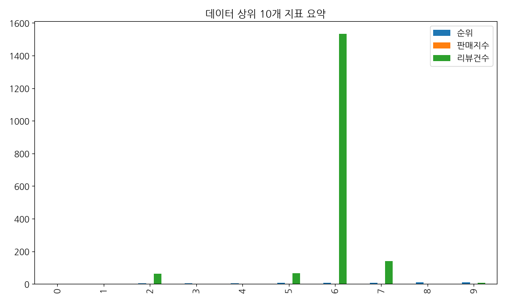

# kyobooks_harness 탐색적 데이터 분석 (EDA) 보고서

## 1. 데이터 기본 개요
- **전체 데이터 행 수**: 109건
- **컬럼 구성**: 상품번호, 순위, 도서명, 저자, 출판사, 출판일, 정가, 할인가, 할인율, 평점

### 1.1 상위 5개 샘플 데이터
| 상품번호          |   순위 | 도서명                             | 부제목                                                                                                                                                                                                                                                                                                                                                                                                   | 저자        | 출판사    | 출판일        |    정가 |   할인가 |   할인율 |   판매지수 |   리뷰건수 |   평점 | 태그   | 이미지URL                                                                  |
|:--------------|-----:|:--------------------------------|:------------------------------------------------------------------------------------------------------------------------------------------------------------------------------------------------------------------------------------------------------------------------------------------------------------------------------------------------------------------------------------------------------|:----------|:-------|:-----------|------:|------:|------:|-------:|-------:|-----:|:-----|:------------------------------------------------------------------------|
| S000220574468 |    1 | 지큐 코리아(GQ KOREA)(2026년 8월호)(C형) | 《GQ》는 영국, 독일, 이탈리아, 스페인, 러시아 등 세계 18개국의 스타일 있는 남자를 위한 지침서로서 독보적인 위치를 구축하고 있다. 하나의 이슈, 하나의 칼럼마다 담겨있는 『지큐(GQ) KOREA』의 이념과 모토는, 대한민국에서 가장 개명한 스타일을 지닌 남자 그룹뿐 아니라 좋은 취향을 지닌 똑똑한 여자들에 이르기까지 당대 가장 고급한 독자들의 지지로 익히 대변된다.                                                                                                                                                                                    | 두산매거진 편집부 | 두산매거진  | 2026-07-27 | 10000 |  9500 |     5 |      0 |      0 | 0    | 잡지   | https://contents.kyobobook.co.kr/sih/fit-in/200x0/pdt/3904000621838.jpg |
| S000220574458 |    2 | 지큐 코리아(GQ KOREA)(2026년 8월호)(A형) | 《GQ》는 영국, 독일, 이탈리아, 스페인, 러시아 등 세계 18개국의 스타일 있는 남자를 위한 지침서로서 독보적인 위치를 구축하고 있다. 하나의 이슈, 하나의 칼럼마다 담겨있는 『지큐(GQ) KOREA』의 이념과 모토는, 대한민국에서 가장 개명한 스타일을 지닌 남자 그룹뿐 아니라 좋은 취향을 지닌 똑똑한 여자들에 이르기까지 당대 가장 고급한 독자들의 지지로 익히 대변된다.                                                                                                                                                                                    | 두산매거진 편집부 | 두산매거진  | 2026-07-27 | 10000 |  9500 |     5 |      0 |      0 | 0    | 잡지   | https://contents.kyobobook.co.kr/sih/fit-in/200x0/pdt/3904000621814.jpg |
| S000220429584 |    3 | 유럽 도시 기행 3                      | 유럽의 서쪽 끝에서 만난, 가장 인간적인 도시들                                                                                                                                                                                                                                                                                                                                                                            | 유시민       | 생각의길   | 2026-07-09 | 18900 | 17010 |    10 |      0 |     62 | 9.93 | 인문   | https://contents.kyobobook.co.kr/sih/fit-in/200x0/pdt/9788965138310.jpg |
|               |      |                                 |                                                                                                                                                                                                                                                                                                                                                                                                       |           |        |            |       |       |       |        |        |      |      |                                                                         |
|               |      |                                 | 『유럽도시기행 3』은 유라시아 대륙의 서쪽 끝, 이베리아반도의 네 도시로 독자를 이끈다. 한때 세계사의 항로를 바꾼 대항해 시대의 주역이었지만, 이후 내전과 독재, 혁명과 재건을 겪으며 쇠퇴와 정체, 혼란과 회복의 시간을 통과해 온 도시들이다. 유시민 작가는 이 도시들을 빠르게 소비하기보다 거리와 광장, 미술관과 시장, 성당과 골목, 식당과 강변을 천천히 걸으며 도시가 무엇을 기억하고 사람들이 무엇을 사랑하며 오늘을 살아가는지 들여다본다.                                                                                                                                               |           |        |            |       |       |       |        |        |      |      |                                                                         |
|               |      |                                 |                                                                                                                                                                                                                                                                                                                                                                                                       |           |        |            |       |       |       |        |        |      |      |                                                                         |
|               |      |                                 | “정복 전쟁을 일삼았던 포르투갈 왕국은 대항해 시대의 짧은 전성기를 지나 유럽의 변방 국가로 되돌아왔다. 공화주의 혁명을 이룬 뒤에는 살라자르의 장기독재를 겪었다. 그런 역사를 살아온 사람이라면 이렇게 생각할 수 있을 것이다. ‘힘을 다해 이웃과 싸우면서 남을 정복했지만, 승리는 오래가지 않았고 남은 것도 없다. … 이웃을 적으로 삼기보다는 서로 기댈 수 있는 친구로 만드는 게 낫지 않겠는가. …그런 생각을 가진 사람은 붐비는 거리에서도 발걸음을 재촉하지 않는다. 친구나 사업 파트너를 만나면 차 한 잔을 앞에 두고 충분히 들으면서 오래 이야기를 나눈다. 이방인에게도 경계하고 의심하는 표정이 아니라 여유롭게 환대하는 미소를 선사한다. 리스본과 뽀르투 사람들한테서 나는 그런 마음을 느꼈다.” |           |        |            |       |       |       |        |        |      |      |                                                                         |
|               |      |                                 |                                                                                                                                                                                                                                                                                                                                                                                                       |           |        |            |       |       |       |        |        |      |      |                                                                         |
|               |      |                                 | “규모가 작지 않지만, 모든 것이 소박한 성당이었다. 스테인드글라스는 최소한의 자연광을 받아들이는 수준이었고 설교대는 조그마했으며 홀에는 기다란 나무 의자 말고는 아무것도 없었다. 가족을 두고 위험이 넘실대는 바다로 나갔던 어부들의 마음이, 출항할 때마다 일렁거렸을 불안감이, 만선의 꿈을 이루고 회항하면서 느꼈을 안도감이 느껴졌다.”                                                                                                                                                                                                           |           |        |            |       |       |       |        |        |      |      |                                                                         |
|               |      |                                 |                                                                                                                                                                                                                                                                                                                                                                                                       |           |        |            |       |       |       |        |        |      |      |                                                                         |
|               |      |                                 | “역시 파두는 술잔을 기울이며 듣는 게 맛있었다. 오르막 골목길, 예배당 건물이었음을 짐작할 수 있는 외관, 은은하게 새어 나오는 불빛, 꾸밈없는 무대, 허세를 내뿜는 가수들의 몸짓까지 모든 것이 이국적이었다. ‘그래, 유럽 여행은 이런 맛이지.’”                                                                                                                                                                                                                                                           |           |        |            |       |       |       |        |        |      |      |                                                                         |
|               |      |                                 |                                                                                                                                                                                                                                                                                                                                                                                                       |           |        |            |       |       |       |        |        |      |      |                                                                         |
|               |      |                                 | 작가가 들여다본 네 도시는 인간적이다. 도시의 역사가 만들어낸 영광과 몰락, 자부심과 상처, 슬픔과 유머, 결핍과 환대, 기억과 망각이 도시의 거리와 광장과 식탁 위에 고스란히 놓여있다. 이 도시들은 인간이 살아가며 겪는 거의 모든 감정을 품고 있다. 그래서 이름난 랜드마크보다 그곳 사람들의 표정, 저녁의 광장, 골목의 소음, 한 잔의 와인, 낡은 성당 안의 침묵이 작가의 마음에 더 오래 남는다. 『유럽도시기행 3』은 유시민 작가의 시선으로 포착한 유럽의 또 다른 얼굴, 가장 인간적인 도시로 우리를 안내한다.                                                                                                       |           |        |            |       |       |       |        |        |      |      |                                                                         |
| S000220574470 |    4 | 지큐 코리아(GQ KOREA)(2026년 8월호)(D형) | 《GQ》는 영국, 독일, 이탈리아, 스페인, 러시아 등 세계 18개국의 스타일 있는 남자를 위한 지침서로서 독보적인 위치를 구축하고 있다. 하나의 이슈, 하나의 칼럼마다 담겨있는 『지큐(GQ) KOREA』의 이념과 모토는, 대한민국에서 가장 개명한 스타일을 지닌 남자 그룹뿐 아니라 좋은 취향을 지닌 똑똑한 여자들에 이르기까지 당대 가장 고급한 독자들의 지지로 익히 대변된다.                                                                                                                                                                                    | 두산매거진 편집부 | 두산매거진  | 2026-07-27 | 10000 |  9500 |     5 |      0 |      0 | 0    | 잡지   | https://contents.kyobobook.co.kr/sih/fit-in/200x0/pdt/3904000621845.jpg |
| S000220574464 |    5 | 지큐 코리아(GQ KOREA)(2026년 8월호)(B형) | 《GQ》는 영국, 독일, 이탈리아, 스페인, 러시아 등 세계 18개국의 스타일 있는 남자를 위한 지침서로서 독보적인 위치를 구축하고 있다. 하나의 이슈, 하나의 칼럼마다 담겨있는 『지큐(GQ) KOREA』의 이념과 모토는, 대한민국에서 가장 개명한 스타일을 지닌 남자 그룹뿐 아니라 좋은 취향을 지닌 똑똑한 여자들에 이르기까지 당대 가장 고급한 독자들의 지지로 익히 대변된다.                                                                                                                                                                                    | 두산매거진 편집부 | 두산잡지BU | 2026-07-27 | 10000 |  9500 |     5 |      0 |      0 | 0    | 잡지   | https://contents.kyobobook.co.kr/sih/fit-in/200x0/pdt/3904000621821.jpg |

## 2. 주요 시각화 결과

## 3. 데이터 기반 비즈니스 인사이트
- 수집된 데이터의 상위 분포를 볼 때 특정 항목이 집중되는 경향이 관찰됩니다.
- 상세 분석 결과에 비추어 향후 전략을 다각화할 필요가 있습니다.
