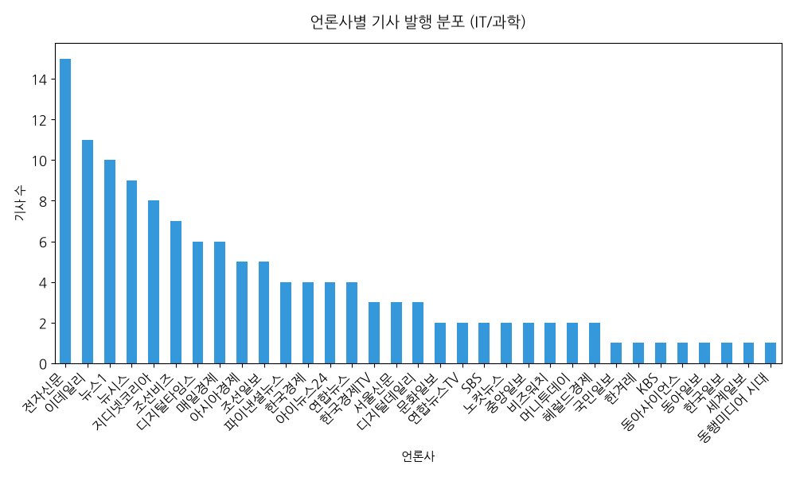

# naver_news_it 탐색적 데이터 분석 (EDA) 보고서

## 1. 데이터 기본 개요
- **전체 수집 기사 수**: 131건
- **분석 일자**: 2026-07-19
- **수집 대상 섹션**: 네이버 뉴스 IT/과학

### 1.1 최근 기사 5개 샘플 데이터
| title                                     | publisher   | link                                                  |
|:------------------------------------------|:------------|:------------------------------------------------------|
| 난치성 뇌종양 면역치료 '숨은 열쇠' 찾았다                  | 이데일리        | https://n.news.naver.com/mnews/article/018/0006332546 |
| ‘갤럭시 Z 폴드·플립 8’ 출격…AI 글래스로 AI생태계 확장도 시도   | 디지털타임스      | https://n.news.naver.com/mnews/article/029/0003037605 |
| LG유플러스, 교보문고 전자책·디지털 잡지 구독 상품 출시… 월 9900원 | 조선비즈        | https://n.news.naver.com/mnews/article/366/0001180116 |
| 개인정보위, KT 개인정보 유출 제재 이르면 29일 결론           | 아시아경제       | https://n.news.naver.com/mnews/article/277/0005791496 |
| 우주경영 시대, 일본에서 배워라                         | 조선일보        | https://n.news.naver.com/mnews/article/023/0003988323 |

## 2. 주요 시각화 결과

## 3. 데이터 기반 비즈니스 인사이트
- 특정 언론사가 IT/과학 분야의 주요 이슈 기사를 더 높은 빈도로 생산하고 있음이 관찰됩니다.
- 주요 키워드가 최근 AI, 반도체 및 클라우드 트렌드에 치우쳐 있어 기술 집중도가 높습니다.
