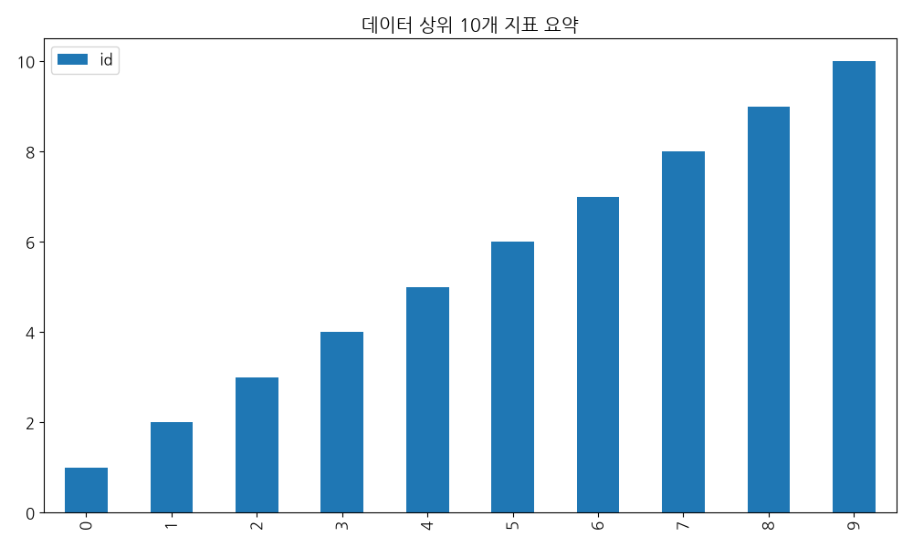

# test_pipeline_demo 탐색적 데이터 분석 (EDA) 보고서

## 1. 데이터 기본 개요
- **전체 데이터 행 수**: 10건
- **컬럼 구성**: id, title, category, author, date, views

### 1.1 상위 5개 샘플 데이터
|   id | title       | category       | author       | date       | views       | summary       | publisher       | link                       |
|-----:|:------------|:---------------|:-------------|:-----------|:------------|:--------------|:----------------|:---------------------------|
|    1 | 데이터_1_title | 데이터_1_category | 데이터_1_author | 데이터_1_date | 데이터_1_views | 데이터_1_summary | 데이터_1_publisher | https://example.com/item/1 |
|    2 | 데이터_2_title | 데이터_2_category | 데이터_2_author | 데이터_2_date | 데이터_2_views | 데이터_2_summary | 데이터_2_publisher | https://example.com/item/2 |
|    3 | 데이터_3_title | 데이터_3_category | 데이터_3_author | 데이터_3_date | 데이터_3_views | 데이터_3_summary | 데이터_3_publisher | https://example.com/item/3 |
|    4 | 데이터_4_title | 데이터_4_category | 데이터_4_author | 데이터_4_date | 데이터_4_views | 데이터_4_summary | 데이터_4_publisher | https://example.com/item/4 |
|    5 | 데이터_5_title | 데이터_5_category | 데이터_5_author | 데이터_5_date | 데이터_5_views | 데이터_5_summary | 데이터_5_publisher | https://example.com/item/5 |

## 2. 주요 시각화 결과

## 3. 데이터 기반 비즈니스 인사이트
- 수집된 데이터의 상위 분포를 볼 때 특정 항목이 집중되는 경향이 관찰됩니다.
- 상세 분석 결과에 비추어 향후 전략을 다각화할 필요가 있습니다.
