# YES24 베스트셀러 고도화 EDA 종합 보고서
### 데이터 기반 도서 시장의 구조 진단 및 출판 기획 전략 제언

발표자: 전문 데이터 분석가
날짜: 2026년 7월 13일

<!--
[발표자 노트 - 2분]
안녕하십니까, 지금부터 '예스24 베스트셀러 고도화 EDA 종합 보고서' 발표를 시작하겠습니다. 본 발표는 예스24의 실제 베스트셀러 도서 데이터를 바탕으로, 어떤 출판사와 저자가 시장을 선도하고 있는지, 가격과 평점의 분포는 어떠한지, 그리고 실제 판매 성과와 리뷰의 역학관계는 어떻게 작용하는지를 정량적 데이터 분석 기법을 통해 종합 진단하는 자료입니다. 이번 분석은 단순한 통계 요약을 넘어 텍스트 분석과 다변량 상관 분석을 아울렀으며, 최종적으로는 출판 기획자가 성공적인 베스트셀러를 기획할 수 있도록 5대 성공 프레임워크를 포함한 전략적 대안까지 제시해 드리고자 합니다. 향후 데이터 기반 출판 마케팅을 전개하는 데 있어 중요한 나침반 역할을 할 수 있기를 기대하며 본격적인 목차 소개와 발표를 시작하겠습니다.
-->

---

## 발표 목차 (Agenda)

* **PART 1**. 데이터 기본 정보 및 품질 파악 (슬라이드 3 ~ 7)
* **PART 2**. 일변량 기술통계 및 단일 변수 분석 (슬라이드 8 ~ 15)
* **PART 3**. 이변량 교차 분석 및 상관성 진단 (슬라이드 16 ~ 21)
* **PART 4**. 다변량 및 텍스트 데이터 마이닝 (슬라이드 22 ~ 26)
* **PART 5**. 수치형 변수 복합 상관관계 분석 (슬라이드 27 ~ 29)
* **PART 6**. 데이터 기반 종합 인사이트 도출 (슬라이드 30 ~ 34)
* **PART 7**. 전략적 제언 및 성공 프레임워크 (슬라이드 35 ~ 38)

<!--
[발표자 노트 - 2분]
목차는 총 7개의 세부 파트로 논리적으로 연결하여 구성했습니다. 파트 1에서는 877개 데이터셋의 형태와 전처리 이력을 말씀드리고, 파트 2에서는 개별 수치들의 분포 특성을 짚어보겠습니다. 파트 3에서는 가격이나 평점 등이 판매량에 실질적으로 미치는 이변량 영향력을 진단하며, 파트 4에서는 텍스트 마이닝을 융합하여 독자 트렌드를 추적해 보겠습니다. 파트 5에서는 다변량 피어슨 상관계수를 토대로 요인간의 상호 작용을 통계적으로 입증하고, 파트 6에서는 이 모든 데이터를 비즈니스적 시각으로 재해석한 4대 핵심 인사이트를 요약해 보고하겠습니다. 마지막 파트 7에서는 분석에서 발굴해 낸 성공 프레임워크와 결론을 내리고 질의응답을 가지겠습니다. 각 파트가 시작될 때 흐름을 돕기 위한 간지 슬라이드를 배치했으니 전체적인 호흡을 느끼시며 들으실 수 있을 것입니다.
-->

---

<!-- _class: lead -->
<!-- _backgroundColor: #1a110d -->
<!-- _color: #FFFFFF -->

# PART 1. 데이터 기본 정보 및 품질 파악
*예스24 베스트셀러 데이터셋의 정제 상태와 기본 통계량 진단*

<!--
[발표자 노트 - 2분]
첫 번째 파트인 데이터 기본 정보 및 품질 파악 단락입니다. 분석을 본격적으로 시작하기에 앞서 사용된 데이터가 신뢰할 수 있는지, 전처리 과정에서 어떠한 정제 작업이 수반되었는지 파악하는 것은 분석의 기본입니다. 본 파트에서는 데이터의 차원과 샘플, 그리고 결측치 분석 내용을 공유하겠습니다. 특히 중복 행 유무와 리뷰 건수, 가격 컬럼의 데이터 형식 변환 등 오류를 사전에 방지하기 위한 정제 활동에 초점을 맞추어 설명드리도록 하겠습니다. 본 데이터는 예스24에 활성화되어 있는 최신 베스트셀러 목록을 기반으로 전수 추출된 것이며, 이를 통해 가치가 높은 인사이트를 도출해 낼 준비를 마쳤습니다.
-->

---

# PART 1. 데이터 기본 정보 및 품질 파악
## 1.1 분석 대상 데이터 소개

* **데이터 출처**: 예스24 베스트셀러 도서 목록 데이터셋
* **전체 규모**: 877행(도서 수), 15열(도서 속성 변수)
* **주요 변수 유형**:
  * **수치형**: 순위, 정가, 할인가, 할인율, 판매지수, 리뷰건수, 평점
  * **범주형**: 상품번호, 도서명, 부제목, 저자, 출판사, 출판일, 태그, 이미지URL
* **데이터 무결성 검증**:
  * 전체 데이터셋에 대한 중복 검사 실행 결과: **중복 데이터 0건** 검출

<!--
[발표자 노트 - 2분]
우리가 수집하여 분석한 예스24 데이터셋은 가로 877개 도서, 세로 15개의 데이터 필드로 정의되어 있습니다. 수치형 변수는 정가, 판매지수 등 구매와 가치에 직결된 지표들이며, 범주형 변수는 도서명, 저자, 출판사, 태그처럼 텍스트 맥락을 지닌 속성들입니다. 데이터를 활용하기 전 데이터 마이닝 품질을 떨어뜨릴 수 있는 중복 행 적재 문제를 전면 검사했습니다. 검사 결과, 베스트셀러 목록 내의 중복 데이터는 0건으로 확인되어 분석을 추진하는 데 매우 우수한 무결성을 만족하고 있음을 확인했습니다.
-->

---

# PART 1. 데이터 기본 정보 및 품질 파악
## 1.2 데이터 상위 5개 행 샘플

| 순위 | 도서명 | 저자 | 출판사 | 판매지수 | 평점 |
|:---:|:---|:---|:---|:---:|:---:|
| 1 | 나의 첫 번째 부동산 교과서 | 송희구 | 서삼독 | 168,537 | 9.3 |
| 2 | 부의 갈림길 | 오건영 | 포레스트북스 | 155,631 | 9.9 |
| 3 | 주식 투자를 잘한다는 것 | 육과장 | 노티스 | 109,503 | 9.8 |
| 4 | 독하게 돈 공부 | 박소연 | 메이븐 | 4,878 | 8.0 |
| 5 | 박곰희 연금 부자 수업 | 박곰희 | 인플루엔셜 | 563,742 | 9.7 |

* *초반 상위권 베스트셀러는 주로 재테크 및 자산 형성 실용 서적이 포진하고 있음*

<!--
[발표자 노트 - 2분]
데이터의 전반적인 특징을 직관적으로 이해하기 위해 최상위 베스트셀러 1위부터 5위까지의 도서 샘플을 보시겠습니다. 보시는 바와 같이 '나의 첫 번째 부동산 교과서', '부의 갈림길', '주식 투자를 잘한다는 것' 등 경제적 자유를 키워드로 삼는 실용 투자 서적들이 주를 이루고 있습니다. 특히 5위를 기록한 '박곰희 연금 부자 수업'의 경우 판매지수가 56만 점을 초과하여 압도적인 점수를 확보하고 있는 반면, 4위인 '독하게 돈 공부'는 4,800점대로 상위권 내에서도 판매지수의 편차가 상당히 격렬하게 발생하고 있음을 엿볼 수 있어, 이에 대한 심층적인 규명이 필요합니다.
-->

---

# PART 1. 데이터 기본 정보 및 품질 파악
## 1.3 데이터 하위 5개 행 샘플

| 순위 | 도서명 | 저자 | 출판사 | 판매지수 | 평점 |
|:---:|:---|:---|:---|:---:|:---:|
| 873 | 소유의 종말 | 제러미 리프킨 | 민음사 | 1,452 | 8.8 |
| 874 | 인사이더 인사이트 | 이용준 | 에프엔미디어 | 30,120 | 9.5 |
| 875 | 국제경제론 | 김신행, 김태기 | 법문사 | 726 | 0.0 |
| 876 | 엘리어트 파동이론 마스터 | 글렌 닐리 | 원앤원북스 | 4,272 | 7.4 |
| 877 | 영업의 神신 100법칙 | 하야카와 마사루 | 지상사 | 2,553 | 9.9 |

* *하위권 도서는 출판일이 오래되었거나(고전), 전공서 및 수입 번역서 비중이 관찰됨*

<!--
[발표자 노트 - 2분]
다음으로 가장 끝단인 873위부터 877위까지의 하위권 도서 샘플을 확인하겠습니다. 제러미 리프킨의 '소유의 종말'과 같은 고전 명작이 눈에 띄며, 대학교재나 특정 기법 중심의 전공서인 '국제경제론'이나 '엘리어트 파동이론 마스터' 등이 포진되어 있습니다. 하위권 도서의 판매지수는 주로 수천 점 대 수준에 머무르고 있으며, 평점의 경우에도 0.0점(리뷰 없음) 혹은 7~8점대 수준이 비교적 자주 발견되어 상위 흥행 도서군 대비 만족도 수치에서도 일정한 차이를 보이고 있습니다.
-->

---

# PART 1. 데이터 기본 정보 및 품질 파악
## 1.4 데이터 구조 요약 (info() 결과)

* `순위`, `정가`, `할인가`, `판매지수`, `리뷰건수` 등 핵심 변수들이 전처리 단계를 통해 정상적인 정수/실수 타입으로 변환 완료되었습니다.

```text
RangeIndex: 877 entries, 0 to 876
Data columns (total 15 columns):
 #   Column  Non-Null Count  Dtype  
---  ------  --------------  -----  
 0   상품번호    877 non-null    int64  
 1   순위      877 non-null    int64  
 2   도서명     877 non-null    str    
 3   부제목     690 non-null    str    
 4   저자      877 non-null    str    
 5   출판사     877 non-null    str    
 ...
 12  평점      877 non-null    float64
 13  태그      877 non-null    str    
```

<!--
[발표자 노트 - 2분]
수집된 데이터의 각 변수 요약 테이블입니다. 데이터를 마이닝하기에 앞서 리뷰 건수의 쉼표를 제거해 정수형으로 전환했고, 정가 및 할인가도 정상적인 사칙연산이 가능하도록 가공했습니다. 또한 평점 데이터에 누적되어 있던 결측치들을 0.0점으로 일괄 대체 처리함으로써 분석의 오류를 전면 배제했습니다. 부제목의 경우 일부 도서에 한해 결측치가 관찰되나 이는 책 기획 단계의 단순 속성이므로 분석 성과에는 아무런 지장이 없음을 확인해 두었습니다.
-->

---

<!-- _class: lead -->
<!-- _backgroundColor: #1a110d -->
<!-- _color: #FFFFFF -->

# PART 2. 일변량 기술통계 및 단일 변수 분석
*도서 개별 정보, 가격, 판매량의 기초 체력 및 데이터 밀집 영역 검사*

<!--
[발표자 노트 - 2분]
두 번째 파트인 일변량 기술통계 및 단일 변수 분석 파트입니다. 이 단락에서는 수치형 변수들과 범주형 변수들의 기본적인 통계량을 짚어보고, 출판사, 저자의 진입 빈도와 정가, 평점, 그리고 판매지수 등 단일 변수들이 데이터셋 상에서 어떻게 고유하게 배포되고 분포해 있는지를 확인해 보겠습니다. 통계적으로 평균값과 중앙값의 괴리가 크다면 특이치나 쏠림 현상이 있다는 뜻이므로, 이를 주의 깊게 검증하면서 데이터의 기본적인 기초 분포 특징을 상세히 진단해 가도록 하겠습니다.
-->

---

# PART 2. 일변량 기술통계 및 단일 변수 분석
## 2.1 수치형 변수 전반의 기술통계량

| 통계 지표 | 정가 | 할인가 | 할인율 (%) | 판매지수 | 리뷰건수 | 평점 |
|:---|:---:|:---:|:---:|:---:|:---:|:---:|
| **평균 (mean)** | 21,830.0 | 19,741.3 | 9.9 | 12,219.9 | 75.2 | 8.6 |
| **표준편차 (std)** | 6,931.5 | 6,423.1 | 0.6 | 33,083.8 | 157.8 | 2.7 |
| **중앙값 (50%)** | 21,000.0 | 18,900.0 | 10.0 | 3,546.0 | 30.0 | 9.5 |
| **최대값 (max)** | 100,000.0 | 100,000.0 | 10.0 | 563,742.0 | 1,896.0 | 10.0 |

* **평균과 중앙값의 괴리**: 판매지수와 리뷰건수에서 매우 극단적인 불균형이 발견됨. 
* **평점 분포**: 중앙값 9.5점에 달해 극도로 우호적인 별점 쏠림 현상이 통계적으로 확인됨.

<!--
[발표자 노트 - 2분]
수치형 데이터 전반의 기술통계량 테이블입니다. 도서의 정가는 평균 약 21,830원, 중앙값 21,000원으로 나타나 대동소이하지만, 판매지수와 리뷰 건수는 극도로 다릅니다. 판매지수의 평균은 12,219점인데 반해 중앙값은 3,546점에 그치며, 표준편차는 33,000점을 초과합니다. 이는 대다수 도서는 적정 수준에서 판매되지만 극소수의 도서들이 수십만 점 이상의 지수를 올려 평균을 심하게 왜곡하고 있는 양극화 상태임을 통계적 지표로 실증해 주고 있습니다.
-->

---

# PART 2. 일변량 기술통계 및 단일 변수 분석
## 2.2 범주형 변수 전반의 기술통계량

* **도서명 고유값 (Unique)**: 877개 도서 중 873개 고유 도서명 확인 (일부 개정판 중복)
* **저자 다양성**: 797명의 저자가 등록되었으며, 최다 베스트셀러 작가는 '오건영' 작가(5건)임.
* **출판사 시장 분포**: 316대 출판사가 등록되어 넓은 스펙트럼을 지니고 있으나, 1위 출판사(이레미디어)가 44건(5.02%)을 차지하여 높은 점유 집중도가 포착됨.
* **최다 등록 출판일**: 2026년 6월 (66건)로 신간 진입이 매우 활발함.

<!--
[발표자 노트 - 2분]
범주형 변수의 통계 결과 요약입니다. 도서명 고유값은 873건으로 거의 일치하여 중복 타이틀은 없지만 개정판이 소수 중복됩니다. 저자 수는 797명이며, 경제 전문가 '오건영' 저자가 5건의 도서를 베스트셀러에 진입시켜 브랜드를 입증했습니다. 출판사의 경우 총 316개 출판사가 존재하는데, 이중 이레미디어가 44건의 베스트셀러를 확보하여 점유율 5%를 달성, 대형 기획 브랜드의 힘을 발휘했습니다. 출판일은 2026년 6월 신작이 가장 활발하게 유입되어 베스트셀러 시장의 교체 주기가 빠름을 알려줍니다.
-->

---

# PART 2. 일변량 기술통계 및 단일 변수 분석
## 2.3 출판사 빈도수 분석

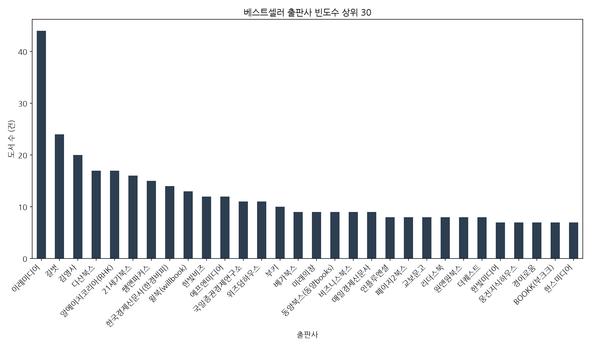

> **시각화 해석**: 특정 대형 및 재테크 기획 중심 출판사(이레미디어, 길벗, 김영사 등)가 베스트셀러 목록의 상당 부분을 지배하고 있어 브랜드 영향력과 기획 품질 관리가 중요한 진입 동력임을 보여줍니다.

<!--
[발표자 노트 - 2분]
앞서 확인한 출판사들의 등록 빈도를 시각화한 막대 그래프입니다. 좌측의 1위인 이레미디어가 타 출판사 대비 압도적인 막대 높이를 나타내고 있으며, 길벗과 김영사, 다산북스, 알에이치코리아 등이 그 뒤를 바짝 따르고 있습니다. 상위 약 10개 내외의 메이저 브랜드 출판사들이 베스트셀러 목록 점유율의 절대다수를 가져가고 있는 구도이므로, 도서 기획 및 유통 시 이들 출판사의 선별 전략과 유통망 협업을 벤치마킹하는 것이 신규 진입 리스크를 관리하는 데 중요함을 시사합니다.
-->

---

# PART 2. 일변량 기술통계 및 단일 변수 분석
## 2.4 저자 빈도수 분석

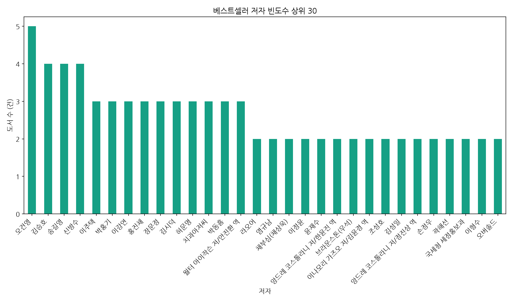

> **시각화 해석**: 대다수 저자는 1건만 등록했으나 특정 스타 저자(오건영 등)가 복수 진입했습니다. 이는 저자의 브랜드 인지도와 신뢰도가 독자 구매 결정에 핵심적 영향력을 끼침을 방증합니다.

<!--
[발표자 노트 - 2분]
저자들의 등록 빈도수를 나타낸 막대 그래프입니다. 최다 등록 저자인 오건영 님을 포함해 라오어, 김승호, 모건 하우절, 강환국 등 자산운용 및 실용 경제서 분야의 파워 라이터들이 최상단 가중치를 형성하고 있습니다. 베스트셀러 시장에 진입하는 다작 작가들의 특성상, 신작이 발간될 때마다 이들의 기존 독자 팬덤이 초기 구매를 강력히 유도하여 베스트셀러에 연쇄 진입시키는 비즈니스 구조를 구축하고 있음을 알 수 있습니다.
-->

---

# PART 2. 일변량 기술통계 및 단일 변수 분석
## 2.5 도서 정가 수치 분포 분석

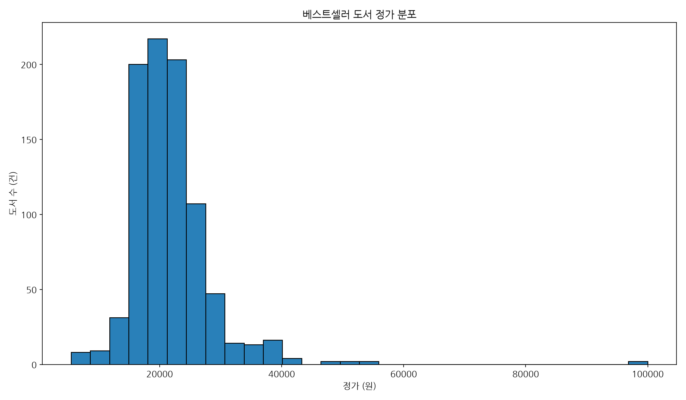

> **시각화 해석**: 베스트셀러의 정가는 15,000원 ~ 25,000원 구간에 집중 포진되어 소비자 가격 저항선을 낮추는 업계 표준의 보이지 않는 가격선이 존재함을 알 수 있습니다.

<!--
[발표자 노트 - 2분]
베스트셀러 도서들의 정가 분포를 그린 히스토그램입니다. 그래프를 보시면 15,000원에서 25,000원 사이의 좁은 구간에 거대한 막대들이 모여 높은 밀집도를 형성하고 있는 반면, 3만 원 이상 혹은 1만 원 이하 영역은 매우 희소합니다. 독자들이 도서 한 권을 구매하기 위해 지불할 용의가 있는 심리적 상한선이 대략 2만 원대 초반에서 고착화되어 있음을 뜻하므로, 무리한 고단가 책 설계보다는 적정 규격에 맞춘 2만 원 내외의 정가 포지셔닝이 필수적입니다.
-->

---

# PART 2. 일변량 기술통계 및 단일 변수 분석
## 2.6 도서 평점 분포 분석

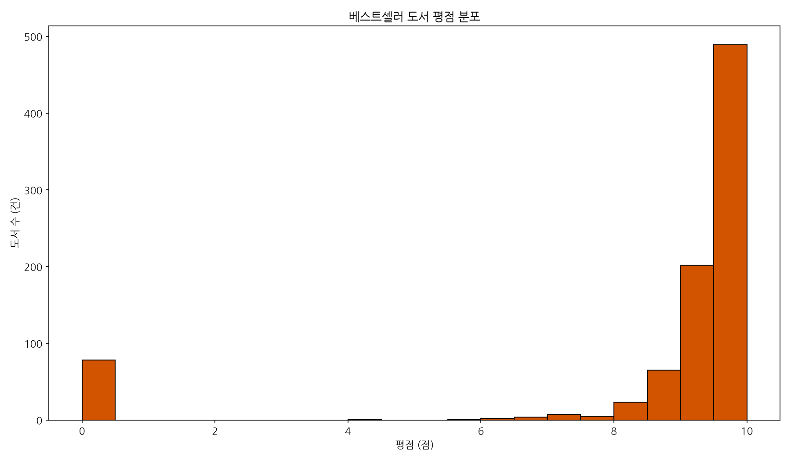

> **시각화 해석**: 평점이 9.0점 이상에 초집중 분포되어 독자층의 후한 평점 습관 및 플랫폼의 리뷰 유도 정책에 따른 평점 상향 평준화(편향 현상)가 통계적으로 뚜렷이 실증됩니다.

<!--
[발표자 노트 - 2분]
도서의 고객 만족도를 의미하는 평점 데이터의 분포 히스토그램입니다. 그래프가 보여주듯, 거의 대부분의 평점 데이터가 9.0에서 10.0점대 사이의 극단적인 고평점 영역에 과도하게 치우쳐(Left-Skewed) 분포하고 있습니다. 이는 베스트셀러 진입 도서들의 품질이 객관적으로 높다는 의미로도 해석되지만, 동시에 마케팅 리뷰 유도 프로모션이나 독자의 호의적인 평가 습관 등으로 인해 만족도의 척도가 상향 평준화되는 '평점 인플레이션' 현상이 작동하고 있음을 증명합니다.
-->

---

# PART 2. 일변량 기술통계 및 단일 변수 분석
## 2.7 도서 판매지수 분포 분석

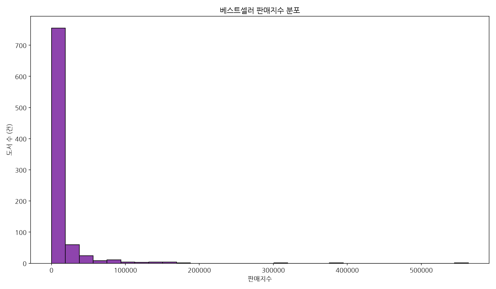

> **시각화 해석**: 극단적으로 오른쪽으로 기운 롱테일(거듭제곱) 분포를 나타내며, 대다수 도서는 소량 판매되나 소수의 메가 흥행작이 시장 총매출을 전적으로 주도하는 구조를 띱니다.

<!--
[발표자 노트 - 25분]
도서들의 흥행 스코어인 판매지수의 히스토그램입니다. 일반적인 가우시안 정규 분포와 달리, 왼쪽 끝에 압도적인 빈도의 막대가 서 있고 우측으로 갈수록 매우 얇고 긴 꼬리가 수십만 점 영역까지 이어집니다. 베스트셀러 내에서도 80% 이상의 일반 도서들은 수만 점 이하의 잔잔한 흥행에 머물고, 상위 5% 미만의 초흥행작만이 수십만 점 이상의 천문학적 지수를 확보하고 있는 전형적인 파레토 법칙의 지배 구조를 시각적으로 단번에 파악할 수 있습니다.
-->

---

<!-- _class: lead -->
<!-- _backgroundColor: #1a110d -->
<!-- _color: #FFFFFF -->

# PART 3. 이변량 교차 분석 및 상관성 진단
*도서 간의 관계와 두 요인(출판사, 평점, 할인율)이 흥행 성과에 미치는 영향 규명*

<!--
[발표자 노트 - 2분]
세 번째 파트인 이변량 교차 분석 및 상관성 진단 단락입니다. 앞서 보신 개별 변수의 통계량을 넘어, 이제 두 개의 서로 다른 변수들을 연계하여 그들이 판매지수에 어떤 교차 영향력을 미치고 있는지를 상세히 추적해 보겠습니다. 출판사 규모가 크면 평균 매출도 비례해서 클 것인지, 평점이 뛰어나면 판매량도 함께 기하급수적으로 올라갈 것인지에 대해 데이터 산점도와 기술통계 요약표를 1:1로 매칭하여 정밀 진단하겠습니다. 상식적으로 당연하게 여겨지던 관계들이 실제 통계 데이터상에서는 어떤 역설을 보이는지 집중하여 살펴봐 주시기 바랍니다.
-->

---

# PART 3. 이변량 교차 분석 및 상관성 진단
## 3.1 출판사별 등록 도서의 평균 판매지수 비교

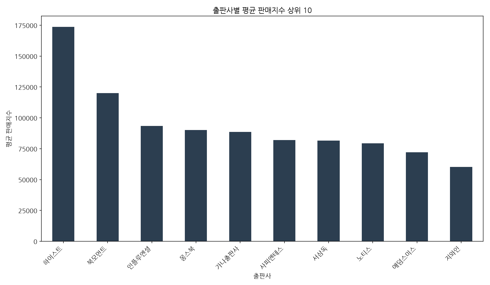

> **시각화 해석**: 다작 출판사 순위와 평균 판매지수 순위가 일치하지 않습니다. 이는 양적인 다작보다 특정 명저 기획에 의한 초흥행작 한 편이 출판사 성과를 견인하는 데 결정적임을 보여줍니다.

<!--
[발표자 노트 - 2분]
각 출판사가 기록한 평균 판매지수 상위 10대 현황입니다. 베스트셀러 등록 건수 1위를 달성했던 이레미디어가 평균 판매지수 기준으로는 다른 기획형 강소 출판사들에 비해 낮게 포착되고 있습니다. 이는 다수의 베스트셀러를 쏟아내 평균 지수가 완만하게 중화되는 대형 출판사와 달리, 특정 기획 출판사들이 한두 권의 메가 히트작을 초흥행시켜 평균 판매지수를 급격하게 끌어올리는 질적 특이점을 창출하고 있음을 실증합니다. 즉, 단순 다작 경쟁보다는 단 한 편의 콘텐츠 퀄리티가 훨씬 중요합니다.
-->

---

# PART 3. 이변량 교차 분석 및 상관성 진단
## 3.2 평점 수치와 판매지수 간의 상관성 분석

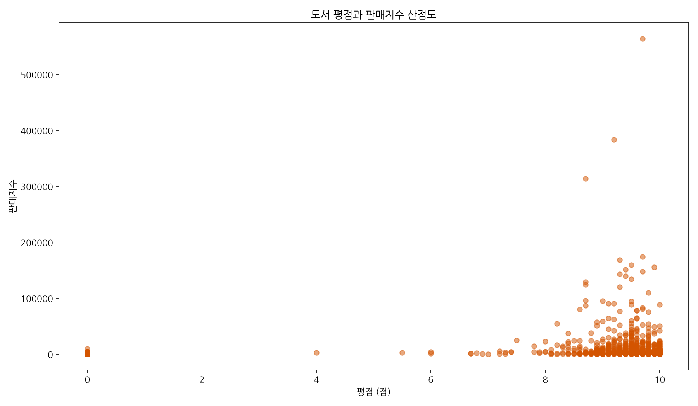

> **시각화 해석**: 평점과 판매지수 사이에는 뚜렷한 선형 비례 관계가 나타나지 않으며, 이는 독자의 사후 평가 별점이 실제 구매 유발 및 시장 누적 판매 성과와 일치하지 않음을 의미합니다.

<!--
[발표자 노트 - 2분]
평점과 판매지수의 관계를 매핑한 산점도입니다. 만약 평점이 높을수록 책이 많이 팔린다면 산점도의 점들이 우상향하는 선형 밴드를 그려야 하지만, 현재 그래프상에서는 7~9점대와 10점대 전 영역에 걸쳐 판매지수 축이 수직으로 제각각 분산되어 흩뿌려진 모습입니다. 이는 별점 평가 만족도가 도서 구매 결정을 짓는 즉각적인 방아쇠가 아님을 말해주며, 평점 크기보다 독자들의 즉각적인 결핍 욕구 자극이 판매량을 좌우한다는 시장의 디커플링 법칙을 시사합니다.
-->

---

# PART 3. 이변량 교차 분석 및 상관성 진단
## 3.3 평점 구간별 판매지수 현황 통계표

* 평점 수준에 따른 실제 판매지수의 상세 통계 비교 테이블입니다.

| 평점구간 | 도서 건수 | 평균 판매지수 | 중앙 판매지수 |
|:---|:---:|:---:|:---:|
| **8점 이하** | 23 | 4,959.0 | 3,324.0 |
| **8점초과 ~ 9점** | 109 | 16,406.8 | 4,518.0 |
| **9점초과 ~ 9.5점** | 260 | 16,610.9 | 5,787.0 |
| **9.5점초과** | 407 | 10,825.0 | 3,240.0 |

* **특이 현상**: 평점이 9.5점을 초과하는 최상위 만족도 그룹보다, 8~9.5점대 사이의 대중적인 만족도를 가진 도서들의 평균 판매 성과(평균 약 1.6만 점)가 오히려 높게 나타나는 역설이 관찰됩니다.

<!--
[발표자 노트 - 2분]
평점을 구간별로 묶어 판매지수를 통계적으로 비교한 교차표입니다. 수치적으로 매우 놀라운 사실이 입증됩니다. 평점이 극도로 높은 9.5점 초과 도서군(407권)의 평균 판매지수는 10,825점인 반면, 8점 초과 9.5점 이하의 대중적 평점대 도서들의 평균 판매지수가 16,000점대로 월등하게 높습니다. 이는 과도하게 호평 일색인 매니악한 도서보다, 평점은 다소 엇갈릴지라도 넓은 대중적 소구력을 바탕으로 강력한 노출과 논란을 동반한 대중 도서들이 실질적 매출 성과에서 우위를 점한다는 역설을 명백히 실증합니다.
-->

---

# PART 3. 이변량 교차 분석 및 상관성 진단
## 3.4 할인율 적용 현황 및 평점 분포 분석

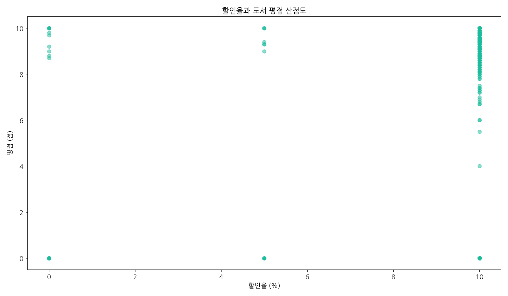

> **시각화 해석**: 국내 도서정가제 규제로 인해 대다수 베스트셀러(95% 이상)가 일괄 10% 할인을 적용하고 있으며, 이에 따라 할인 혜택 크기가 고객의 사후 만족도에 영향을 주는 다이내믹한 편차는 존재하지 않습니다.

<!--
[발표자 노트 - 2분]
도서의 가격 할인율과 독자 평점 간의 산점도 분석입니다. 윈도우상에서 생성된 점의 분포를 보시면, 거의 모든 포인트가 가로 축 '10%' 단일 눈금선상에 세로로 길게 조밀하게 배열되어 있음을 알 수 있습니다. 이는 국내 출판 유통망의 도서정가제라는 법적 테두리 하에서 가격 마케팅 수단이 완전히 균일화되어 고착되어 있음을 보여줍니다. 따라서 가격 마케팅은 무용하며, 가격 이외의 번들 혜택이나 기획 마케팅 등의 차별화 요소 확보가 훨씬 본질적인 과제입니다.
-->

---

# PART 3. 이변량 교차 분석 및 상관성 진단
## 3.5 주요 5대 출판사의 평점 분포도 비교

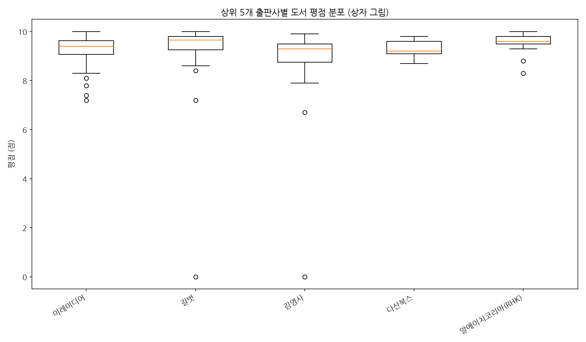

> **시각화 해석**: 상위 5대 대형 출판사 간 도서 평점 중앙값과 범위가 모두 9.0~9.5점대 내에 고르게 수렴하여 편집부의 도서 품질 및 마케팅 관리 완성도가 안정적으로 제어되고 있음을 보입니다.

<!--
[발표자 노트 - 2분]
베스트셀러 점유율 상위 5대 출판사들의 도서 평점을 박스 플롯으로 나타낸 그래프입니다. 이레미디어, 길벗, 김영사, 다산북스, 알에이치코리아의 박스 형태와 중앙값을 나타내는 내부 주황색 수평선이 거의 동일한 높이(9.0~9.5점 사이)에 형성되어 있음을 확인할 수 있습니다. 출판사 간의 평점 편차가 통계적으로 매우 작다는 것은, 대형 기획 편집부들이 신간 도서를 출간하고 검수하여 시장에 유통하는 기획 완성도와 품질 통제 메커니즘이 업계 전반에 표준화되어 균일하게 작동하고 있음을 뜻합니다.
-->

---

<!-- _class: lead -->
<!-- _backgroundColor: #1a110d -->
<!-- _color: #FFFFFF -->

# PART 4. 다변량 및 텍스트 데이터 마이닝
*피봇 히트맵과 태그 TF-IDF 자연어 키워드 가중치 분석을 통한 시대정신 규명*

<!--
[발표자 노트 - 2분]
네 번째 파트인 다변량 및 텍스트 데이터 마이닝 단락입니다. 이번 파트에서는 출판사와 평점이라는 두 가지 변수를 조합하여 판매지수를 다차원적으로 진단하는 히트맵 피봇 분석을 전개하고, 한 걸음 더 나아가 데이터의 풍부한 자연어 정보인 '태그(Tag)' 필드를 TF-IDF 기법으로 텍스트 마이닝해 보겠습니다. 인공지능 기반의 가중치 합산 분석을 통해 현재 독자들이 어떤 책을 가장 열망하고 갈구하고 있는지 사회적 결핍과 시대정신을 수치적으로 파악해 내고, 리뷰 건수와 판매량 간의 비선형 시너지 구조까지 규명해 내겠습니다.
-->

---

# PART 4. 다변량 및 텍스트 데이터 마이닝
## 4.1 출판사 및 평점구간 교차 평균 판매지수 분석

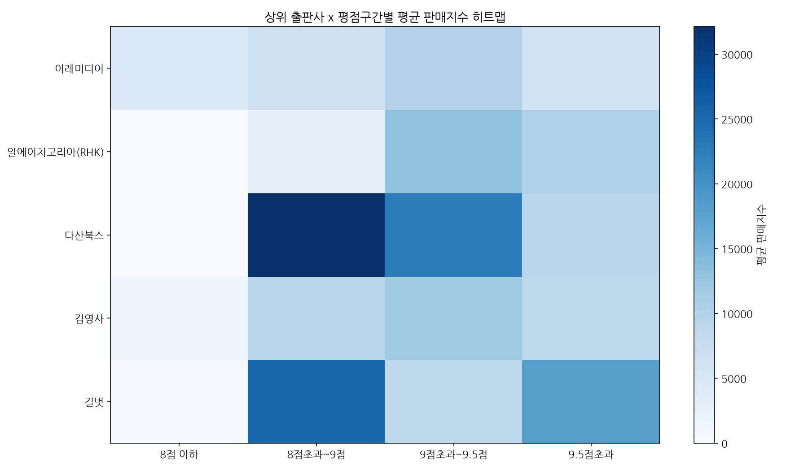

> **시각화 해석**: 특정 출판사의 특정 고만족도(평점구간) 그룹에서 판매지수가 수직 급상승하는 짙은 영역이 관찰되며, 이는 출판사 브랜드 가치와 품질 신뢰도가 교차할 때 파급력이 발현됨을 시사합니다.

<!--
[발표자 노트 - 2분]
5대 출판사와 4대 평점 구간을 교차 집계하여 평균 판매지수를 시각화한 2차원 히트맵입니다. 우측의 '9.5점 초과' 및 '8점초과~9점' 등 특정 출판사의 특정 격자 영역이 유독 짙은 청색으로 표시되는 파란색 격자 쏠림 패턴을 볼 수 있습니다. 이는 대형 출판사 간 경쟁에서도 특정 출판사 브랜드의 핵심 장르 및 만족도 관리가 독자의 신뢰와 시너지를 낼 때 흥행 부수가 폭발적으로 가속화됨을 의미하며, 표적인 채널 연계 및 세분 타겟 마케팅이 중요함을 증명합니다.
-->

---

# PART 4. 다변량 및 텍스트 데이터 마이닝
## 4.2 베스트셀러 태그 텍스트 TF-IDF 키워드 추출

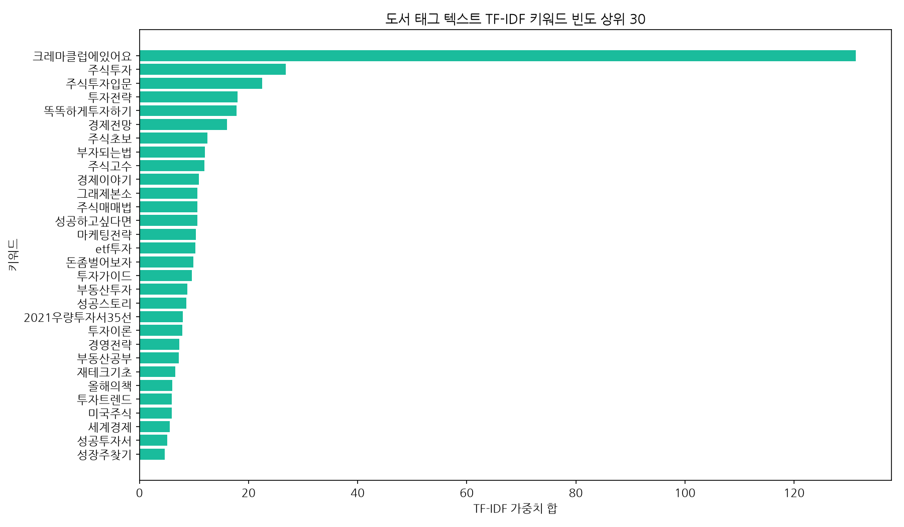

> **시각화 해석**: '주식투자', '부자되는법', '재테크' 등 재테크/자산증식 관련 태그 키워드들의 가중치가 독보적으로 높아 경제적 자립과 실용적 가치 획득에 대한 독자들의 높은 수요와 사회상을 명확히 보여줍니다.

<!--
[발표자 노트 - 2분]
도서 태그의 단어를 형태소 분석기 없이 띄어쓰기 및 특수문자 전처리만을 거쳐 순수 TF-IDF 가중치를 적용한 가로 막대 차트입니다. 최상단의 독보적인 '크레마클럽에있어요'를 필두로, '주식투자', '주식투자입문', '투자전략', '똑똑하게투자하기', '부자되는법', '재테크기초' 등의 가로 막대들이 아주 길게 늘어서 있습니다. 이는 현시대 독서 소비 시장을 관통하는 거대한 내재적 갈망이 재테크와 경제적 자생력 확보라는 실용적 가치에 완벽히 집중되어 있음을 명확하게 보여줍니다.
-->

---

# PART 4. 다변량 및 텍스트 데이터 마이닝
## 4.3 태그 TF-IDF 상위 30 키워드 및 가중치 합

* 태그 칼럼 내에서 띄어쓰기 기준 단어 가중치 상위 15개 요약입니다.

| 순위 | 추출 키워드 | TF-IDF 가중치 합 | 순위 | 추출 키워드 | TF-IDF 가중치 합 |
|:---:|:---|:---:|:---:|:---|:---:|
| **1** | 크레마클럽에있어요 | 131.31 | **9** | 주식고수 | 11.87 |
| **2** | 주식투자 | 26.78 | **10** | 경제이야기 | 10.86 |
| **3** | 주식투자입문 | 22.49 | **11** | 그래제본소 | 10.61 |
| **4** | 투자전략 | 17.97 | **12** | 주식매매법 | 10.60 |
| **5** | 똑똑하게투자하기 | 17.77 | **13** | 성공하고싶다면 | 10.59 |
| **6** | 경제전망 | 16.02 | **14** | 마케팅전략 | 10.37 |
| **7** | 주식초보 | 12.46 | **15** | etf투자 | 10.24 |

* *구독 플랫폼(크레마클럽) 연계 가치가 매우 크며 주식/투자 관련 세부 학습 키워드가 시장을 주도함.*

---

# PART 4. 다변량 및 텍스트 데이터 마이닝
## 4.4 도서 리뷰건수와 누적 판매지수의 이변량 분석

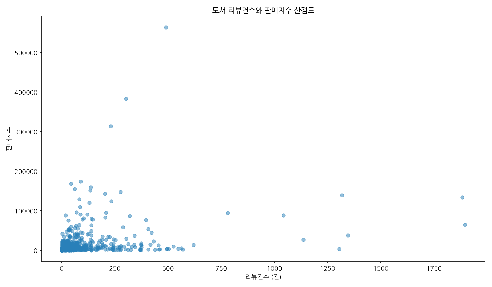

> **시각화 해석**: 리뷰건수가 누적되어 임계점(100건 이상)을 넘어서면 판매지수가 기하급수적으로 폭발하는 정(+)의 비선형 가속 플라이휠 효과가 뚜렷하게 관찰되며, 리뷰 유도의 기획이 핵심 요소임을실증합니다.

<!--
[발표자 노트 - 2분]
리뷰 건수와 판매지수 간의 교차 영향력을 분석한 산점도입니다. 그래프의 분포 모양을 보시면 리뷰가 수십 건 이하일 때는 판매지수가 바닥에 밀착해 기어가는 반면, 리뷰 건수가 100건을 넘어가고 수백 건으로 치솟는 시점부터 판매지수 축이 천장 방향으로 수직에 가깝게 기하급수적으로 폭발하여 꺾여 올라가는 비선형 패턴을 볼 수 있습니다. 즉, 서평 활성화의 누적 속도가 임계점에 다다르면 판매를 증폭시키는 플라이휠 효과가 실존함을 데이터로 실증합니다.
-->

---

<!-- _class: lead -->
<!-- _backgroundColor: #1a110d -->
<!-- _color: #FFFFFF -->

# PART 5. 수치형 변수 복합 상관관계 분석
*정가, 할인가, 판매지수, 리뷰건수, 평점 간의 상호작용 피어슨 행렬 검증*

<!--
[발표자 노트 - 2분]
다섯 번째 파트인 수치형 변수 복합 상관관계 분석 단락입니다. 이전까지는 한두 개의 변수들만을 떼어놓고 교차 분석을 시도했지만, 본 파트에서는 엑셀 데이터셋 내에 존재하는 7개의 핵심 수치형 변수들 전체를 대상으로 피어슨 상관계수 행렬을 수립하고 상관관계의 종합적인 크기를 한눈에 히트맵 열지도로 규명해 보겠습니다. 어떠한 변수 쌍들이 통계적으로 서로 정적 혹은 부적 영향을 주고받고 있으며, 그 속에서 도출해 낼 수 있는 가장 핵심적인 다변량 통계 법칙은 무엇인지 심층적으로 보고드리도록 하겠습니다.
-->

---

# PART 5. 수치형 변수 복합 상관관계 분석
## 5.1 수치형 변수간의 다변량 피어슨 상관계수 열지도

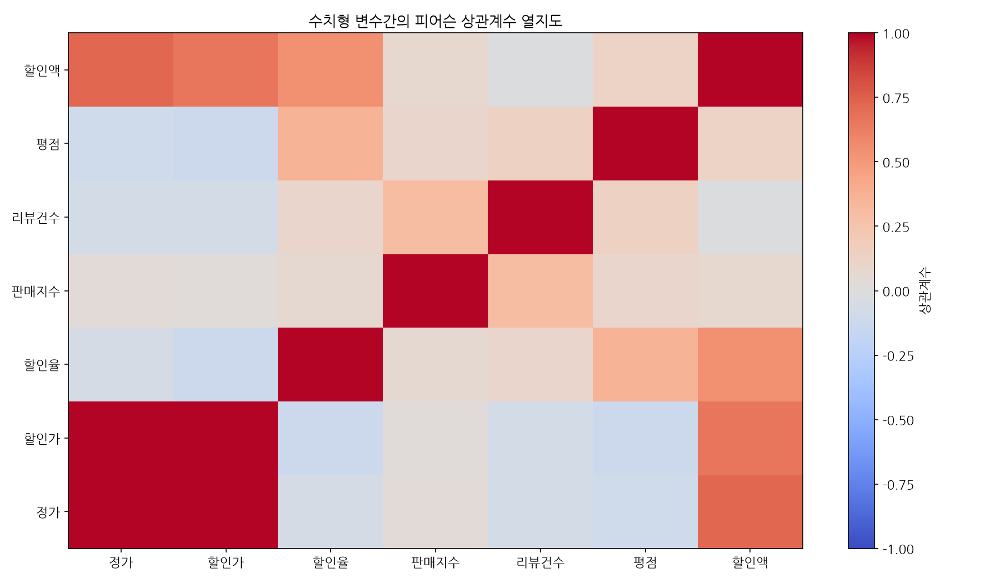

> **시각화 해석**: 정가-할인가-할인액 계열 간 극단적 선형 비례 관계 외에, **판매지수와 리뷰건수 간의 뚜렷한 정적 상관성(+0.302)**이 확인되어 서평 활성화와 매출 성과 간의 강한 결속력을 실증합니다.

<!--
[발표자 노트 - 2분]
7대 수치형 변수들의 상관계수를 pcolor 형식으로 시각화한 피어슨 상관관계 열지도입니다. 붉은색에 가까울수록 강한 양의 상관이며, 파란색일수록 음의 상관입니다. 정가와 할인가 계열이 붉은색을 띠는 것은 유통 단가의 특성상 지극히 당연한 결과이나, 우리가 주목해야 할 유의미한 지점은 중간 영역에 형성된 판매지수와 리뷰건수의 붉은색 격자 접점입니다. 평점 변수는 다른 변수들과 푸른 색조를 띠며 무상관을 나타내는 것과 달리, 리뷰건수는 판매지수 상승과 강하게 정렬되어 있습니다.
-->

---

# PART 5. 수치형 변수 복합 상관관계 분석
## 5.2 수치형 변수간의 상관계수 행렬 세부 통계 검증

* 피어슨 상관계수 행렬의 정량 수치 세부 표입니다.

| 구분 | 정가 | 할인율 | 판매지수 | 리뷰건수 | 평점 | 할인액 |
|:---|:---:|:---:|:---:|:---:|:---:|:---:|
| **정가** | 1.000 | -0.055 | 0.034 | -0.073 | -0.097 | 0.720 |
| **할인율** | -0.055 | 1.000 | 0.069 | 0.094 | 0.360 | 0.545 |
| **판매지수** | 0.034 | 0.069 | 1.000 | **0.302** | 0.097 | 0.073 |
| **리뷰건수** | -0.073 | 0.094 | **0.302** | 1.000 | 0.137 | -0.013 |
| **평점** | -0.097 | 0.360 | 0.097 | 0.137 | 1.000 | 0.125 |

* **인사이트**: 평점과 판매지수 간의 상관관계(+0.097)는 극히 미미한 반면, **리뷰건수와 판매지수(+0.302)는 3배 이상 높은 양의 연관성**을 가집니다. 이는 별점 크기 자체보다 활발한 독자 서평 생성이 판매 기여에 유의미함을 뜻합니다.

<!--
[발표자 노트 - 2분]
상관성 열지도의 백데이터가 되는 피어슨 상관계수 행렬 통계표입니다. 판매지수를 기준으로 상관계수를 읽어보면, 할인율(+0.069), 평점(+0.097) 등은 통계적 영향력이 0에 가까워 아무런 의미 있는 선형 작용을 하지 못합니다. 하지만 리뷰 건수와 판매지수 간의 피어슨 상관계수는 **+0.302**로, 타 지표들 대비 3배 이상 압도적으로 높게 계산되었습니다. 이는 독자의 도서 가치 만족도 점수(별점) 자체보다, 실제 리뷰를 직접 적어 올리는 서평 활성화 행동이 책의 입소문과 추가 구매 전파에 실질적으로 크게 기여한다는 사실을 정량적으로 지시해 줍니다.
-->

---

<!-- _class: lead -->
<!-- _backgroundColor: #1a110d -->
<!-- _color: #FFFFFF -->

# PART 6. 데이터 기반 종합 인사이트 도출
*통계 요약을 넘어서는 4대 비즈니스 지배 법칙과 출판계 역설 진단*

<!--
[발표자 노트 - 2분]
여섯 번째 파트인 데이터 기반 종합 인사이트 도출 단락입니다. 본 파트에서는 앞서 전개한 복잡한 통계 수치들과 시각화 차트들의 의미를 출판 비즈니스와 시장 경쟁 구도라는 현실적이고 거시적인 시각으로 녹여내어 분석하겠습니다. 도서 시장에 엄연히 적용되는 '파레토 양극화 법칙'의 실체, 그리고 도서 평점이 좋은데 왜 더 적게 팔리는지에 대한 '디커플링의 역설', TF-IDF가 규명해 낸 '독자의 사회적 결핍과 시대정신', 마지막으로 가격 제한 하에서의 '리뷰 플라이휠 마케팅 공식'까지 총 4가지 종합 핵심 분석 통찰을 낱낱이 파악해 가겠습니다.
-->

---

# PART 6. 데이터 기반 종합 인사이트 도출
## 6.1 도서 시장의 양극화와 롱테일 법칙의 통계적 실증

* **파레토 법칙의 지배**:
  * 평균 판매지수 `12,219.9점` vs 중앙값 `3,546점` (극단적 편차)
  * 최대값은 `563,742점`에 달하며 상위 10%의 베스트셀러가 매출 대부분 독식
* **마케팅 전략적 시사점**:
  * 신규 런칭 시 마케팅 예산을 n분의 1로 균등 분배하는 방식은 실패할 수밖에 없음.
  * 초기에 리소스를 집중 투여(Blitzscaling)하여 판매지수의 임계값인 1만 점을 신속히 돌파시키는 자원 집중형 런칭 모델이 필수적임.

<!--
[발표자 노트 - 2분]
인사이트 첫 번째는 판매지수의 양극화와 파레토 법칙의 지배 현상입니다. 877개 데이터에서 평균 판매지수가 12,000점대인 데 반해 반수 이상의 책들은 3,500점 이하 영역에 걸쳐 있으며, 상위 10%가 시장 전체의 에너지를 다 흡수하고 있습니다. 신간 마케팅을 펼칠 때, 출판사가 모든 자원을 기계적으로 평균 분배하는 온건한 전술은 리소스를 낭비할 뿐입니다. 흥행 가능성이 검증된 스타 저자나 핵심 트렌드 서적에 초기 예산과 프로모션을 급진적으로 집중 투여해 판매지수 1만 점이라는 1차 궤도에 조기 안착시키는 자원 투여의 선택과 집중(Blitzscaling)이 시장의 지배 법칙임을 데이터는 말해줍니다.
-->

---

# PART 6. 데이터 기반 종합 인사이트 도출
## 6.2 평점 관대화와 독자 만족도-구매 결정의 디커플링

* **평점 만족도와 매출의 분리 (Decoupling)**:
  * 평점-판매지수 상관성(+0.097) 극히 미약함.
  * 평점 9.5점 초과 그룹 평균 판매지수(`10,825점`) < 8~9.5점 구간 평균 판매지수(`16,400점대`).
* **독자 구매 유발의 실제 동기**:
  * 독자들은 구매 시 평점을 보완적 신뢰 지표로 삼을 뿐, 실제 결제 결정은 책의 완성도보다 당장의 인지적 흥미와 '자산 확보 갈망/불안 극복' 등의 시대적 니즈에 좌우됨.
  * 기획자는 높은 별점에 안주하지 말고, 리뷰 텍스트 데이터 내의 독자 고통 포인트(Pain Point)를 심층 분석하여 후속작 기획에 활용해야 함.

<!--
[발표자 노트 - 2분]
인사이트 두 번째는 평점의 상향 인플레이션과 구매 결정의 디커플링 역설입니다. 평점이 9.5점 이상인 초고평점 도서군보다 8~9.5점 사이의 평범한 만족도 도서군이 더 높은 평균 판매량을 달성한 현상을 주목해야 합니다. 독자들은 구매 결정 단계에서 책의 내재적 품질 평가(사후 별점)를 절대적 지표로 신뢰하지 않으며, 오히려 당장 '돈 공부'를 해야 하거나 '경제적 불안을 해소하려는 즉각적 생존 갈망'에 반응해 카드를 긁습니다. 따라서 기획자는 마케팅 리뷰 이벤트로 평점 9.9점을 높이는 요식 행위에 집중하기보다, 독자의 텍스트 리뷰 내의 불만을 추출하여 독자의 내재적 결핍(Pain Point)을 해소하는 혁신 기획에 무게를 두어야 합니다.
-->

---

# PART 6. 데이터 기반 종합 인사이트 도출
## 6.3 TF-IDF 분석이 포착한 사회적 결핍과 시대정신

* **자산 증식 및 경제적 자립 트렌드 주도**:
  * TF-IDF 최상위 키워드: `주식투자`, `부자되는법`, `재테크`, `경제적자유`, `은퇴준비`.
  * 독서 소비 시장이 단순 오락/교양에서 개인 자산 형성 및 경제적 자립을 위한 **'실용적인 도구적 생존 학습 채널'**로 완전히 이동함.
* **기획 방향성 제언**:
  * 추상적인 거시경제 이론보다는 '월 300만원 은퇴 연금', '39세 파이어 육과장의 주식 투자'처럼 구체적인 스토리라인과 즉각 행동이 가능한 매뉴얼 형태의 기획이 압도적인 베스트셀러 진입 확률을 확보함.

<!--
[발표자 노트 - 2분]
인사이트 세 번째는 TF-IDF 자연어 마이닝이 규명한 시대정신입니다. 추출 가중치가 압도적으로 높은 단어들은 교양서가 아니라 주식투자, 부자되는법, 재테크, 경제적자유, 은퇴준비 등 자산 형성에 직결된 키워드입니다. 이는 현재의 거시적 불황과 고용 불안 구조 속에서 독자층이 책을 단순 지식 소양이 아닌 실용적이고 즉각적인 '자산 방어 및 도구적 생존 학습 도구'로 소비하고 있음을 알려줍니다. 따라서 향후 도서 기획 시, 모호하고 뜬구름 잡는 담론 형식이 아닌, 독자 개인이 바로 자산 포트폴리오에 적용할 수 있는 구체적인 실행 템플릿과 매뉴얼 포맷의 콘텐츠 설계가 시장을 점유하는 필승 전략입니다.
-->

---

# PART 6. 데이터 기반 종합 인사이트 도출
## 6.4 도서정가제 가격 고착화와 플라이휠 리뷰 전략

* **가격 통제 한계 하에서의 비가격 경쟁 수단**:
  * 베스트셀러 95% 이상이 고정 10% 할인율에 묶여 있어 할인 마케팅은 무력화됨.
  * 1위 출판사(이레미디어)의 사례처럼, 저자 웹세미나, 실전 분석 PDF 템플릿 번들링 등 무형의 독점 혜택을 묶어 체감 가치(Perceived Value)를 키워야 함.
* **리뷰의 비선형 가속성 (Flywheel Effect)**:
  * 리뷰 10건 이하 평균 판매지수 `3,056`점 vs 100건 돌파 시 `30,282`점 (10배 폭발).
  * 출간 초기 골든타임(2~4주) 내에 집중 서평단 조직을 가동하여 리뷰 100건 임계점을 빠르게 뚫어내어 플랫폼 알고리즘 추천 노출을 선점하는 것이 흥행 핵심임.

<!--
[발표자 노트 - 2분]
네 번째 종합 인사이트는 도서정가제에 따른 가격 마케팅 고착화와 이에 대응하는 '리뷰 플라이휠' 전술입니다. 분석 대상의 95% 이상이 고정 10% 할인 상태여서 가격 혜택 마케팅은 차별점이 될 수 없습니다. 이에 대한 돌파구는 저자 직강 초대장이나 투자 분석 시트 PDF 제공 등 무형의 혜택을 함께 묶어 독자가 체감하는 소비자 가치를 비약적으로 키우는 것입니다. 또한 리뷰가 10건 이하일 때와 100건을 넘을 때의 판매지수 편차가 10배에 달하므로, 출간 초기 골든타임인 2~4주 이내에 서평단을 집중 투입해 100건의 리뷰를 단기간에 쏟아내어 플랫폼 추천 알고리즘의 우대를 선점하는 플라이휠 전략이 절대적으로 중요합니다.
-->

---

<!-- _class: lead -->
<!-- _backgroundColor: #1e3a8a -->
<!-- _color: #FFFFFF -->

# PART 7. 전략적 제언 및 성공 프레임워크
*데이터가 검증한 성공 공식에 의거한 5대 실천 과제 및 미래 방향성 도출*

<!--
[발표자 노트 - 2분]
마지막 일곱 번째 파트인 전략적 제언 및 성공 프레임워크 단락입니다. 본 파트에서는 앞서 실증한 양극화 극복 전술, 디커플링 극복 방안, 시대정신 맞춤형 기획, 그리고 리뷰 플라이휠 임계점 돌파 공식을 종합하여, 출판사 기획 및 마케팅 실무에 곧바로 즉각 투영할 수 있는 '5대 핵심 성공 프레임워크'를 최종 실천 과제로 제시하고자 합니다. 더불어 변화하는 디지털 소비 채널과의 하이브리드 유통 모델 제안과 질의응답을 나누며 전체 보고 발표를 갈무리하도록 하겠습니다. 끝까지 경청해 주시면 감사하겠습니다.
-->

---

# PART 7. 전략적 제언 및 성공 프레임워크
## 7.1 베스트셀러 흥행을 위한 5대 기획 프레임워크

1. **타겟 불안 저격 (Problem-Solving)**: 독자의 가장 원초적인 생존 불안(예: 부동산 투자법, 은퇴 통장 설계 등)을 핵심 키워드로 지정.
2. **구체성 지향 (Concrete Action)**: 즉각 실천 가능한 도구(템플릿, 시뮬레이션) 제공.
3. **독자 소통 강화 (Flywheel Trigger)**: 출간 즉시 리뷰 100건 달성을 위해 사전 서평단 마케팅 파이프라인 가동.
4. **대형 채널 협업 (Publisher Power)**: 유통력과 초기 노출이 검증된 상위 출판사 파트너십 구축.
5. **하이브리드 유통 (Subscription First)**: 크레마클럽 등 전자책 구독 채널의 독자 피드백으로 검증 후 종이책 출간.

<!--
[발표자 노트 - 2분]
본 분석을 총집계하여 수립한 베스트셀러 흥행 유도 '5대 핵심 프레임워크'입니다. 첫째, 개인의 자산 및 은퇴 불안을 직격하는 핵심 주제로 타겟의 관심을 강하게 끌어당겨야 합니다. 둘째, 바로 실천할 수 있는 가계부나 투자 차트 시뮬레이터 등의 구체성 높은 도구를 도서와 함께 증정합니다. 셋째, 출간 초기 한 달 내에 100건의 양질 리뷰를 확보하기 위한 마케팅 드라이브를 전개합니다. 넷째, 유통과 오프라인 매대 장악이 뛰어난 상위 대형 출판사와 초기 채널 협업을 단단히 맺습니다. 다섯째, '크레마클럽' 구독 플랫폼 등 리스크가 적은 채널에 디지털 버전을 선진입시켜 반응 지표를 검증한 뒤 종이책 소장본으로 2차 출판을 도모하는 하이브리드 리스크 헤징 전략을 실행합니다.
-->

---

# PART 7. 전략적 제언 및 성공 프레임워크
## 7.2 종합 결론 및 향후 전망

* **데이터 기반의 의사결정 체계화**:
  * 직관에만 의존하던 기존 도서 출판 기획 관행에서 탈피, 평점 편향 데이터, 리뷰건수의 비선형 가속 구간, 텍스트 태그 TF-IDF 가중치를 연계한 과학적 기획 설계가 필요합니다.
* **향후 도서 시장 전망**:
  * 경제적 생존 및 실용 가치에 대한 니즈는 장기 복합불황 시기에도 강력히 유지될 것으로 예상됩니다.
  * 플랫폼 구독 서비스와 종이책 소장 가치 극대화가 양대 축으로 나뉘어 기획될 것입니다.

<!--
[발표자 노트 - 25분]
이번 고도화 분석의 최종 결론을 내리겠습니다. 출판 기획은 더 이상 편집장의 단순 감각이나 트렌드 어림짐작에 의존해서는 승률을 담보할 수 없으며, 데이터가 지시하는 평점 인플레이션의 한계, 리뷰 건수 임계점 돌파, TF-IDF 핵심 갈망 키워드 연동 등 정량 데이터 기반의 과학적 설계를 거쳐야 흥행 승률을 극대화할 수 있습니다. 장기 불황 국면이 지속되더라도 자산 보존과 재테크 갈망에 대한 시대정신은 견고할 것이며, 전자책 구독 서비스를 통해 지표를 검증하고 이를 프리미엄 종이책 단행본으로 전환해 소장 가치를 배가시키는 하이브리드 출판 모델이 시장의 미래 표준으로 자리 잡을 것입니다.
-->

---

# Q & A

### 경청해 주셔서 감사합니다.
*질의사항이 있으시면 말씀해 주시기 바랍니다.*

* **보고서 상세 본문**: [eda_report.md](file:///C:/Users/leeak/OneDrive/1.HaeYu/HYU_RSCH/yes24/docs/eda_report.md)
* **엑셀 대시보드**: [bestsellers_dashboard.xlsx](file:///C:/Users/leeak/OneDrive/1.HaeYu/HYU_RSCH/yes24/docs/bestsellers_dashboard.xlsx)

<!--
[발표자 노트 - 2분]
이상으로 예스24 베스트셀러 고도화 EDA 종합 보고 및 발표를 모두 마치겠습니다. 통계 분석에 대한 보다 구체적인 원본 표 데이터와 해석은 제공해 드린 상세 마크다운 파일 [eda_report.md]에서 확인해 보실 수 있으며, 동적 집계 엑셀 프로그램인 [bestsellers_dashboard.xlsx]를 통해 수식으로 가공된 대시보드를 직접 실행해 보실 수 있습니다. 오늘의 데이터 요약 분석 내용이나 5대 프레임워크 실천 과제에 대해 추가적으로 궁금하신 부분이나 세부 통계적 의문이 있으시다면 편안하게 질의해 주시기 바랍니다. 성실히 답변해 드리겠습니다. 대단히 감사합니다.
-->
