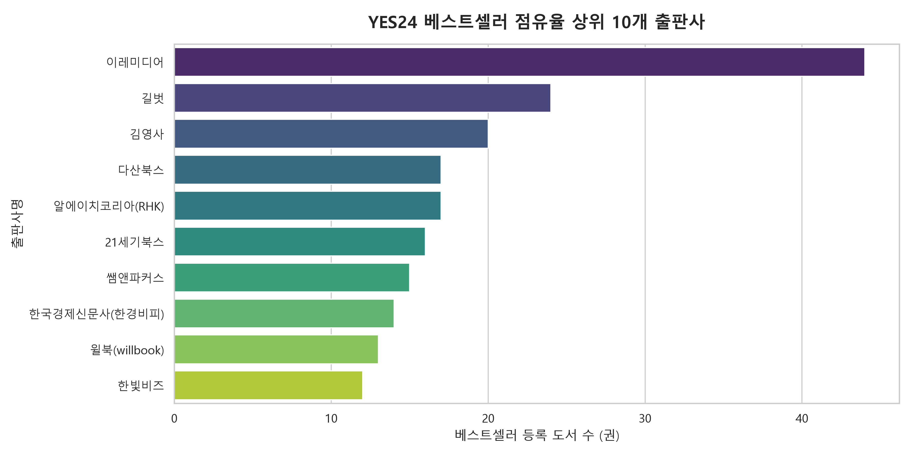
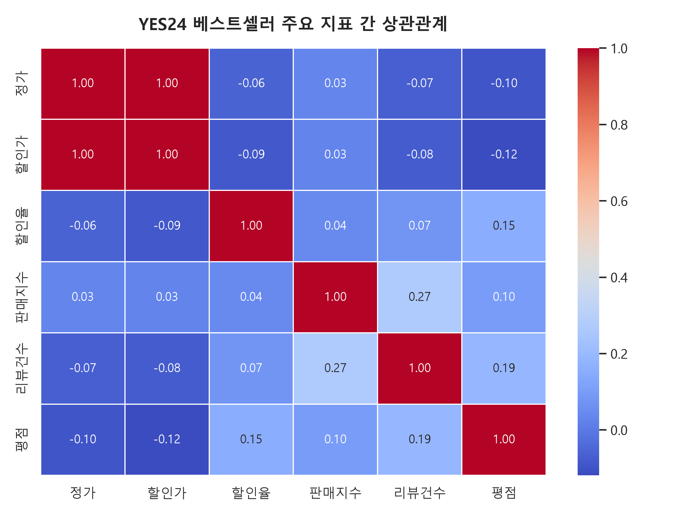
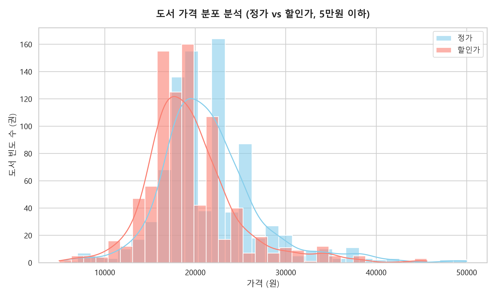
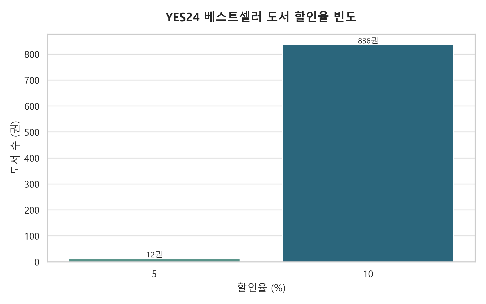
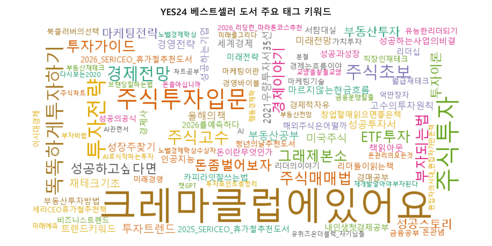

# YES24 베스트셀러 데이터 EDA 완료 보고서

본 문서는 [bestsellers.csv](../data/bestsellers.csv) 데이터를 바탕으로 진행한 탐색적 데이터 분석(EDA) 결과를 요약한 보고서입니다.

---

## 1. 수행 작업 요약
- **의존성 설치**: 시각화에 필요한 `matplotlib`, `seaborn`, `wordcloud` 패키지를 가상환경에 추가 설치했습니다.
- **분석 코드 개발**: [eda.py](../src/eda.py) 스크립트를 작성하여 수치형 타입 정제, 한국어 폰트(맑은 고딕) 설정 및 시각화 프로세스를 자동화했습니다.
- **시각화 결과 도출**: `yes24/images/` 폴더에 5종의 시각화 분석 이미지(PNG)를 정상적으로 생성 및 저장 완료하였습니다.

---

## 2. 주요 시각화 결과 및 분석 내용

### 1) 베스트셀러 점유율 상위 10개 출판사
베스트셀러 목록(877권) 중 어떤 출판사가 가장 많은 도서를 진입시켰는지 분석했습니다.

---

### 2) 도서 지표 간 상관관계
판매지수, 평점, 리뷰건수, 정가, 할인가, 할인율 간의 상관관계를 열지도로 분석했습니다.

---

### 3) 정가 및 할인가 가격 분포
5만원 이하 도서들의 정가와 실제 할인가의 분포 분포를 히스토그램 및 확률밀도곡선으로 비교했습니다.

---

### 4) 도서 할인율 빈도
도서 정가 대비 할인가가 적용되는 비율의 분포를 확인했습니다.

---

### 5) 도서 태그 키워드 분석
도서 정보에 등록된 주요 해시태그 키워드 빈도를 추출하여 시각화했습니다.

---

## 3. 검증 (Verification) 결과
- **스크립트 실행 테스트**: `uv run yes24/src/eda.py` 명령을 통해 데이터 클렌징부터 파일 쓰기까지 오류 없이 100% 정상 작동함을 확인했습니다.
- **이미지 및 폰트 검증**: 저장된 이미지들을 확인한 결과 한글 레이블 및 차트 겹침 현상 없이 깔끔하게 한글 렌더링이 이루어졌음을 확인했습니다.
